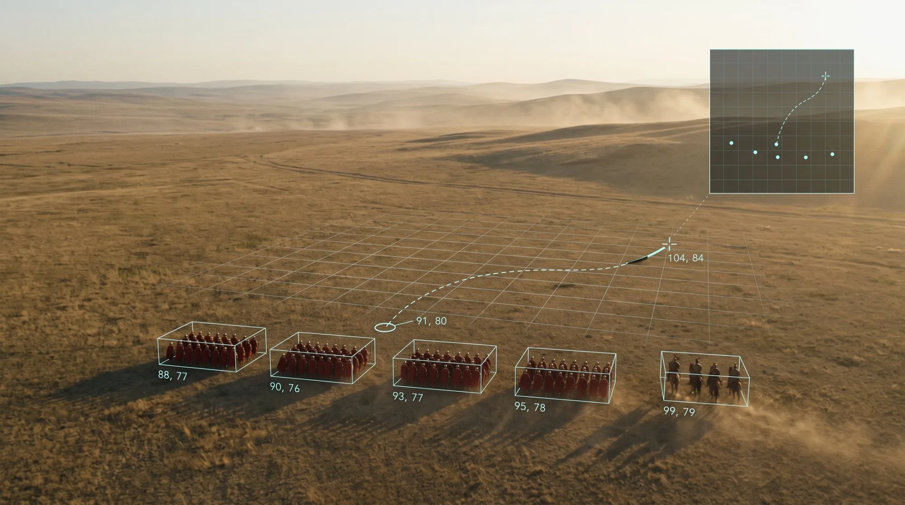
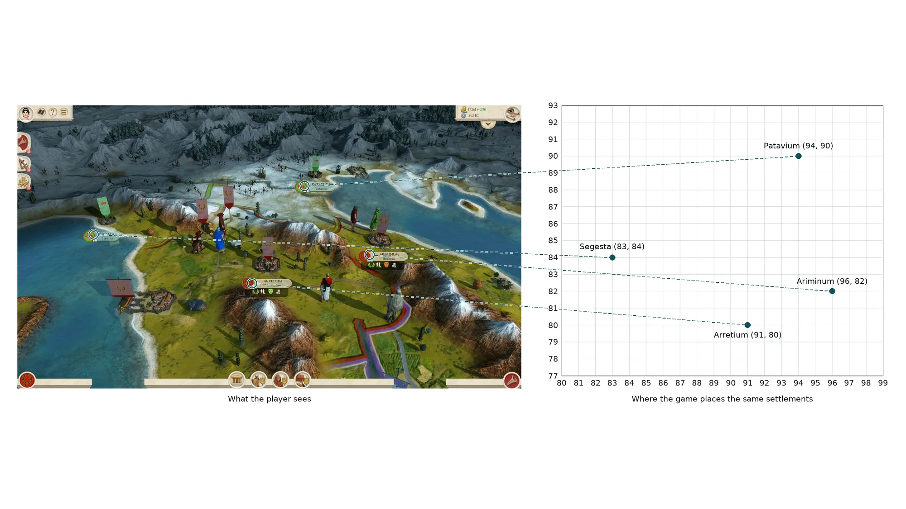
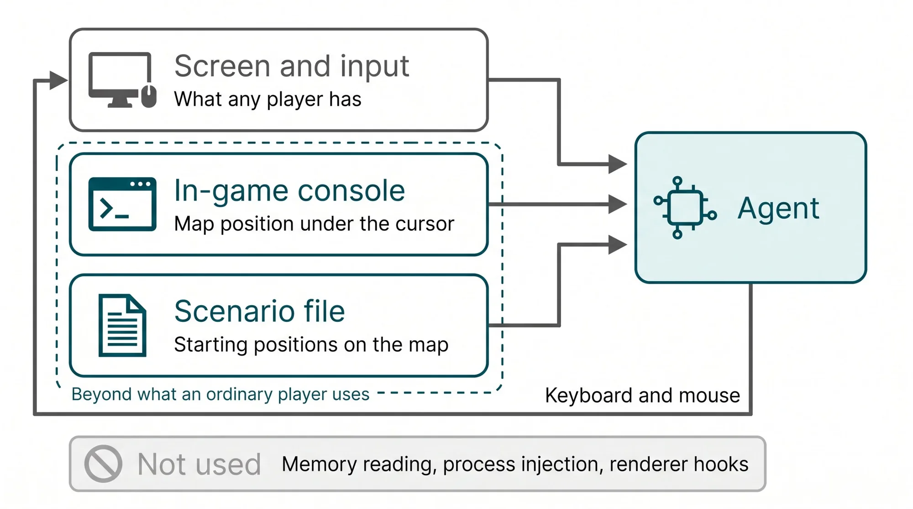
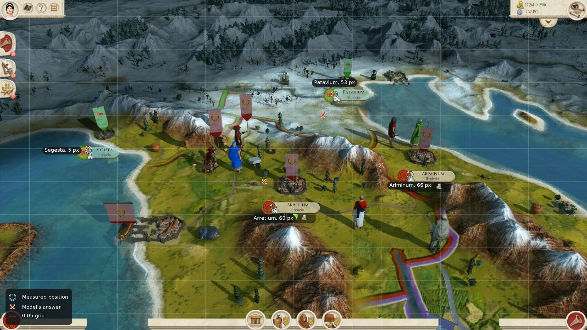
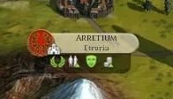
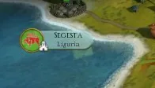
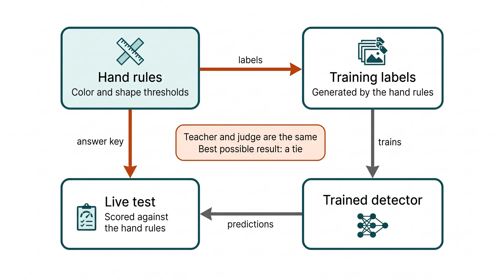
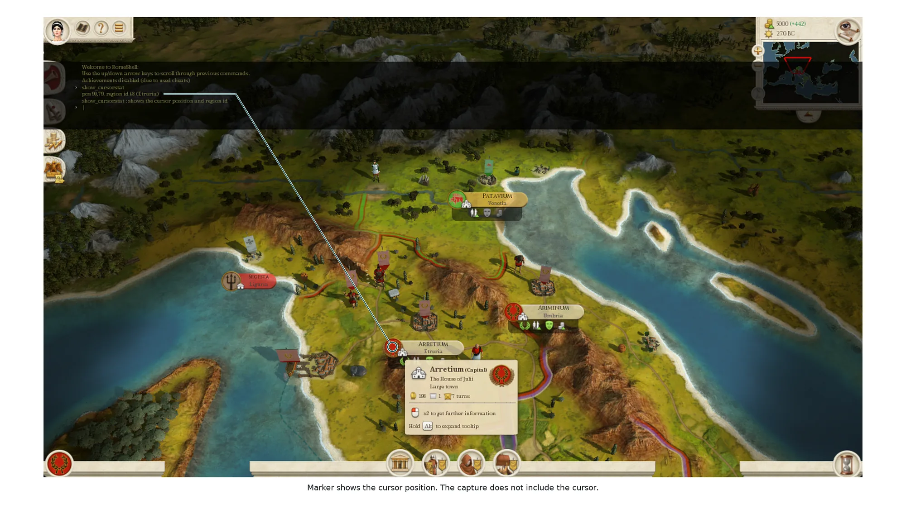
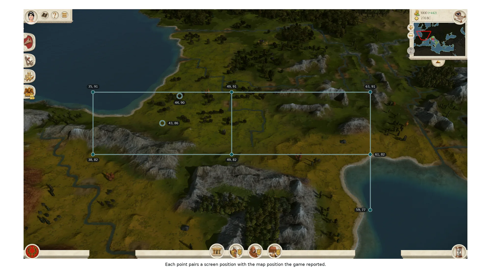
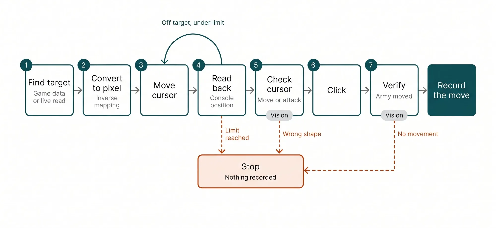

  

    Listen
    <audio class="whitepaper-audio" controls preload="metadata" src="../assets/white-papers/comstar-game-ai/comstar-game-ai-v1.0-narration.mp3">
      Your browser does not support audio playback.
    </audio>
    
  

  

    <a class="whitepaper-download" href="https://github.com/zlatko-lakisic/white-papers-comstar-game-ai-1/raw/main/COMSTAR-GAME-AI_WhitePaper_Part1_v1.0.pdf" download="COMSTAR-GAME-AI_WhitePaper_Part1_v1.0.pdf">Download PDF (v1.0)</a>
    <a href="https://github.com/zlatko-lakisic/white-papers-comstar-game-ai-1">Public release repo</a>
  

# COMSTAR Game AI: The wrong coordinate system

<em>Part 1: why my AI could read the map but not find anything on it</em>

<figure class="whitepaper-cover">

</figure>

## TABLE OF CONTENTS

1. [Summary](#summary)
2. [1. The problem](#the-problem)
3. [2. Ground rules and the information boundary](#ground-rules)
4. [3. Attempt one: ask a vision model](#vision-model)
5. [4. Attempt two: write the rules by hand](#hand-rules)
6. [5. Attempt three: train a detector](#detector)
7. [6. Attempt four: assume the camera](#camera)
8. [7. The turn: translate instead of perceive](#translation)
9. [8. What would count as proof](#proof)
10. [9. Beyond a game](#beyond)
11. [10. Where the series goes](#series)
12. [Appendix A: methods and counts](#appendix-a)
13. [Appendix B: references](#appendix-b)

## Summary {#summary}

I am building an open-source AI client that plays Total War: Rome Remastered. The game is made for human eyes. It shows a 3D perspective view of terrain, cities, and armies. Underneath, the game places everything on a flat map with integer x, y coordinates, and it reports those coordinates through a console command and its own data files. A machine that only sees pixels has to act in the first world while the answers it needs live in the second.

Four approaches came first: asking a vision model where things are, writing detection rules by hand, training a detector, and assuming a fixed camera model. Each tried to make the machine perceive the human view directly, and none produced a usable result. The approach I am testing now is a translation layer. Read the map coordinate under the cursor through the game's console, collect pairs of screen position and map position, fit the mapping between them, and check it again whenever the camera changes.

This part reports the earlier attempts, the turn, and what would count as proof. It does not claim the translation layer works. Section 8 says plainly where it stands, including two problems found while preparing this paper.

<figure class="whitepaper-figure">

<figcaption>Figure 1. The same four settlements, as a player sees them and as the game positions them. Segesta (83, 84), Arretium (91, 80), Patavium (94, 90), Ariminum (96, 82).</figcaption>
</figure>

---

## 1. The problem {#the-problem}

On the campaign map, a human sees a tilted 3D landscape. Settlements appear as small clusters of buildings with a name plaque. Armies appear as banners beside walking figures. To send an army to attack a settlement, a person looks at the screen, picks the settlement, and clicks.

The game also describes the same world as a flat map. Positions are integer x, y pairs. A console command reports the map position under the cursor, and the game's installed data files place settlements and starting armies in the same coordinates. The 3D view is a rendering of that map for human benefit.

For a machine, the flat map is the useful form. Coordinates are what software handles well. What it gets from the screen is a picture, which is the wrong coordinate system for most of what it needs to do. To click a settlement it needs a pixel. To decide whether the settlement is worth attacking it needs a map position. Neither comes directly from the image.

Agents pointed at other software built for people may meet a similar gap. That is a hypothesis, and section 9 returns to it.

The project is called COMSTAR Game AI. It is a client of an orchestration engine I also build, and it runs on a local workstation GPU. An AI coding agent does most of the implementation. I set the rules, approve the plans, review the work, and label the test data. A second model reviews the coding agent's reports and helps draft its instructions. That workflow matters to this story, because it is how several of the failures were caught, and in one case how a failure was built.

---

## 2. Ground rules and the information boundary {#ground-rules}

Two constraints shaped almost every choice below.

**The agent works through the game's own interfaces.** It does not read game memory, inject code into the process, or hook the renderer. The game draws its interface in a separate render pass, so hooking the graphics calls would hand the machine the objects on a blank background. I ruled that out.

That rule does not mean the agent sees only what an ordinary player looks at. It uses three sources of information, and they should be named separately:

1. **Screen and input.** Screen capture in, keyboard and mouse out. This is what any player has.
2. **The in-game console.** The game ships a console command, `show_cursorstat`, which the publisher documents as available on the campaign and battle maps and as showing "the cursor position and region id." The agent opens the console, runs the command, and reads the numbers off the screen. Most players never use it.
3. **Installed campaign data.** Files installed with the game describe the campaign map. The scenario file lists starting positions for characters and armies. Settlement positions come from the region map, an image in which each settlement is marked by a single pixel, with names in a companion file. A player could open these files. Few do.

<figure class="whitepaper-figure">

<figcaption>Figure 2. What the agent uses, and what it does not.</figcaption>
</figure>

Sources 2 and 3 give the agent information an ordinary player does not use while playing. I think that is the right design for this project, because both come from interfaces the game itself provides. I have not done a legal analysis of the game's license terms against this use, and this paper makes no compliance claim.

**The client should be cheap to move to another game.** The project is a freely distributed open client. Whether it matters beyond Rome depends on how much it costs to port to a second title. That question returns in a later part of this series. The same concern shaped software licensing: the repository uses a permissive license, and some popular detection libraries carry a license that would reach the inference path of a distributed client. That narrowed the model choices later on.

---

## 3. Attempt one: ask a vision model {#vision-model}

The first design was the obvious one. If the agent only sees pixels, use a vision model. It needs no training, and it does not depend on any one game.

The early work was mostly plumbing. Model calls timed out, and answers were not being extracted as plain text, so the vision calls failed closed. When those were fixed, I ran a clean test: one 1280 by 720 frame with four settlements in view, sent to qwen3-vl 8B served locally through Ollama. The prompt described what a settlement plaque and a town look like and asked for each settlement's name, region, color, and center as a fraction of image width and height.

The model returned well-formed output. It identified all four settlements, with the right region and faction color for each, and one spelling slip ("Arretum" for Arretium). Its positions were not usable.

| Settlement | Measured badge center (fraction of frame) | Model's answer | Miss at 1280 by 720 |
|---|---|---|---|
| Segesta | 0.151, 0.456 | 0.15, 0.45 | 5 px |
| Arretium | 0.466, 0.628 | 0.45, 0.55 | 60 px |
| Patavium | 0.570, 0.285 | 0.55, 0.35 | 53 px |
| Ariminum | 0.699, 0.528 | 0.65, 0.50 | 66 px |

<figure class="whitepaper-figure">

<figcaption>Figure 3. Measured positions (circles) against the model's answers (crosses). Every answer sits on the 0.05 grid.</figcaption>
</figure>

All eight coordinate values in the response were multiples of 0.05. They came from one response to one frame, so they are not eight independent measurements, but the pattern is clear: the model returned round numbers on a coarse grid. Segesta looks like a hit because the grid happened to fall near its plaque.

At this resolution, half a grid cell is about 32 by 18 pixels. A settlement at the zoom level the project uses is 15 to 20 pixels across. Output on that grid cannot hit the target reliably, whatever the model's underlying skill. The call took about 111 seconds on the local GPU.

I suspect the cause is image resizing. Vision encoders turn an image into a limited number of patches, and a 28 pixel sprite in a 1280 pixel frame loses most of its detail when the frame is scaled down to fit. I did not confirm this. qwen3-vl supports variable input resolution, and I never checked what image size the serving stack passed to the model. A different model, a different serving configuration, cropped tiles, or a different prompt might do better. The finding is narrower: in this test, with this model and this setup, the output was too coarse for the task.

**What it taught:** reading a scene and measuring it are different skills. Separate "what is this" from "where is it."

---

## 4. Attempt two: write the rules by hand {#hand-rules}

The game's interface is made of deterministic sprites. The same badge renders the same way every time, apart from scale and how it blends with the terrain underneath. That is the setting where color and shape rules can work very well.

I built a detector with hue thresholds and ring tests on the faction badges. It found settlements at exact pixel positions in about 15 milliseconds and used no GPU memory.

It had three problems.

- **It found the badge, not the thing to click.** The click point sits at an offset from the badge. That offset depends on zoom, has to be measured at one camera setup, and stops being valid when the camera changes.
- **It skipped some factions.** Factions with pale or low-saturation colors, such as white, taupe, and olive, flood the terrain under a hue threshold, so they were left out.
- **The plaques are not one sprite.** On the test frame, two settlements drew a solid cream card with garrison icons, and two drew a translucent label straight onto the terrain.

| Solid card | Translucent label |
|---|---|
| <figure class="whitepaper-figure"></figure> | <figure class="whitepaper-figure"></figure> |

*Figure 4. Two plaque styles from the same frame. A rule keyed on the cream card finds the first and misses the second.*

The split followed faction color, and on that frame also followed ownership. A detector keyed on the cream card would find only the settlements you already own, which is the wrong direction for an attack. Ownership may not be the cause. Faction, selection state, zoom, or settlement type could explain it equally well, and one frame cannot separate them.

**What it taught:** these rules worked for the badges and camera pose they were tuned on, and failed on the factions and poses they were not. Whether hand rules port to another game was never tested.

---

## 5. Attempt three: train a detector {#detector}

If the rules were too narrow, a trained detector looked like the answer. The case for it was:

- The town could get its own class, so the model would find the thing you click and the offset problem would disappear.
- Faction emblems, armies, and ships could be classes too.
- A detector tolerates changes in zoom within its training range.
- Porting to another game would mean relabeling and retraining, not new engineering.

There was an argument against it. The sprites are deterministic, so a learned detector spends capacity on variation that mostly does not exist. I decided the experiment was worth running, and approved the plan. Licensing narrowed the model family to YOLOX, which is permissively licensed.

The coding agent ran the sprint. It trained a small YOLOX model on 275 frames and held to the gate the plan gave it: switch over from the hand rules only if the detector reached at least 90% recall and 80% precision against the rules on live frames. The best live run reached 100% precision and 25% recall. Nothing shipped, and settlements stayed on the hand rules.

The gate worked. The experiment behind it was built so it could not succeed, and that design was mine to catch.

<figure class="whitepaper-figure">

<figcaption>Figure 5. One component taught the model and graded it.</figcaption>
</figure>

1. **The teacher and the judge were the same component.** The hand rules labeled the training data and were also the reference the live gate scored against. The best possible outcome was a tie with the rules. A settlement the rules missed and the model found would have counted as a model error.
2. **The labels excluded the cases that mattered.** The pale factions the rules skipped appeared in training frames unlabeled, so the model learned to treat them as background. Those are the cases where a learned detector could beat a hue threshold.
3. **The validation score could not predict anything.** Frames came from panning and zooming over a small set of settlements, then split by individual frame. Neighboring frames from one pan landed on both sides of the split, so validation was close to a copy of training. The reported validation score of about 76 average precision did not hold up on live data.
4. **The classes that justified the model were never labeled.** There were zero army and zero ship labels. The "town" class turned out to be a crop of the name plaque, not the town itself, so even the offset argument was never tested.

There was also a process problem. The coding agent made changes without a human review step, and that let the mistakes compound. Review is now structural: the agent works on a new branch, proposes before it acts, stops and reports after each step, and merges nothing without approval.

Out of this came the rules the project has run on since:

- Write the conditions that would kill an experiment before spending on it.
- Never let the component that makes the labels also judge the result.
- Lock the test set, and score it once.
- Split data by identity, so near-duplicates cannot straddle the split.
- Label test data by hand, with the answers never taken from the system being tested.

**What it taught:** an evaluation that cannot fail tells you nothing. This attempt says nothing either way about whether a trained detector would work here. It only says this experiment could not have shown it.

---

## 6. Attempt four: assume the camera {#camera}

With detection stalled, I tried the geometry directly. Reset the camera to a known zoom and pose every time, assume a fixed scale and anchor, and project from a belief about where something is to the pixel where the click should go.

A live test passed. The agent marched an army toward a nearby settlement, the cursor changed to the expected shape, and a right-click was sent.

That result meant less than it sounded like. "Passed" meant the click was sent. Nothing confirmed that the army moved. The march never read its position back after moving the cursor, so it could not tell whether it was off. The scale and anchor were hardcoded numbers.

The first measured data then disagreed with the hardcoded scale. Probes implied about 0.0275 of the screen width per map unit, against the 0.0133 the code assumed. Camera zoom may have differed between those runs, so this does not show the camera model was wrong. It shows the scale had never been measured.

**What it taught:** assumed values feel like measurements until you check them, and a test that passes on the first step of a sequence says little about the rest. This attempt was inconclusive, not a failure of the idea.

---

## 7. The turn: translate instead of perceive {#translation}

The four attempts shared one assumption. In each, the machine was asked to perceive the human view directly, and each time I added machinery to make the pixels give up their answers: a bigger model, finer rules, more training data, a camera model.

The game is built for humans, and I was trying to make a machine see it the way a human does. But the game describes the same world twice, and one of those descriptions is already in machine terms.

- The **3D view** is a rendering made for human eyes. It is the wrong coordinate system for a machine.
- The **flat map** is where positions are integer x, y pairs. The console reports it under the cursor, and the installed campaign data places settlements and starting armies on it.

What was missing was a translation between the two, and the console supplies the raw material. Put the cursor at a pixel, run the command, read the output, and you hold a matched pair: this screen position is that map position.

<figure class="whitepaper-figure">

<figcaption>Figure 6. One matched pair. The cursor on Arretium's badge; the console reports (90, 79). The campaign data places Arretium at (91, 80). The marker shows the cursor position, because the capture does not include the cursor.</figcaption>
</figure>

A set of pairs builds a coordinate system for the current view.

<figure class="whitepaper-figure">

<figcaption>Figure 7. Each point pairs a screen position with the map position the game reported. The points sit on an even screen grid, but the coordinates do not step evenly: the top row spans more map units than the middle row, which is the camera's perspective. Three probes are left out because the reader returned a stale value for them. Section 8 explains.</figcaption>
</figure>

From there the work is mathematics, not perception.

- **Fit the mapping.** Because the camera is tilted, the scale differs across the screen, so one ratio cannot describe it. Figure 7 shows this directly: on the top row, about 28 map units span the same width that covers about 23 on the middle row. A homography, a mapping with eight parameters that handles perspective between two flat surfaces, can describe it. Four well-spread pairs determine one. A grid of nine or more gives a fit with error to measure, and further points held out of the fit give an honest check.
- **Use it in both directions.** The fitted mapping converts a pixel to a map position. Its inverse converts a map position to the pixel to click. Neither needs a new capture.
- **Recheck on change.** The mapping holds for one camera state. When a turn ends, the camera moves, or the view changes in any way, the agent probes at least two points away from the screen center and compares the readings with what the mapping predicts. A probe at the center alone would miss a zoom, since zooming about the center leaves that point where it was. The check is a cheap drift signal, not a validation. If it shows drift, the agent runs the full grid and refits.

The installed data removes part of the vision work. Settlements do not move, and the region map places each one in the same coordinates the console reports. Finding a settlement stops being a detection problem and becomes a lookup. Armies are different: they move, so their current positions have to be read live, not taken from the starting data. The loop for a move becomes:

<figure class="whitepaper-figure">

<figcaption>Figure 8. The closed loop. The move is recorded only after the army is seen to have moved.</figcaption>
</figure>

1. Look up or read the target's map position.
2. Convert it to a pixel with the inverse mapping.
3. Move the cursor there.
4. Read the console back, and correct, with a cap on the number of corrections.
5. Check the cursor shape, to tell a move command from an attack.
6. Click.
7. Verify that the army actually moved, and only then record the move.

Vision keeps two small jobs: confirming the cursor shape and observing the result. Neither requires locating anything.

This turned the early work around. The question stopped being "how does a machine see the map like a person" and became "what does the game already report, and how do I get it in the machine's terms."

There are limits. A homography assumes a flat surface, and the map has terrain height, so the fit is an approximation that has to be tested on hills and coasts as well as plains. The campaign data covers the standard campaign. Other scenarios and mods may place things differently, and I have not tested them. And the foundation of the whole scheme is reading a few small numbers off a translucent console reliably. A wrong digit can move a position by a few map units, which may sit inside the fit tolerance, so no later check would catch it. The reader has to be right, not mostly right.

---

## 8. What would count as proof {#proof}

All of these apply to game version 2.0.4 at 1280 by 720, the only configuration tested. Other resolutions, UI scales, and versions are out of scope until tested.

**A note on timing.** A first attempt at fitting the mapping had already run, and failed, before I wrote these criteria. The status below reports it. The criteria are fixed now, before the diagnosis and refit they will judge.

**The reader.** On a fresh capture, labeled by hand before anyone sees the reader's output, locked, and scored once:

- zero wrong reads, and
- at least 95% of labeled frames read. The reader may refuse the rest.

Both numbers are reported together, because a reader that refuses everything would make zero wrong reads. The fresh capture includes frames where the console shows more than one position line. On those frames, the reader passes if it refuses or reads the newest line, and fails if it returns an older one. A clean result covers the conditions in the test set. It does not prove zero errors in general.

**The mapping.** The mapping is fit from a grid of probe points. On held-out points not used in the fit, spread across the usable screen area and including varied terrain, the largest error stays within 3 map units, measured as the larger of the x and y differences. I will report the number of held-out points and the full error distribution, not only whether it passed.

Three map units is the bar because the console reads in whole units and a settlement covers a few units on the map, so an error of 3 or less still lands on the settlement. If testing shows click targets are smaller than that, the bar tightens.

**The loop.** A march succeeds when the agent's readback lands within tolerance of the target, the cursor shape matches the intended command before the click, and the army's position after the move confirms it went there. The comparison against open-loop marches, with matched routes, camera states, and attempt counts, will be specified in Part 3 before it is run.

**What would show the approach is wrong.** The refinement steps, in order, are: add more probe points, then move from a flat-plane homography to a camera model that includes terrain height. If held-out error is still above tolerance after the last step, the approach fails for this game. The same holds if the reader cannot reach zero wrong reads at 95% coverage, or if closed-loop marches do not land better than open-loop marches under the Part 3 protocol.

**Status at the time of writing.**

*The reader.* It failed two locked tests. Each time the cause was found and fixed, and it now reads every frame of both sets correctly. Because those fixes were made after seeing the sets, they count only as regression data. Then, while making figure 7, it failed in a way neither test covered: in a normal probing sequence, the console kept earlier position lines on screen, and in 3 of 12 probes the reader returned an older line. None of the test frames had ever shown more than one line, so the tests could not have caught it. The fix is designed and not yet applied: reset the console before every read, have the reader refuse when it sees more than one position line, and include multi-line frames in the fresh test.

*The mapping.* A first fit was run at three zoom levels, before either reader fix. All three failed the held-out check by a wide margin, with worst errors of 30 to 112 map units. The inputs were read by a reader version with known errors, and possibly by the stale-line problem above, so the result is inconclusive. The diagnosis rule is fixed now: I will label the outlier frames by hand, blind, and refit with those labels. If the fit still fails, it counts against the homography. If it passes, it still has to pass again on a fresh capture, because these frames have now been looked at.

*The loop.* Not built.

---

## 9. Beyond a game {#beyond}

I have one game, one console command, and no passing results yet for the approach itself, so I make no general claim. The question is still worth asking, because agents are being pointed at legacy applications, terminals, and web interfaces built for human perception, and the usual response is to improve perception: a larger model, a better prompt, more examples.

The question this project raises is: when does an application report its own state in a form closer to what the agent needs, and when is translating from that report cheaper or more reliable than seeing better? I do not know how often the answer favors translation. Part 4 of this series tests one piece of it, by asking how much of this approach survives a move to a second game.

The four attempts also failed in different ways, and the differences matter. The vision model had a real limitation in this setup. The hand rules worked inside their scope and broke outside it. The detector experiment was invalid, so it showed nothing about detectors. The camera test was inconclusive. Only one of the four was a technique that clearly did not fit the job. One was an experiment that could not have shown success, and one was a test too weak to show anything.

The reader's story adds a fourth kind: a test that was valid for what it covered and silent about what it did not. It passed, and the first ordinary use found a case it had never seen. That argues for designing the evaluation before building the system it judges, and then asking what the evaluation leaves out.

---

## 10. Where the series goes {#series}

I expect the later parts to cover:

- **Part 2: building the translation layer.** Reading the console reliably, how the reader was tested, what happened when some of my own answer labels turned out to be wrong, and the failure that only normal use exposed.
- **Part 3: from mapping to action.** The mapping fit and its diagnosis, runtime rechecks, and the closed loop, with the open-loop comparison protocol stated before it runs.
- **Part 4: portability.** Whether this approach moves to a second game, and how much of it depends on files and commands specific to this one.

These are plans, not commitments. Each part depends on results that do not exist yet.

---

## Appendix A: methods and counts {#appendix-a}

**Game and capture.** Total War: Rome Remastered, version 2.0.4, unchanged for every frame in this paper. All frames are 1280 by 720, cropped to the game window's client area, with no resizing. The capture does not include the mouse cursor.

**Hardware.** Local workstation with an NVIDIA RTX 4000 Ada (20 GB) for model inference and training.

**Vision model test (section 3).** qwen3-vl 8B, served locally through Ollama. One 1280 by 720 frame with four settlements in view, sent as a JPEG at quality 85. Badge centers were measured by hand. Misses are straight-line pixel distances at 1280 by 720, rounded to whole pixels. The serving stack's effective input resolution was not checked.

**Detector experiment (section 5).**

| Item | Value |
|---|---|
| Model | YOLOX-Nano, pretrained, 640 by 640 input |
| Training | about 80 epochs, batch 4, half precision |
| Frames | 275 total: 234 train, 41 validation |
| Oversampling | settlement frames repeated 8 times, giving 1,011 training samples |
| Labels | generated by the hand rules, not by a person |
| Boxes | 257 badge, 257 name plaque, 0 army, 0 ship |
| Split | by individual frame |
| Validation score | about 76 average precision (COCO AP50:95) |
| Live gate | recall of at least 0.9 and precision of at least 0.8 against the hand rules, matched within 60 px |
| Best live run | precision 1.00, recall 0.25 |
| Verdict | no switchover |

**Settlement coordinates (figures 1 and 6).** Settlement names from the campaign's region description file. Positions from the single marked pixel for each settlement on the region map image, with y measured from the bottom, which is the game's convention.

**Console reader (sections 7 and 8).** Labels come from a person through a blind labeling tool that shows only the image. Each test set is locked before scoring and scored once.

| Test | Frames | Result when scored | After the fix |
|---|---|---|---|
| First locked test | 528 | failed: 35 wrong reads, a faint leading digit dropped or misread | 527 read, 1 refused, 0 wrong |
| Second locked test | 440 | failed: 10 wrong reads. 8 were a missing leading digit. 2 were labeling errors, found by checking each label against its neighbors along the probe path | 440 read, 0 wrong, with the 2 labels corrected |
| Figure 7 probe run (not a test) | 12 | 3 wrong: the reader returned an older position line | fix designed, not applied |

Neither locked set contains a frame with more than one position line.

**First mapping fit (section 8).** Run before both reader fixes.

| Zoom level | Fit points | Held-out points | Worst held-out error | Mean held-out error |
|---|---|---|---|---|
| 0 | 15 | 6 | 112.0 | 27.9 |
| 1 | 15 | 8 | 84.1 | 29.6 |
| 2 | 16 | 6 | 30.1 | 14.6 |

Errors in map units. Gate: 3.

**Figures.** Figures 1, 3, 4, 6, and 7 are drawn by script from real captures, with the base frames unmodified. Figures 2, 5, and 8 are diagrams. The cover image is an illustration, not a game capture.

---

## Appendix B: references {#appendix-b}

- Feral Interactive, Total War: Rome Remastered console command listing, entry for `show_cursorstat`: https://github.com/FeralInteractive/romeremastered/blob/main/documentation/feature_guides/scripts/console_commands.txt
- OpenCV documentation, feature matching and homography: https://docs.opencv.org/4.x/d1/de0/tutorial_py_feature_homography.html
- Dehghani et al., "Patch n' Pack: NaViT, a Vision Transformer for any Aspect Ratio and Resolution," 2023: https://arxiv.org/abs/2307.06304

---

**White Paper, Version 1.0**

**License:** Creative Commons Attribution 4.0 International (CC BY 4.0)  
**Author:** Zlatko Lakisic  
**Portfolio:** [zlatko-lakisic.github.io](https://zlatko-lakisic.github.io/zlatko-lakisic/)  
**LinkedIn:** [linkedin.com/in/zlatko-lakisic](https://www.linkedin.com/in/zlatko-lakisic/)

Source release: [white-papers-comstar-game-ai-1](https://github.com/zlatko-lakisic/white-papers-comstar-game-ai-1) · [Download PDF](https://github.com/zlatko-lakisic/white-papers-comstar-game-ai-1/raw/main/COMSTAR-GAME-AI_WhitePaper_Part1_v1.0.pdf)

