

  

    Listen
    <audio class="whitepaper-audio" controls preload="metadata" src="../assets/white-papers/comstar-hospital/comstar-hospital-v1.0-narration.mp3">
      Your browser does not support audio playback.
    </audio>
    
  

  

    <a class="whitepaper-download" href="https://github.com/zlatko-lakisic/white-papers-comstar-hospital/raw/main/COMSTAR-HOSPITAL_WhitePaper_v1.0.pdf" download="COMSTAR-HOSPITAL_WhitePaper_v1.0.pdf">Download PDF (v1.0)</a>
    <a href="https://github.com/zlatko-lakisic/white-papers-comstar-hospital/raw/main/COMSTAR_Hospital_ROI_Model.xlsx">ROI model (Excel)</a>
    <a href="https://github.com/zlatko-lakisic/white-papers-comstar-hospital">Public release repo</a>
  

# COMSTAR: The Addressable Hospital

<em>Federated Edge Intelligence With a Face, and Why It Is Buildable Now</em>

<figure class="whitepaper-cover">

</figure>

## TABLE OF CONTENTS

1. [Foreword: A Boy, A Starburst, And A Communication Network](#foreword-a-boy-a-starburst-and-a-communication-network)
2. [Abstract](#abstract)
3. [Executive Summary](#executive-summary)
4. [The Problem: The Intelligence Already Exists, And Nobody Can Reach It](#the-problem-the-intelligence-already-exists-and-nobody-can-reach-it)
5. [The Concept: An Addressable Presence At The Edge](#the-concept-an-addressable-presence-at-the-edge)
6. [Pain Points And Outcomes: Six Things A Hospital Would Pay To Fix](#pain-points-and-outcomes-six-things-a-hospital-would-pay-to-fix)
7. [Architecture: Three Tiers, One Fabric](#architecture-three-tiers-one-fabric)
8. [The Network: Why This Is A Telecom Problem](#the-network-why-this-is-a-telecom-problem)
9. [Graceful Adoption: Outcome First, Footprint Second](#graceful-adoption-outcome-first-footprint-second)
10. [Predictable Scaling: The Argument Cloud Cannot Make](#predictable-scaling-the-argument-cloud-cannot-make)
11. [The Value Case: Capacity, Not Headcount](#the-value-case-capacity-not-headcount)
12. [Security, Privacy, And Governance](#security-privacy-and-governance)
13. [What Exists Today, What Must Be Built, What Is Argued](#what-exists-today-what-must-be-built-what-is-argued)
14. [Known Considerations And Open Questions](#known-considerations-and-open-questions)
15. [Conclusion And Call To Action](#conclusion-and-call-to-action)
16. [References](#references)
17. [Appendix A: Reference Hospital Model](#appendix-a-reference-hospital-model)
18. [Appendix B: Value Model Assumptions](#appendix-b-value-model-assumptions)

## 1. FOREWORD: A BOY, A STARBURST, AND A COMMUNICATION NETWORK

I was a boy when I first read about ComStar.

In the BattleTech universe, humanity has spread across hundreds of worlds and then, having spread, has fallen into a long war that broke most of what it had built. What survives, almost alone, is a communication network. ComStar keeps the hyperpulse generators running. It keeps messages moving between stars when almost nothing else moves. It is not the army and it is not the government. It is the infrastructure, and because it is the infrastructure, it quietly becomes the most consequential organization in known space.

What caught me, at eleven or twelve, was not the giant walking machines. It was the idea that a network could be the protagonist. That the interesting thing in a technological civilization might not be the weapons or the ships but the layer underneath them that everything else depends on, and that the people who understood that layer would understand something important about the world.

I grew up and went to work on networks. Then on systems that run on networks. Then on the orchestration of agents that run on systems that run on networks. It took a long time to notice I had been circling the same idea since I was a child.

Two things have changed recently, and together they are why this paper exists.

The first is that the science fiction stopped being fiction. Speech recognition that runs in real time on a device costing less than a dinner out. Vision models that identify a person, a posture, a fall in progress. Language models that plan a multi-step task, call a tool, evaluate their own output, and revise. None of this is speculative. All of it is downloadable, and much of it is open source.

The second is that carriers built the distribution layer without a plan for what to put on it. AI-native radio access networks are being deployed at scale today, with billions in capital expenditure behind them, generating capability that the operators themselves have no monetisation strategy for. That is the argument of the companion paper to this one, *FUSION*, and it stands on its own.

This paper is about what happens when you give that infrastructure a face.

I built a thing called COMSTAR. It is a small screen and a camera and a microphone in a room, backed by an orchestration engine that can see, hear, reason, and call tools. It recognises who walks in. It answers out loud. On its screen is the ComStar starburst, because I am not immune to sentiment, and because the name turned out to be more apt than the joke intended: the whole point of the thing is that it is a communication layer with a presence.

It runs in my house, on a Raspberry Pi and a workstation GPU, and it is a toy. But it is a toy that demonstrates something serious, which is that the entire stack required to put an intelligent, identity-aware, privacy-preserving presence into every room of a building is available today, at commodity prices, and that the architectural positions that would make it safe, affordable, and governable in a hospital have not been taken together by the platforms already selling into that setting.

That setting is a hospital.

*A note on the name.* "ComStar" and the ComStar starburst are the intellectual property of Topps and Catalyst Game Labs. COMSTAR as described here is a personal, non-commercial reference implementation, and the name is used affectionately. Any commercial realization of the ideas in this paper would carry a different one.

---

## 2. ABSTRACT

This paper proposes an architecture for **addressable edge intelligence in healthcare facilities**: a distributed layer of low-cost terminals that convert the intelligence a hospital already generates into something a clinician can talk to at the point of work.

Hospitals have spent a decade instrumenting themselves. Real-time location systems track assets. Computerized maintenance management systems track service intervals. Environmental services platforms track room turnover. Scheduling systems track staff, operating rooms, and cases. Electronic health records track everything else. The data exists. It is accurate. And it is almost entirely unreachable by the person who needs it, because it lives in dashboards, on workstations, behind logins, in a different room from the work.

The proposal has three parts. First, that the correct interface to this data is **spoken, ambient, and identity-aware** rather than a screen someone has to walk to. Second, that the correct place to run the inference is **on the endpoint and at the network edge**, so that raw audio and video stay inside the hospital trust domain, with wake-word and pose inference on the endpoint and heavier recognition at the edge, which is what makes both the privacy properties and the economics work. Third, that the correct commercial framing is **outcome-led graceful adoption with deterministic capacity planning**, because the failure mode of current cloud AI in healthcare is not capability but unpredictable cost and an unauditable trust boundary.

A working reference implementation exists. It is described here not as a product but as an existence proof: every component in the architecture is available today, most of it open source, and the integration is the contribution rather than any single technology.

**What this paper is.** A concept paper with a working prototype behind it. It argues that the opportunity is real, the architecture is buildable with current technology, and the governance is designable. It is not a product specification, a clinical validation, or an investment memorandum. Figures for hospital sizing, terminal counts, and compute requirements are engineering estimates derived from public data and stated assumptions, not forecasts. Every claim about what is built versus what is designed versus what is argued is labeled in Section 13.

---

## 3. EXECUTIVE SUMMARY

**The observation.** A nurse on a medical-surgical floor walks between four and five miles in a twelve-hour shift. A meaningful fraction of that is spent looking for things: an infusion pump, a wheelchair, a bladder scanner, a clean room, the attending. The hospital knows where most of those things are. It has an RTLS deployment that cost six figures and a dashboard on a workstation two corridors away. The gap between the data existing and the data being usable is measured in footsteps.

**The proposal.** Put a terminal in the room. Not a screen to walk to and log into, but a presence that knows who just walked in, listens when addressed, and answers out loud. Back it with an orchestration engine that can call the systems the hospital already owns. Run the inference on hardware inside the building so that nothing sensitive crosses a boundary the hospital does not control.

**Why now.** Four things converged in the last twenty-four months. Speech recognition small enough and fast enough to run on an edge device. Vision models capable of presence, identity, and posture at commodity cost. Orchestration engines that can plan, call tools, and evaluate their own output. And private cellular networks, CBRS and 5G, that give a hospital deterministic, uplink-capable, sliceable transport that Wi-Fi cannot provide at this density.

**What makes it different from a smart speaker.** Identity. In the architecture described here, the recognised or badge-asserted identity of the person in the room becomes the identity of the session, which means memory, tool permissions, and data scope are per person by construction rather than by prompt. An unrecognised person receives a restricted session automatically. This is the single property that no consumer voice assistant has, and it is what makes the approach viable in a clinical setting at all.

**Six outcomes**, in ascending order of regulatory difficulty and descending order of near-term feasibility:

| # | Outcome | Regulatory friction | Data sensitivity |
|---|---|---|---|
| 1 | Asset location and readiness | None | Operational |
| 2 | Room readiness and turnover | None | Operational |
| 3 | Schedule and resource conflict detection | None | Operational |
| 4 | Ambient clinical documentation | Moderate | High (PHI) |
| 5 | Identity-aware patient interaction | High (biometric consent) | High (PHI) |
| 6 | Patient safety observation | High (device classification) | Highest |

The first three involve no protected health information, no biometric consent exposure, and no medical device classification. They are also, individually and collectively, worth a great deal of money to a hospital operations leader. **They are the entry point, and most analyses of this technology skip them entirely in favor of the clinical use cases, which is a mistake.**

**Adoption is outcome-led, not room-led.** Nobody buys seven hundred terminals. A department buys an outcome, deploys the minimum footprint that delivers it, and expands into a platform the next department does not have to buy again. The first deployment can require zero new hardware, running on interactive patient systems, telehealth carts, and workstations already installed.

**Economics are deterministic, and that is the commercial wedge.** Cloud AI pricing scales with usage, which means success raises the bill and no CFO can budget it. The architecture here is fixed capital with calculable capacity: every input to the sizing model is a number the hospital already measures. A capacity table can be published, verified by the hospital's own team against their own volumes, and held to in the pilot. That is a materially different cost profile from consumption-priced AI services.

**The value is capacity, not headcount.** For the reference facility, an illustrative full-scope case is on the order of **~$5–7M of annual value** before finance discounts, of which most is soft-dollar capacity rather than posts removed. Only one of the six outcomes produces genuine headcount reduction, and it is the outcome with the hardest regulatory path. **The honest commercial number is the increment over tools the hospital already owns or would otherwise buy**, not the gross value of finding equipment or drafting a note. The operational entry point (outcomes 1–3) is intentionally the case that can be argued without PHI. Section 11 sets out the model, the increment framing, and the assumptions that would invalidate it.

**Security is architectural rather than policy.** Two boundaries matter and they are not the same claim. Wake-word detection and, for observation workloads, pose estimation run on the endpoint, so raw sensor streams for those functions do not leave the room. Speech recognition and face matching for assistant workloads run at the on-premise or near-premise edge, so raw media may cross the room network but stays inside the hospital trust domain and is not retained as a vendor-side encounter repository. That is a categorically different claim from a retention setting and a business associate agreement, and it must be stated with that precision.

---

## 4. THE PROBLEM: THE INTELLIGENCE ALREADY EXISTS, AND NOBODY CAN REACH IT

### 4.1 A decade of instrumentation with a broken last mile

Walk a modern hospital and count the systems that know something useful:

- **RTLS** knows where the pumps, beds, wheelchairs, telemetry boxes and, increasingly, the staff are.
- **CMMS** knows when each device was last serviced, what its preventive maintenance interval is, and whether it is under recall.
- **EVS platforms** know which rooms are dirty, which are in progress, which are clean, and how long each state has lasted.
- **ADT and bed management** know who is admitted, who is pending discharge, and which beds are held.
- **Surgical scheduling** knows the case list, the room assignments, the turnover times, and the equipment each case requires.
- **Workforce management** knows who is rostered, who called out, who is on overtime, and where ratios are at risk.
- **The EHR** knows the rest.

This is not a data problem. Most hospitals of any size have all of the above, purchased at considerable expense, generating accurate telemetry every minute of every day.

It is an **interface** problem. Every one of those systems terminates in a dashboard on a workstation, or a module in the EHR, or a web application requiring a login and a context switch. The person who needs the answer is a nurse in a corridor with their hands full, a charge nurse trying to make a bed assignment at shift change, an EVS supervisor with a radio, or a surgeon standing in a room that is not ready.

**The last mile of hospital intelligence is a human walking to a screen.**

<figure class="whitepaper-figure">
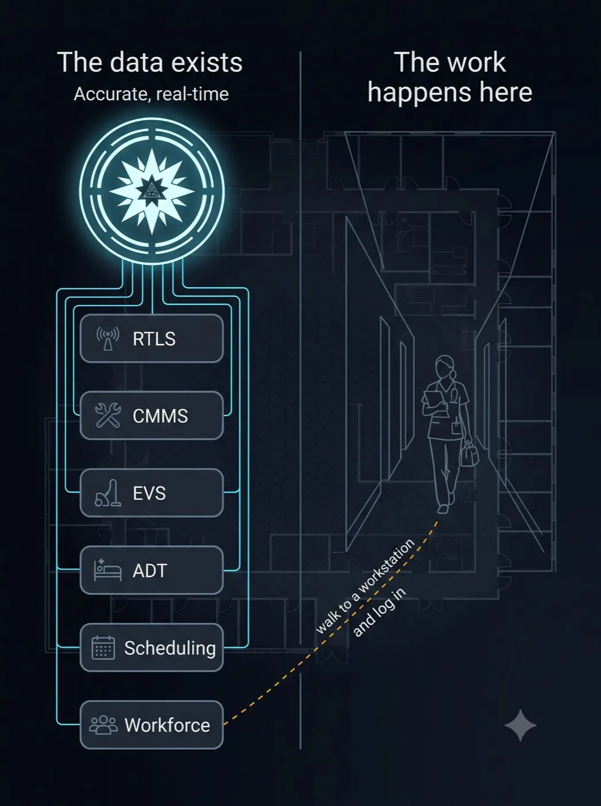
<figcaption>Figure 1: The hospital already holds accurate, real-time operational data. The person who needs the answer still walks to a workstation and logs in.</figcaption>
</figure>
### 4.2 What that costs, concretely

The literature and the operational anecdote agree on the shape even where the numbers vary by facility:

- **Equipment search time.** Nursing staff routinely spend a meaningful share of each shift locating equipment. The commonly cited figure is on the order of an hour per nurse per shift across search, waiting, and workaround.
- **Utilization collapse.** Infusion pump fleets are the standard example. Because pumps cannot be found, units hoard them, and because units hoard them, central supply cannot rebalance, so utilization across the fleet runs far below what the hospital paid for. The hospital then buys more pumps to solve a location problem.
- **Bed turnover latency.** A room that is clean but not known to be clean is functionally dirty. Every minute between the actual state changing and the bed management system reflecting it is a minute of emergency department boarding, and boarding is one of the most reliably measured harms in hospital operations.
- **OR delays from readiness conflicts.** A case scheduled at seven, a room not terminally cleaned, a piece of equipment in another department, a required staff member double-booked. Each is individually visible in one system. The conflict between them is visible in none.
- **Preventive maintenance drift.** Devices come due for service and are not found. Compliance becomes a paper exercise conducted before an accreditation visit rather than a continuous state.
- **Documentation burden.** Physicians spend a large and well documented share of their day in the electronic record rather than with patients, and it is a leading contributor to burnout.

Each of these is a known problem with a known cost and, in most hospitals, an existing system that already holds the data required to fix it.

### 4.3 Why the existing answer has not worked

Hospitals have tried to close this gap, and the attempts share a pattern.

**More dashboards.** The response to unreachable data has usually been another screen, which is another place to walk to and another login. This does not reduce the number of context switches, it increases it.

**Mobile applications.** Better, and genuinely useful, but a phone is a device you have to take out, unlock, and navigate while holding something else, and hospital mobile deployments fight the same battery, hygiene, and roaming problems as everything else.

**Integration projects.** Expensive, slow, and brittle, and they typically produce a unified dashboard rather than a unified answer.

**Cloud AI assistants.** Capable, but they arrive with a trust boundary the hospital does not control, a cost model that scales with success, and no awareness of who is standing in front of them.

The missing element in all of these is not intelligence. It is **presence**: something in the room, always on, that knows who you are and can be spoken to without a decision to use it.

### 4.4 Why incumbents do not close the last mile

The claim is not that nobody has sold voice, vision, or virtual care into hospitals. Artisight, Stryker (Vocera and care.ai), AvaSure, Microsoft Dragon Copilot, Abridge, Nabla, Suki, Ascom, and related platforms are active, funded, and in some cases deployed at multi-facility scale. EHR vendors expose APIs. RTLS vendors have sold search-time reduction for years. Ambient documentation is an active category with health-system deployment guidance.

The claim is narrower, and it has to be stated that way or the paper will be read as uninformed.

What those products typically do not assemble together is the architectural package this paper argues for:

1. **On-premise inference as the default trust boundary**, not cloud transcription with a BAA.
2. **Capability removal rather than egress filtering**, so private workloads cannot call an external model catalog.
3. **Directory-sourced authorization**, so a biometric or badge asserts presence while the hospital identity provider decides entitlements.
4. **Deterministic capacity pricing**, not per-seat or per-minute consumption that rises with success.
5. **Readiness composition as a first-class object**, joining location, cleaning, service, recall, and reservation into one answer rather than another dashboard panel.
6. **Outcome-ordered adoption** that can begin with zero PHI and zero cameras.

Those positions can be contested. They cannot be waved away by pointing at a smart room vendor or an ambient note product. Section 13 returns to the market map with an explicit exists / must-build / argued split.

---

## 5. THE CONCEPT: AN ADDRESSABLE PRESENCE AT THE EDGE

### 5.1 The core proposition

Place a terminal in each relevant space. Give it four capabilities:

1. **It knows who is there.** Through a staff badge, a directory lookup, and optionally a face or voice match, with confidence graded to what is being asked.
2. **It listens when addressed**, and only when addressed, with the wake-word model running locally so that nothing is transmitted before the device has been spoken to.
3. **It can call the systems the hospital already owns**, through a tool interface, so that answers come from the RTLS or the CMMS or the scheduling system rather than from a model's imagination.
4. **It answers out loud**, in a sentence, in the room, without anyone walking anywhere.

That is the whole idea. Everything else in this paper is the engineering required to make it safe, affordable, and scalable.

### 5.2 The relationship to FUSION

The companion paper argues that carriers should convert their radio access network edge into an intelligence layer: inference runs near the source, structured outputs rather than raw sensor streams traverse the network, aggregation happens without centralizing raw data, and privacy is achieved by architecture rather than by policy.

That architecture is unidirectional. Sensors produce inferences, inferences aggregate, and enterprise customers query an interface. The edge is a **source**.

The proposal here adds the missing direction. An addressable terminal is a node that both contributes to the fabric and delivers from it, to a human standing in front of it. **FUSION describes the intelligence layer. This paper describes what happens when that layer can be spoken to.**

The mapping is direct:

| FUSION layer | Hospital instantiation |
|---|---|
| Layer 1: client devices and RAN edge | Terminals and room sensors. Wake word, voice activity detection, presence, pose, UWB ranging. Hard real-time raw stays on the endpoint. |
| Layer 2: regional edge compute hubs | On-premise or near-premise inference. Speech recognition, vision, orchestration, synthesis. |
| Layer 3: national governance hub | Health-system governance plane. Model registry, model cards, audit, consent registry, policy. Holds no raw clinical data. |

The privacy principle transfers exactly. Because hard real-time inference stays on the endpoint, heavier recognition stays on-premise, and only structured outputs leave the hospital trust domain, there is no vendor-side repository of room audio or video to secure, leak, or subpoena. That is a stronger property than filtering raw data after collection, because it removes the raw data from the trust boundary rather than relying on the operator to discard it correctly.

### 5.3 Identity is the architecture, not a feature

The single design decision that makes this viable in a hospital is the separation of authentication from authorisation.

> **The badge or the face authenticates. The directory authorises.**

The identity signal asserts *who is standing there*. It never asserts *what they may do*. Entitlements come from the hospital's existing directory, mapped to roles the identity team already maintains. A nurse's session and an attending's session receive different tool sets and different data scopes, sourced from groups that already exist.

Three consequences follow, and each is a security property rather than a convenience:

**Minimum necessary is enforced by construction.** HIPAA's minimum-necessary standard becomes a property of session assembly rather than an access policy someone has to write and audit separately.

**A biometric error cannot escalate privilege.** A mistaken or spoofed identity match grants only what that person's directory role already permits. There is no path from a face to an entitlement.

**Revocation happens once, in the place the hospital already revokes things.** Disabling a directory account disables every terminal in every building, immediately, with no separate system to remember.

An unrecognised person receives a restricted session automatically: it will converse, and it will not touch records, schedules, or controls. This is a tested boundary rather than a configuration setting.

<figure class="whitepaper-figure">
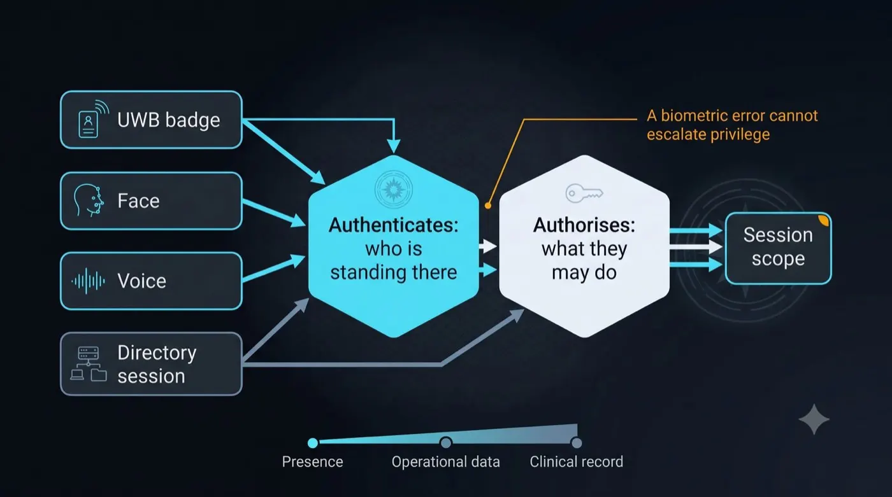
<figcaption>Figure 2: Badge, face and voice authenticate who is standing there. The directory authorises what they may do. A biometric error cannot escalate privilege.</figcaption>
</figure>
### 5.4 Graded confidence

Identity is not binary in a clinical environment. A clinician is masked, at an oblique angle, moving, and often backlit. Face recognition degrades in exactly the conditions where identity matters most.

The design therefore fuses signals and grades the requirement to the request:

| Signal | Asserts | Fails when |
|---|---|---|
| UWB badge | Staff identity, range, presence at room or bed level | Badge left behind |
| Directory session | Role, entitlements, scope | Never, it is the source of truth |
| Face | Identity without a carried device | Masks, angles, low light |
| Voice | The speaker is the identified person | Noise, similar voices |

"Where is the nearest available wheelchair" requires presence and a valid staff role. "Read me this patient's medication schedule" requires a higher confidence floor and a directory role that permits it. Setting one global threshold for both is the wrong design.

---

## 6. PAIN POINTS AND OUTCOMES: SIX THINGS A HOSPITAL WOULD PAY TO FIX

This section is the argument. Each outcome is stated as the operational problem, the systems that already hold the answer, what the terminal changes, and what it is worth.

### 6.1 Asset location and readiness

**The problem.** A nurse needs an infusion pump. The unit's pumps are in use, or in a room, or on another floor, or in the soiled utility waiting for cleaning. She walks. She asks colleagues. She borrows from another unit, which starts the hoarding cycle. Eventually she finds one, and she has no way to know whether it is clean, charged, in service, or subject to an open recall.

<figure class="whitepaper-figure">
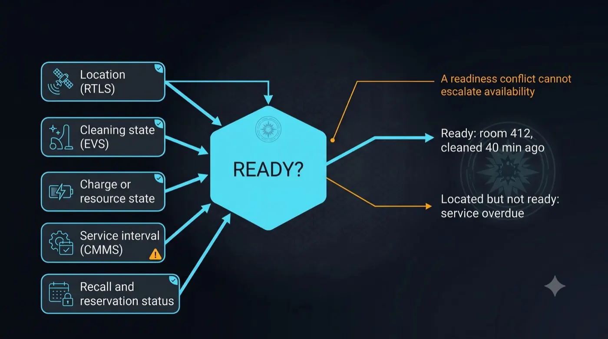
<figcaption>Figure 3: Readiness is a composition across location, cleaning state, charge, service interval, and recall status. A readiness conflict cannot escalate availability.</figcaption>
</figure>
**What already knows the answer.** RTLS knows location. CMMS knows service status and recall state. Central supply knows par levels. Biomed knows what is out for repair.

**What the terminal changes.**

> "Where is the nearest available infusion pump?"
> "There are two on this floor. One in room 412, unoccupied since this morning. One in the clean utility on 4 East, cleaned and charged forty minutes ago."

Note what the second sentence does. It does not report location. It reports **readiness**, which is the composition of location, cleaning state, charge state, service currency, and recall status. That composition does not exist in any single system today. It is exactly the kind of cross-source synthesis an orchestrator performs by calling several tools and reasoning over the results.

**Readiness as a first-class concept.** This is the contribution. Hospitals track assets. They do not track readiness, because readiness is a join across four systems that nobody has performed in real time. An asset is ready when it is: located, clean, charged or otherwise resourced, within its service interval, not recalled, and not reserved for a scheduled case.

**What it is worth.** The honest increment is the interface delta over the RTLS and CMMS the hospital already owns, not the entire historical "hour per shift" productivity claim those vendors have sold for years. Recovered nursing search time that the dashboard never captured, fewer false walks, reduced hoarding, and deferred capital as a one-time timing benefit rather than an annual annuity. If the hospital owns an RTLS and still cannot find pumps, the missing piece is partly interface and partly data quality. This architecture addresses the first; the pilot must measure the second.

**Composed readiness accuracy.** Readiness is a join. Errors compound. If location, cleaning state, service currency, and reservation are each imperfect at query time, the composed assertion is weaker than any single input. Zone-resolution RTLS and EVS status that updates only when someone reaches a terminal fail in the same direction. The failure mode is a nurse walking to room 412 for a pump that is not there, and two of those events can kill adoption because the proposition is that you trust the answer without checking. Answers must degrade gracefully: "last seen in 412 eleven minutes ago" rather than a false certainty. The pilot therefore measures answer correctness alongside search-time reduction.

**Regulatory friction: none.** No PHI, no biometrics, no device classification.

### 6.2 Room readiness and turnover

**The problem.** The emergency department is boarding patients. There are clean beds upstairs. Nobody knows they are clean, because the EVS technician finished eight minutes ago and the status will update when they get to a terminal. Meanwhile a discharge happened on another unit and the room has not been flagged dirty because the nurse is with another patient.

Every minute in that gap is boarding time, and boarding is one of the most reliably measured harms in hospital operations.

**What already knows the answer.** ADT knows the discharge. The EVS platform knows the cleaning queue. Bed management knows the assignment. RTLS, in facilities that badge EVS staff, knows who is in which room and for how long.

**What the terminal changes.** Two directions, and both matter.

*Inbound.* The EVS technician finishing a room says so, out loud, from inside the room, at the moment it becomes true. No terminal, no login, no walk. The status change propagates immediately.

> "Room 412 is terminal clean."
> "Recorded. 412 is available. Bed control has been notified."

*Outbound.* The charge nurse asks the wall at shift change.

> "What's ready on this unit?"
> "Three clean and available: 408, 412, 419. Two pending clean, both discharged within the last twenty minutes. 415 is on hold for a scheduled admission at two."

**Why voice is the right interface here specifically.** Status reporting fails because it is friction imposed on someone whose hands are full and who is already behind. Removing the walk and the login removes the reason the data is stale. The value is not the query, it is the **capture**.

**What it is worth.** Reduced time from actual-clean to known-clean, which converts directly into reduced boarding and improved throughput. Both are metrics hospital operations leaders already report on and are already accountable for.

**Regulatory friction: none.**

### 6.3 Schedule and resource conflict detection

**The problem.** This is the most valuable of the three operational outcomes and the least served by existing tools.

A first case is scheduled in operating room four at seven in the morning. The room needs terminal cleaning after last night's late case. The procedure requires a C-arm, which is currently in interventional radiology. The scrub tech assigned called out at four in the morning and the float pool has not been reassigned. The surgeon is also listed on a clinic session that overlaps.

<figure class="whitepaper-figure">
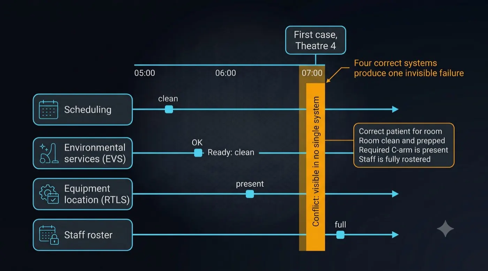
<figcaption>Figure 4: Four systems can each be correct while the readiness conflict between them is visible in none. First case, OR 4.</figcaption>
</figure>
Every one of those facts is correct in the system that owns it. The **conflict between them exists in no system at all**, and it is discovered at 06:50 by a charge nurse with a phone.

**What already knows the answer.** Surgical scheduling, EVS, RTLS, workforce management, and the clinic scheduling system. Five systems, five sources of truth, no join.

**What the terminal changes.** Two modes.

*Queried.* The charge nurse asks, from the board room, from a nurse station, from anywhere.

> "Are we clear for first cases tomorrow?"
> "Three issues. Operating room four needs terminal clean and EVS has no assignment for it. The C-arm required for the seven o'clock is currently in IR with no return scheduled. And Dr. Adeyemi is listed for both the seven o'clock and a clinic session at eight thirty."

*Proactive.* The orchestrator runs the same reconciliation on a schedule and surfaces conflicts before anyone asks. This is where an agentic system earns its keep: the reconciliation is a multi-step task with tool calls, intermediate reasoning, and a synthesis, and it is exactly what a planning orchestrator does well and a dashboard does not do at all.

**What it is worth.** First-case on-time starts are a tracked metric in every surgical department, with a well understood downstream cost in OR minutes, staff overtime, and cancelled cases. Late discovery of a conflict is the dominant failure mode, and the entire value is in moving discovery earlier.

**Regulatory friction: none.** Operational data, staff scheduling, equipment status. No PHI in the query or the answer.

### 6.4 Ambient clinical documentation

**The problem.** Physicians spend a large, well documented, and widely resented share of the working day in the electronic record. It is a leading contributor to burnout and it is time not spent with patients.

**The existing answer and its cost.** Ambient documentation products exist and work. They also send the most sensitive audio in the hospital, a recorded clinical encounter, to a third-party cloud, priced per clinician per month.

**What the terminal changes.** The capability is comparable. The trust boundary is not.

With on-premise inference, raw audio stays inside the hospital trust domain and is not retained as a long-lived encounter archive at a vendor. What leaves the building, if anything leaves, is a structured note. Ambient documentation is also a contested market: Abridge, Nabla, Microsoft Dragon Copilot, Suki and related products already recover physician time. The honest increment here is the subscription differential plus the on-premise trust boundary, not the full value of documentation relief those products also claim. That is the argument a chief information security officer and a CFO can both test.

**What it is worth.** Denominated in clinician hours, which is the arithmetic a chief financial officer will already have done for the incumbent products.

**Regulatory friction: moderate.** PHI throughout, so business associate agreements, audit logging, minimum necessary, and consent for others present in the room. No device classification if the output is a draft note for clinician review rather than a recommendation.

### 6.5 Identity-aware patient interaction

**The problem.** Patients ask the same questions repeatedly and mostly cannot get answers: when is my procedure, what is this medication, when will the doctor come, can I have water. Each unanswered question becomes a call light, and call lights are the highest-volume interruption in nursing work.

**What the terminal changes.** A bedside presence that can answer scheduling and care-plan questions from the record, escalate clinical questions to the nurse rather than answering them, and route requests appropriately.

**The constraint that must be respected.** Patient identity should come from the admission record and the wristband, not from a camera. Face recognition of patients and visitors is legally hazardous. Among state biometric privacy statutes, Illinois BIPA is the one with a private right of action and statutory damages; Texas CUBI and Washington's biometric statute are enforced by the attorney general, which is not low risk, as recent AG settlements have shown. Staff face and voice matching sits in the employee biometric zone that has produced substantial BIPA litigation and requires written release, a published retention schedule, and a destruction policy, not a casual "employment consent" footnote. Where a patient needs to authenticate to their own record, the correct mechanism is a device-code OAuth flow with an on-screen code, authorized by the patient on their own phone against their own portal account. That is consent by construction: user-initiated, on their own device, revocable by them. Avoid patient face recognition entirely.

**Regulatory friction: high**, driven by biometric consent and by the consent of others in the room. Semi-private rooms and family presence are the hard cases.

### 6.6 Patient safety observation

**The problem.** Falls, unwitnessed deterioration, pressure injury from missed repositioning, and elopement risk. Continuous observation is the answer and it is expensive: one-to-one sitters are among the most costly staffing line items a hospital carries.

**What the terminal changes.** Pose estimation on the endpoint, detecting bed exit, prolonged floor-level position, agitation, and repositioning intervals. Alerts to the nursing team with the evidence attached.

**The design constraint is absolute.** For this workload, **raw frames must never leave the room.** A monitored patient is often undressed, sedated, incontinent, or dying, has not chosen to be observed, and frequently is not competent to consent. The inference runs on the endpoint and what travels upstream is a skeleton and a state label, never an image. This forces a more capable endpoint, and it is not negotiable.

**Two categories, separated by regulation.** Camera-derived pose analysis for bed exit and deterioration is signal analysis and time-critical. FDA's January 2026 Clinical Decision Support Software final guidance makes that path harder, not easier: software intended for time-critical decision making cannot rely on "independent clinician review" as an exemption, and systems that analyze a medical image or signal to manage an acute condition are treated as devices for that reason. Incumbents such as AvaSure and care.ai often keep a human virtual observer in the loop. Autonomous pose detection is a harder regulatory path than that model, not a shortcut around it. Alerting on bed exit or measuring respiratory rate is a medical device function with a known and non-optional pathway.

**Regulatory friction: highest.** This is a later phase, and it should be entered deliberately with a regulatory strategy rather than arrived at by feature creep.

### 6.7 Why the order matters

The instinct is to lead with the clinical use cases, because they are impressive. The correct sequence is the opposite.

Outcomes one through three involve no protected health information, no biometric consent exposure, and no device classification. They are worth real money, the buyer is hospital operations rather than clinical leadership, and the entire capability can be delivered by calling systems the hospital already owns. **They are the beachhead.** They also prove the platform, the network, the identity model, and the governance plane, so that outcomes four through six become an incremental extension of a deployed system rather than a bet.

---

## 7. ARCHITECTURE: THREE TIERS, ONE FABRIC

<figure class="whitepaper-figure">
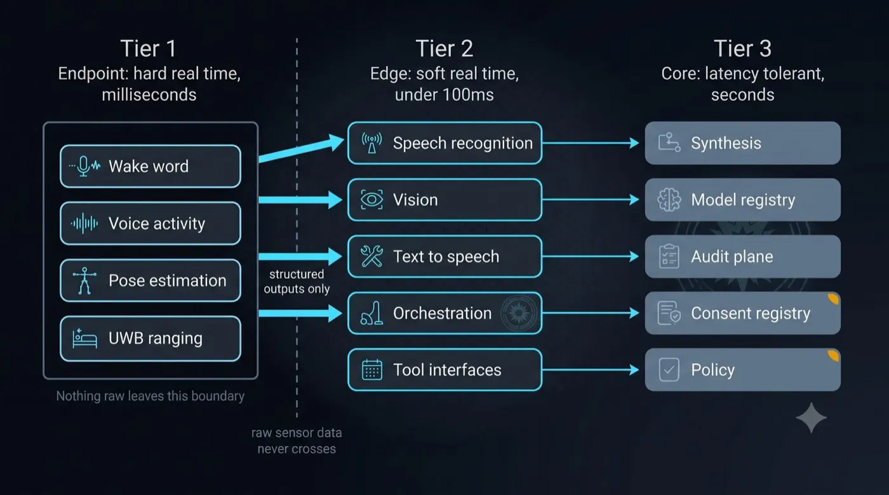
<figcaption>Figure 5: Hard real time stays on the endpoint. Soft real time runs at the edge. Latency-tolerant work sits in the core. Hard real-time raw stays on the endpoint; heavier recognition stays on-premise.</figcaption>
</figure>
### 7.1 Latency classes determine placement

Workloads separate cleanly by how much delay they tolerate, and that separation determines where each one runs.

| Class | Budget | Where | What |
|---|---|---|---|
| **Hard real time** | Milliseconds | On the endpoint | Wake word, voice activity detection, pose estimation, UWB ranging |
| **Soft real time** | Under 100ms | Edge, on or near premise over fibre | Streaming speech recognition, vision, text to speech, identity matching |
| **Latency tolerant** | Seconds | Core | Note generation, cross-system synthesis, conflict reconciliation, aggregation, governance |

Two consequences follow that are worth stating plainly, because both are counter-intuitive.

**The endpoint needs modest inference, not heavy inference.** Wake word and pose estimation are small convolutional models. They do not require a data-centre GPU, they require a neural processing unit costing tens of dollars.

**The network is not the bottleneck, and moving compute closer does not fix a slow agent.** Orchestration dominates the latency budget by an order of magnitude. Light in fibre travels roughly five microseconds per kilometer, so a near-premise facility twenty kilometers away costs about two hundred microseconds round trip, which is invisible against a multi-second planning cycle. The meaningful boundary is not distance. It is whether the path crosses the public internet and whose trust domain the compute sits in.

### 7.2 Tier 1: the endpoint

**The terminal is an abstraction, not a product.** Its requirements are short: render a web view, play audio out, capture audio in, run a small local daemon, network, and remote manageability. A camera and a local neural processing unit are required only for identity and observation workloads.

Three of the six outcomes require no camera at all, which removes the hardest regulatory constraint from the entry-level deployment.

**Roles separate at scale.** Presentation, audio, sensing, and compute are one device in a prototype. In a hospital they need not be. A room might use an existing bedside screen for presentation, a ceiling microphone array for audio, an existing telehealth camera for sensing, and no dedicated compute at all.

**What it can run on, in three categories:**

*Already installed.* The interactive patient systems market was approximately $2.8 billion in 2025, with hardware representing 50 to 60 percent of revenue, covering bedside terminals, patient-facing kiosks, and integrated platforms with open API integration to electronic health records. In a large fraction of hospitals there is already a screen, a network drop, and an EHR integration at every bed. Telehealth carts are better equipped still: screen, pan-tilt-zoom camera, quality microphone array, and compute. Workstations on wheels are at the bedside already.

*Purpose built.* Medical-grade panel computers are a mature category with IEC 60601-1 certification, antimicrobial and cleanable housings, fanless operation, and DC power, available from several established vendors, any of which will manufacture to specification.

*Sensing-capable.* Where local pose estimation is required, an embedded module with an integrated GPU or neural accelerator, sharing the same model toolchain as the server tier, removes an entire class of conversion and validation work.

**Audio deserves specific attention.** Far-field capture across a room, with a television or equipment noise present, is the single most common failure mode in voice deployments. A microphone array with on-chip acoustic echo cancellation, beamforming, and noise suppression does more for perceived quality than any other component choice, and it is the enabler for barge-in, which is the ability to interrupt the device mid-sentence.

### 7.3 Tier 2: the edge

On-premise or near-premise inference, connected by fibre, running:

- **Streaming speech recognition** for conversational turns and ambient documentation
- **Vision inference** for presence and identity where those are used
- **Text to speech**
- **The orchestration engine**, planning, calling tools, and synthesising
- **Tool interfaces** to the hospital's existing systems

**Serving matters more than models.** An inference server with dynamic batching and concurrent model execution is the difference between "a fraction of one accelerator" and "a rack." Five hundred discrete detection requests per second become a handful of batched GPU calls. Mature open-source inference servers provide this along with per-model metrics, including inference queue duration, which is the direct signal for whether batching headroom remains. That metric is what makes capacity planning empirical rather than theoretical.

**Continuous sensor pipelines are a different runtime.** Where the input is a continuous stream rather than discrete requests, a purpose-built streaming runtime is appropriate, and several exist with explicit medical-device edge positioning.

### 7.4 Tier 3: the core and the governance plane

The core tier holds what is latency tolerant and what must be centralised for governance rather than for performance:

- Note generation and long-context synthesis
- Cross-facility aggregation for operational analytics
- **Model registry**, with version pinning, model cards, and performance and fairness metrics
- **Audit plane**, tamper-evident and indexed by patient and by principal
- **Consent registry**, patient-level, honored across every terminal, surviving room transfers
- **Policy plane**, defining what each role may reach

Critically, this tier holds **metadata, model versions, access logs, and aggregated insight**, and does not centralise raw sensor data. That is the same boundary the companion paper defines, and it holds here for the same reason.

### 7.5 Tool integration is the actual product

The intelligence in this architecture comes from an orchestration engine that plans a task, calls tools, evaluates the result, and revises. The tools are the hospital's existing systems, exposed through a standard interface.

| Tool | Backing system | Used by outcome |
|---|---|---|
| `locate_asset` | RTLS | 1 |
| `asset_service_status` | CMMS | 1 |
| `room_status`, `set_room_status` | EVS platform | 2 |
| `bed_availability` | ADT and bed management | 2 |
| `case_schedule` | Surgical scheduling | 3 |
| `staff_roster` | Workforce management | 3 |
| `who_is_present` | Terminal presence and UWB | all |
| `notify_role` | Existing paging or secure messaging | 2, 3, 6 |

**A critical property: the planner decides which tools to call.** "Is operating room four ready for the first case?" is not a lookup. It is a plan: check the case schedule, check the room's cleaning status, check the equipment required by the case, locate that equipment, check the assigned staff against the roster, and synthesize a single answer. That is a multi-step task with intermediate reasoning, and it is precisely what a planning orchestrator does and a dashboard cannot.

This is also the answer to a question hospital architects will rightly ask: what happens when we add a system? The answer is a tool definition, not an integration project.

### 7.6 Output verification as a gate

An orchestration layer intended for a regulated environment needs a step that most conversational systems lack: an impartial evaluation of the finished output before it is treated as complete, combining assertion checks, scoring against a rubric, and a faithfulness review that verifies claims against the retrieved evidence.

Two operating modes matter. **Advisory**, where a failing report is recorded and surfaced, is appropriate for operational outcomes. **Enforcing**, where a failing report fails the run before the output is delivered, is what a clinical deployment requires. The gate re-executes nothing; it evaluates.

For the clinical decision support exemption, the requirement that a clinician be able to independently review the basis of a recommendation turns this from a quality feature into a compliance mechanism. Every clinical output must carry its sources, the model version that produced it, and the tool calls that informed it.

---

## 8. THE NETWORK: WHY THIS IS A TELECOM PROBLEM

### 8.1 The arithmetic that decides the transport

For a reference facility of 400 staffed beds with approximately 600 terminals at full coverage, and roughly 30 percent engaged at any moment, **assistant workloads that stream discrete vision frames and conversational audio to an on-premise edge** size approximately as follows:

| Stream | Aggregate uplink inside the building |
|---|---|
| Vision, discrete frames, presence and identity only | 250 to 400 Mbps |
| Audio, conversational turns | 15 to 40 Mbps |
| Audio, continuous ambient documentation | additional 10 to 20 Mbps |
| **Total, assistant workloads to edge** | **~300 to 450 Mbps sustained** |

This table is **not** a claim that raw media leaves the hospital. It sizes the room-to-edge path inside the trust domain. With continuous observation and pose inference on the endpoint, the video contribution collapses, because skeleton keypoints are a few kilobytes per second rather than megabits. Endpoint inference is therefore both a privacy control and a bandwidth control.

On fiber, the aggregate is not remarkable. **The transport problem is quality, isolation, and mobility, not total bits.**

### 8.2 Why shared Wi-Fi becomes operationally difficult

<figure class="whitepaper-figure">
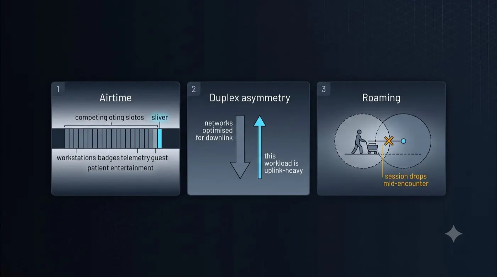
<figcaption>Figure 6: Airtime contention, uplink-heavy load, and roaming drops are the failure modes. Aggregate throughput is not the constraint.</figcaption>
</figure>
Many hospitals run large clinical environments on managed Wi-Fi successfully. The claim here is not that Wi-Fi is incapable. It is that this workload shape becomes operationally difficult beyond certain densities and mobility patterns, and that private cellular is one answer, not the only one. Hybrid models that keep Wi-Fi and add indoor cellular or neutral-host coverage are already the direction of travel for many systems.

**Airtime, not published throughput.** Classic Wi-Fi contention is half-duplex and hostile to constant small uplink frames mixed with workstations on wheels, badges, telemetry, entertainment, and guest traffic. Wi-Fi 6 and 7 improve this with uplink OFDMA, trigger frames, and BSS coloring. Those features help, and a fair critique must say so. They do not erase co-channel load, sticky-client roaming, or the operational reality of a shared SSID carrying entertainment and clinical traffic together.

**The workload is uplink-heavy.** Assistant and observation streams send more up than down. Cellular NR TDD configurations often favor downlink by design; changing them on CBRS is constrained by synchronization and neighbor interference, so "duplex is a free configuration choice" is only conditionally true. The useful contrast is not a false claim that Wi-Fi has a TDD frame. It is that private cellular can dedicate a slice and a QoS class to this uplink shape in a way shared clinical Wi-Fi rarely does in practice.

**Roaming.** A cart crossing a ward boundary mid-encounter can still drop a speech stream when roam and reauthentication are slow. Cellular handover is built for mobility; Wi-Fi can be engineered carefully and still fails more often in real buildings than a lab diagram suggests.

**Coverage.** Mid-band private cellular often handles thick masonry and lift shafts with fewer radios than dense 5 or 6 GHz Wi-Fi. Lead-lined imaging suites attenuate essentially all RF; both technologies need a radio inside the room. Drop the lead-lining talking point.

**Identity at scale.** At several hundred to several thousand devices, SIM-based authentication provides hardware-rooted, centrally provisioned, individually revocable device identity with less certificate sprawl than many Wi-Fi enterprise deployments.

### 8.3 Slicing as a governance boundary

This is the strongest argument for private cellular in this context, and it is not a performance argument. Lead with it.

A dedicated network slice for clinical ambient audio, separate from the operational slice, separate from guest access, separate from building management, implements data segregation **in transport** rather than in a firewall rule.

<figure class="whitepaper-figure">
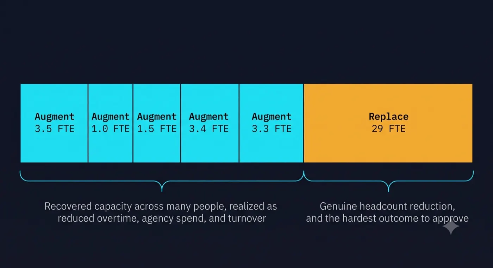
<figcaption>Figure 7: A single private cellular network carries logically separated slices with separate keys, QoS and audit.</figcaption>
</figure>
 Each slice carries its own quality-of-service guarantee, its own encryption keys, and its own audit plane.

When a privacy officer asks how clinical audio is isolated from building management telemetry, "it is a separate slice with separate keys and a separate audit trail" is a materially different answer from "we have VLANs."

The companion paper argues that commercial, law enforcement, and medical streams should be architecturally separated with independent governance and access control. Network slicing is that principle implemented at the transport layer.

### 8.4 Ultra-wideband: the identity signal that does not degrade

UWB provides centimeter-level ranging and precise relative positioning, and it solves problems the other signals cannot.

**Identity where face fails.** In a patient room the clinician is masked, at an angle, moving, often backlit. A badge does not care about any of that, and it reports not only who but how far and roughly where.

**Asset location at useful resolution.** Room-level or bed-level positioning is the difference between "the pump is in the building" and "the pump is in 412." Existing RTLS deployments frequently operate at zone resolution; UWB is what makes outcome 6.1 answerable rather than approximate.

**Consent and arming.** A badge crossing a threshold is a cleaner signal that the device should become attentive than a camera inferring intent.

**Sensor fusion, which is the name of the thing.** Combining badge, directory, face, and voice into a graded confidence score, with a floor set per capability, is a better identity system than any one of them and is robust to the failure of each.

---

## 9. GRACEFUL ADOPTION: OUTCOME FIRST, FOOTPRINT SECOND

<figure class="whitepaper-figure">
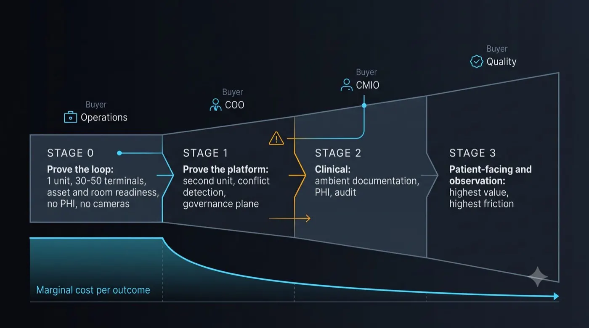
<figcaption>Figure 8: Outcome first, footprint second. Stage 0 proves the loop with operational outcomes only. Marginal cost per outcome falls as the platform is reused.</figcaption>
</figure>
### 9.1 Nobody buys the whole thing

Full coverage of a 400-bed facility is approximately 600 terminals at roughly 1.5 per staffed bed. **That number is a scale proof, not a proposal.** It exists to demonstrate that the architecture, the network, and the compute hold at full density. It is not how anyone would begin.

Adoption is driven by outcome, and each outcome has its own footprint, its own endpoint specification, and, critically, its own budget holder.

| Outcome | Where | Endpoint | Units (400 beds) | Buyer |
|---|---|---|---|---|
| Asset location and readiness | Nurse stations, clean and soiled utility, supply | Audio, screen, no camera | 30 to 60 | Operations, supply chain |
| Room readiness and turnover | Patient rooms, EVS staging, bed control | Audio, screen, or existing bedside system | 0 to 350 | Operations, EVS |
| Schedule conflict detection | OR control, charge desks, board rooms | Audio, screen | 15 to 30 | Perioperative, COO |
| Clinical documentation | Exam rooms, physician workspaces | Audio only | ~200 | CMO, CMIO |
| Patient interaction | Patient rooms | Existing bedside system | 0 new | Patient experience |
| Safety observation | High-risk units only | Camera, local NPU | 40 to 80 | Quality, risk |

Two properties of that table matter more than the numbers.

**Different outcomes have different buyers.** That is not a complication, it is the adoption path. You do not need one large approval. You need one department to say yes and then expand into a platform the next department does not have to purchase again.

**The lowest-friction entry point requires no new hardware and no camera.** Asset and room readiness at nurse stations, running on existing screens, audio only. No biometric exposure, no device classification, no PHI in the queries, no installation project.

### 9.2 A four-phase sequence

**Phase 0: prove the loop.** One unit, thirty to fifty terminals, outcomes 1 and 2. Existing network where possible. Measure recovered nursing time, equipment search duration, and time from actual-clean to known-clean. Establish the capacity coefficients described in Section 10.

**Phase 1: prove the platform.** Extend to a second unit and a second outcome, typically schedule conflict detection, which requires almost no new endpoints and demonstrates cross-system synthesis. Introduce the governance plane and the audit trail. This is where private cellular becomes worth deploying, because the footprint now spans buildings.

**Phase 2: enter the clinical domain.** Ambient documentation for a physician cohort. First encounter with PHI at scale, so business associate agreements, audit, and consent processes must be in place before, not during.

**Phase 3: patient-facing and observation.** Highest value per unit and highest regulatory friction. Entered with a regulatory strategy, a consent registry, and a clinical governance committee, or not entered.

**Every subsequent phase costs less than the first**, because the network, the compute, the identity integration, and the governance plane are already paid for. That is the definition of graceful, and it is the property that makes the proposition survivable at a hospital's actual pace of change.

---

### 9.3 Who has to say yes

Technology is rarely why hospital programs stall. Veto power is distributed.

| Stakeholder | What they need to believe | Typical objection |
|---|---|---|
| COO / operations | Outcomes 1–3 move measurable flow metrics | Another pilot that does not survive first contact with the floor |
| CNO / nursing councils | Saves time without surveillance theater | Microphones and presence feel like monitoring |
| CIO / enterprise architecture | Fits identity, network, and integration standards | Yet another stack beside Epic and the RTLS |
| CMIO / clinical informatics | Clinical phases are gated and evidence-based | Ambient and observation vendors already exist |
| CISO / privacy / legal | Architectural controls beat BAAs alone | Biometric and recording statutes; BAA still required for PHI phases |
| Clinical engineering / biomed | Endpoints are maintainable and cleanable | Fleet failure rates and infection-control materials |
| Supply chain / finance | Increment over incumbents, not gross category value | Soft dollars and deferred capital games |
| Unions / labor relations | Positioned as asset and operational assistant | Presence detection and ambient audio as workforce monitoring |
| Patient experience | Visible mute and consent | Room devices that feel like cameras always on |

A deployment that cannot name a sponsor in operations and a sponsor in nursing will not clear the rest of the table. Section 11.6 is written for that reality.

## 10. PREDICTABLE SCALING: THE ARGUMENT CLOUD CANNOT MAKE

### 10.1 The problem with consumption pricing in a hospital

Cloud AI is priced per token, per minute, or per call. Three consequences follow, and each is genuinely hostile to how hospitals plan:

**Cost scales with adoption, so success raises the bill.** A pilot that goes well produces a budget variance.

<figure class="whitepaper-figure">
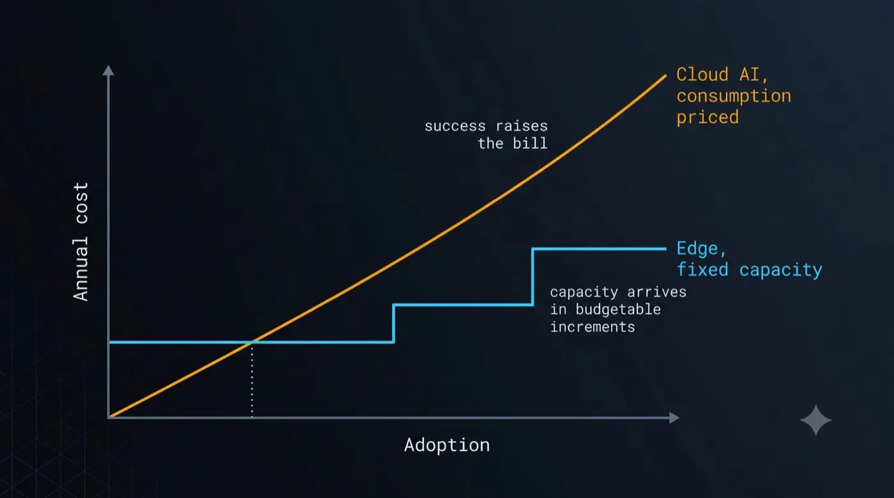
<figcaption>Figure 9: Cloud AI is consumption priced: success raises the bill. Edge capacity arrives in budgetable increments.</figcaption>
</figure>
**The bill is discovered in arrears.** A chief financial officer cannot budget it and a chief information officer cannot cap it without capping the service.

**The vendor sets the price and can change it.** A hospital that has integrated a capability into clinical workflow has limited negotiating position at renewal.

Health systems operate on thin margins, plan on annual capital cycles, and are institutionally conservative about variable operating expense. A model where the better it works the more it costs is not a pricing detail. It is a structural mismatch.

### 10.2 Why this architecture is calculable

Every input to the capacity model is a number the hospital already measures precisely and has years of history for.

| Workload | Driver | Hospital already knows |
|---|---|---|
| Vision | terminals × frame rate × duty cycle | Room count, census, occupancy |
| Speech recognition | concurrent encounters × mean duration | Encounters per hour by department |
| Synthesis and note generation | encounters per day × output length | Encounter volume, note length |
| Tool calls | queries per terminal per shift | Measured in the pilot |
| Storage | records per day × retention | Policy |

That permits something no consumption-priced vendor can offer: **a published capacity table with stated coefficients, verifiable by the hospital's own team against their own volumes, before signing anything.**

For the reference facility, consolidated inference across the whole hospital lands in the range of a small number of accelerators, not a data centre. Vision batches to near nothing. Speech recognition is the sustained cost and scales with concurrent encounters rather than with terminal count. Synthesis is latency tolerant and batches well.

### 10.3 Three properties a finance leader will repeat back

**Marginal cost of the next terminal is near zero until a step.** Adding fifty rooms to a deployment with headroom costs the endpoints and nothing else. Capacity arrives in visible increments, and increments are budgetable in a way that a slope is not.

**Recurring cost is knowable in advance and does not track usage.** Power, support, and a hardware refresh cycle. No egress charges, no per-token exposure, no repricing risk.

**Success does not raise the bill.** Moving from 20 percent clinician adoption to 90 percent consumes headroom already purchased. On a per-clinician monthly contract, that same success is a four-and-a-half-fold cost increase.

### 10.4 How to prove it rather than assert it

Instrument the capacity model from the first deployment and publish it as part of the product. Modern inference servers expose the necessary telemetry natively, including per-model queue duration, which directly indicates remaining batching headroom.

A pilot on one unit should produce measured coefficients: accelerator-seconds per encounter, per detection, per generated note. Those project to the full deployment with a stated error band. **If a health system can be handed a model, plug in their own volumes, and then watch the pilot hit the number, that is an argument no cloud vendor is structurally able to make.**

The companion paper argues that edge inference wins on bandwidth economics and privacy properties. In healthcare there is a third property, and it may be the most persuasive of the three: **the cost is calculable before you commit, and it stays calculable afterwards.**

---

## 11. THE VALUE CASE: CAPACITY, NOT HEADCOUNT

<figure class="whitepaper-figure">
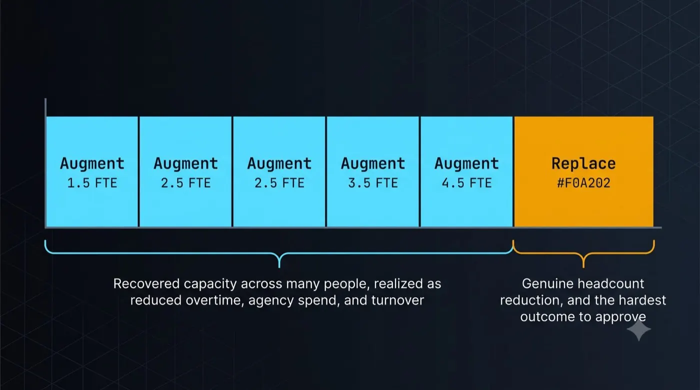
<figcaption>Figure 10: Five of six outcomes recover fractional capacity across many people. Only one produces genuine headcount reduction, and it is the hardest to approve.</figcaption>
</figure>
A companion workbook accompanies this paper. Every figure below is a formula over a labeled, editable assumption, and every assumption is a number a hospital already measures. The intent is that a finance team should be able to replace the inputs with their own and either confirm or destroy the case in an afternoon. That is the point: a model you can argue with is worth more than a number you have to believe.

### 11.1 The framing matters more than the arithmetic

Three framing rules determine whether a hospital finance audience will keep reading.

**Price the increment, not the category.** Outcome 1 is not worth the entire historical "hour per shift" RTLS productivity claim. Outcome 4 is not worth both the documentation relief ambient vendors already sell and the avoided subscription. The model in the companion workbook should be read as **illustrative incremental value over the tool the hospital already owns or would otherwise buy**. Gross category value is a sizing aid. The proposal number is the delta.

**Capacity is not headcount.** Five of the six outcomes return fractional time across a population. Recovering minutes per shift across inpatient bedside nurses is capacity, not a reduction-in-force slide. Soft dollars realize as reduced overtime, reduced agency spend, lower turnover, more bedside time, and headroom for census growth. If those channels do not move, a CFO will correctly score the line near zero.

**Adoption is the largest unmodeled risk.** A system introduced as surveillance or as a headcount program will be routed around. A voice interface people avoid returns nothing. Far-field audio in rooms with alarms, television, and HVAC is harder than lab demos. Behavioral friction belongs in the pilot plan, not in a footnote.

### 11.2 Augment and replace are different products

Illustrative annual figures below use **inpatient bedside RN FTEs (~280)**, not organization-wide RN headcount, for outcome 1, so the denominator matches the people who walk looking for pumps. Appendix A's day-peak of roughly 70 to 95 nurses on site is the operational check on that population. Outcome 4 FTE-equivalents use the same 40 percent realization factor as the dollar line. Deferred equipment capital is excluded from the annual line and treated as a one-time timing benefit in the workbook.

| Outcome | Illustrative annual increment | FTE-equivalent | Type |
|---|---|---|---|
| 1. Asset location and readiness | ~$0.6M | ~3.5 | Augment |
| 2. Room readiness and turnover | ~$0.3M | ~1.0 | Augment |
| 3. Schedule and conflict detection | ~$0.9M | ~1.5 | Augment |
| 4. Ambient clinical documentation | ~$0.8–1.2M | ~3.4 | Augment |
| 5. Patient interaction | ~$0.4M | ~3.3 | Augment |
| 6. Safety observation | ~$1.7M | ~29 | **Replace** |
| **Illustrative full-scope total** | **~$5–7M** | **~40+** | **~29 actual posts only in outcome 6** |

Two observations matter more than the total.

**Exactly one outcome produces genuine headcount reduction.** Sitter substitution is the only replace line, and it carries the hardest regulatory and labor path. Remove outcome 6 and the case is almost entirely soft dollars. That can still be a good case. It is a different conversation.

**The operational outcomes remain the beachhead.** Outcomes 1 through 3 require no PHI, no biometrics, and no cameras, and they are delivered by calling systems the hospital already owns. Their value is the interface and composition increment, not a claim that RTLS never existed.

### 11.3 Investment and return

Two scopes are modeled. Full deployment covers all six outcomes at approximately 600 terminals. Phase 0+1 covers outcomes 1 through 3 only, at approximately 100 terminals, with no protected health information, no cameras, and no biometric processing anywhere in the deployment. Terminal installed cost is treated as a sensitive input: medical-grade installs often run well above a sub-$1,000 prototype number once cabling, mounting, biomed, and infection-control sign-off are counted. The workbook exposes that input rather than hiding it.

| | Full deployment | Phase 0+1 |
|---|---|---|
| Terminals | ~600 | ~100 |
| Capital | ~$2.5–4M+ | ~$0.6–1.2M |
| Annual operating | order ~$0.8M | order ~$0.2M |
| Illustrative annual value at full realization | ~$5–7M | ~$1.5–2.5M |
| Indicative payback | mid-teens months | roughly one year, before soft-dollar discount |

Benefits ramp over the first two years. Capital falls in year zero.

**The phase 0+1 column has the better return on capital and the lower political surface**, which is the result that should shape the proposal.

<figure class="whitepaper-figure">
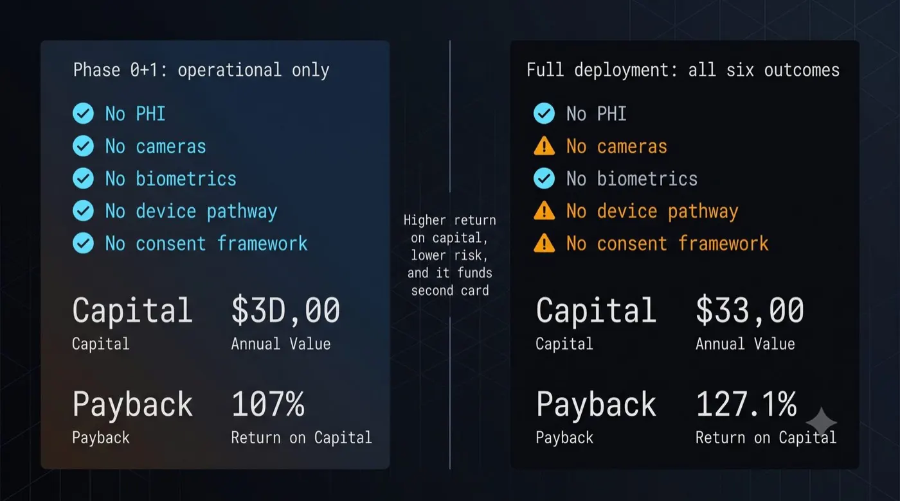
<figcaption>Figure 11: The operational entry point carries lower regulatory friction and a stronger return on capital. It funds the second card.</figcaption>
</figure>
 The expensive components, private cellular, ultra-wideband anchor infrastructure, camera-capable endpoints, and integration to clinical systems, are all deferred, while the outcomes that carry no regulatory friction are delivered in full.

### 11.4 Apply the discount to yourself before finance does

Five of the six outcomes return soft dollars. A hospital finance function will discount those by 30 to 50 percent, and it is correct to do so.

The model exposes that as an input rather than burying it. At a 40 percent discount applied to the five augment outcomes:

<figure class="whitepaper-figure">
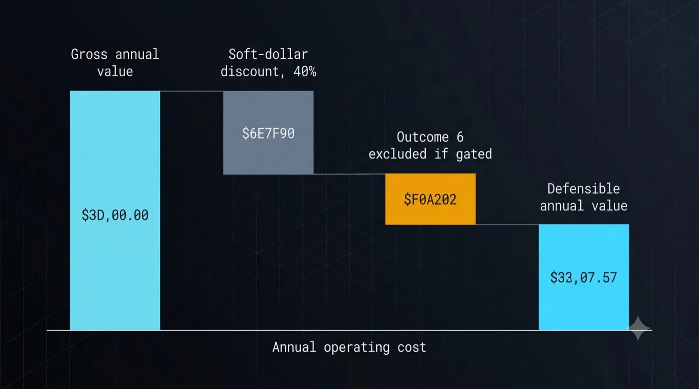
<figcaption>Figure 12: Illustrative gross value discounted for soft dollars, with outcome 6 excluded when gated, yields a defensible range a finance team can argue with.</figcaption>
</figure>
| | Undiscounted | At 40% soft-dollar discount |
|---|---|---|
| Full deployment, illustrative annual value | ~$5–7M | ~$3.5–5M |
| Full deployment, indicative payback | mid-teens months | high-teens months |
| Phase 0+1, illustrative annual value | ~$1.5–2.5M | ~$1–1.7M |
| Phase 0+1, indicative payback | ~12 months | ~16 months |

The case survives comfortably. Presenting it pre-discounted is also a credibility decision: a business case that has already conceded the discount reads very differently from one where the discount is discovered.

### 11.5 What actually moves the answer

Four inputs dominate, and none of them is a technology variable. Any facility considering this should establish all four before a number is quoted.

**Occupancy.** Outcome 2 converts faster bed turnaround into recovered bed-days, and recovered bed-days are worth nothing if there is nothing waiting to fill them. Below roughly 65 percent occupancy the outcome approaches zero. Above 85 percent with active turn-aways it is worth three to five times the modeled figure. Post-pandemic national occupancy has often run above a 70 percent conservative base, which strengthens this line where boarding exists. **Ask about occupancy and emergency department boarding hours before quoting anything.**

**Payer mix.** Contribution margin per admission ranges from under $1,000 in a Medicare-heavy safety-net facility to over $5,000 in a commercially insured suburban one. That single input swings outcomes 2 and 4 by a factor of three.

**Whether outcome 6 is in scope.** Discussed above. It carries more than half of the actual headcount effect and none of the regulatory ease.

**Adoption.** Every recovered hour assumes clinicians use the system. This is the risk no spreadsheet captures and the one most likely to determine the result.

### 11.6 Pilot validation plan

Ninety days. One clinical unit. Thirty to fifty terminals. Outcomes 1 and 2 only. No protected health information, no cameras, no biometric processing, no consent framework required.

**Success criteria, stated in advance:**

1. Equipment search time per shift falls by a pre-agreed percentage against a measured baseline.
2. Elapsed time from actual-clean to known-clean falls by a pre-agreed percentage.
3. Composed readiness answer correctness stays above a pre-agreed threshold, including graceful "last seen" answers when confidence is low.
4. Clinician use is voluntary and sustained: sessions per shift and route-around rate are reported, not assumed.
5. Capacity coefficients from Section 10 are published and checked against the unit's own volumes.

**Explicit non-goals for the pilot:** no headcount reduction claim, no PHI, no biometric enrollment, no observation workload, no dependence on private cellular if existing wired or carefully segmented wireless paths can carry the edge traffic.

That pilot costs a fraction of the phase 0+1 capital, requires no IRB process for pure operational metrics, and produces the only two things that matter: measured coefficients that make the rest of the model arguable, and evidence of whether clinicians actually use it.

**If those numbers move, the platform argument makes itself**, because every subsequent outcome runs on network, compute, identity integration, and governance that has already been paid for.

### 11.7 What would invalidate this

Stated plainly, because a business case that lists no failure modes is not a business case.

- **Adoption below roughly 50 percent** removes most of the value in every augment outcome simultaneously.
- **A capacity-unconstrained facility** removes outcome 2 entirely and materially weakens outcome 3.
- **Regulatory or labor blocking of outcome 6** removes all genuine headcount reduction.
- **Integration failure**, where hospital system vendors will not expose adequate interfaces, removes outcomes 1 through 3 at the root, since they are entirely composed of calls to existing systems.
- **Operational figures proving materially smaller in practice** than the health services literature suggests. The equipment search time input in particular is a literature range used here at its conservative end, and it should be measured directly in the pilot rather than assumed.

**None of the failure modes above are technology risks.** That is worth noticing. The architecture is not the uncertain part.

---

## 12. SECURITY, PRIVACY, AND GOVERNANCE

<figure class="whitepaper-figure">
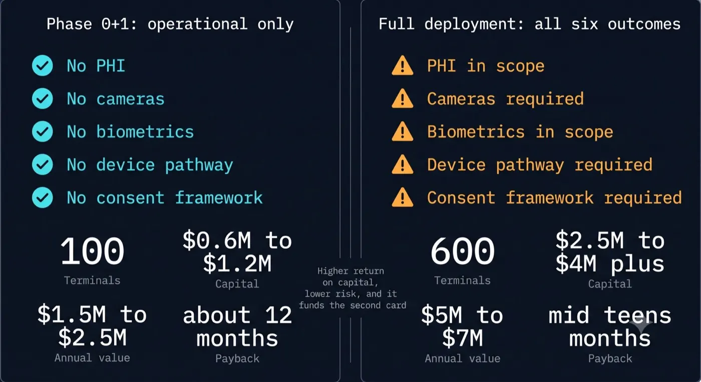
<figcaption>Figure 13: Wake word and pose stay on the endpoint. Heavier recognition stays on-premise. Structured outputs leave the trust domain. There is no vendor-side encounter repository to breach.</figcaption>
</figure>
### 12.1 The organizing principle

Every vendor in this space offers policy controls: a business associate agreement, a retention setting, a data processing addendum, and a promise. The controls described here are **architectural**. The distinction is the entire security argument.

A policy control requires trusting that the operator discards data correctly. An architectural control removes the data from the trust boundary, so there is nothing to discard. Hard real-time raw stays on the endpoint; heavier recognition stays on-premise. There is no vendor-side encounter archive whose retention setting is the only control.

### 12.2 Layered controls

**Layer 1: endpoint versus building.** Wake-word detection and voice activity detection run on the endpoint; nothing is transmitted before the device has been addressed. Captured audio for those functions lives in a bounded in-memory buffer and is never written to disk, enforced by a test that fails on any write. For observation workloads, pose inference runs on the endpoint and only skeletons and state labels travel. Speech recognition and face matching for assistant workloads may leave the room for the on-premise edge and still must not leave the hospital trust domain as a retained vendor archive.

**Layer 2: identity and authorisation.** The badge or face authenticates; the directory authorises. A misconfigured identity path fails loudly rather than merging users. An unrecognised person receives a restricted session automatically, and that boundary is tested rather than configured.

**Layer 3: scope isolation.** Per-principal session, memory, and knowledge scoping. Guest and restricted sessions provably exclude sensitive tools. Multi-tenant isolation where one platform serves several facilities in a system, with cross-tenant tool calls structurally impossible rather than policy-prevented. Break-glass emergency override as a distinct, heavily logged, time-boxed path rather than an exception coded around.

**Layer 4: egress control.** Redaction of identifiers before any cloud model call, with reversible tokenisation where reversal is needed. More importantly, **capability removal**: requests marked private or offline drop cloud providers from the available catalog entirely, so egress is not filtered but unavailable. A filter must be trusted. A capability that is not present need not be.

**Layer 5: output verification.** The impartial gate of Section 7.6, in enforcing mode for clinical outputs.

**Layer 6: audit.** Tamper-evident, append-only, indexed by patient and by principal, with the model version recorded against every output, retained under policy, and queryable by a compliance officer.

**Layer 7: consent.** Patient-level opt-out recorded at admission, honored across every terminal, revocable, and surviving room transfers. Visible, unambiguous device state from the bed. A hardware indication tied to the sensor, because a software mute is not a promise you can make to someone who cannot leave the room.

### 12.3 A note on terminology

"Anonymization" is used loosely in this industry and the legal consequences of the three common meanings differ substantially.

| Term | Meaning | Status |
|---|---|---|
| Pseudonymisation | Identifiers replaced with a reversible key | Still personal data, still PHI |
| De-identification | HIPAA standard: Safe Harbor removal of 18 identifiers, or Expert Determination | No longer PHI |
| Anonymization | Irreversible, no re-identification path | Out of scope of GDPR |

Most systems claiming anonymization perform pseudonymisation. That is a legitimate control and it is not the stronger claim. Any implementation of this architecture should state precisely which of the three it performs, and for clinical text should name the standard it meets, noting that automated redaction of free-text clinical dictation routinely misses dates, ages, and names in context.

### 12.4 Fail-safe direction as a design principle

Several defaults are stated here because they should be written down as principles rather than left as implementation choices:

- No signal means no automatic mute. Fail toward remaining armed and honest rather than silently deaf.
- If mute cannot be confirmed, do not display mute. The worst failure available is a mute indicator over a live microphone.
- An empty permission set denies everything. A fresh deployment is closed until deliberately opened.
- A monitoring workload that goes silent is an alarm condition, not an absence of events.

### 12.5 The regulatory map

| Domain | Applies to | Consequence for design |
|---|---|---|
| HIPAA | Outcomes 4, 5, 6 | BAAs, audit, minimum necessary, breach notification |
| State biometric privacy statutes | Any face or voice matching of patients, public, or staff | Avoid patient biometrics entirely; Illinois BIPA private right of action; TX/WA AG enforcement still material; staff biometrics need written BIPA-grade releases and retention schedules |
| FDA CDS guidance (Jan 2026 final) | Outcome 6, parts of 4 | Time-critical and signal-analysis paths are device territory; do not lean on casual CDS exemption; human-in-loop observation is the incumbent pattern |
| 42 CFR Part 2 / state consumer health acts | Substance use and certain consumer health data | Separate consent and disclosure rules beyond HIPAA baseline |
| Recording consent statutes | Outcomes 4, 5, 6 | Consent must cover others present, not only the addressed person |
| Life safety codes | Any interaction with nurse call | Explicitly out of that path, or in it with an entirely different reliability posture |
| GDPR, AI Act, and equivalents | Any deployment outside the United States | Lawful basis, risk classification, conformity assessment, human oversight |

Outcomes 1 through 3 sit outside all but the last row. That is the reason they are the beachhead.

---

## 13. WHAT EXISTS TODAY, WHAT MUST BE BUILT, WHAT IS ARGUED

<figure class="whitepaper-figure">
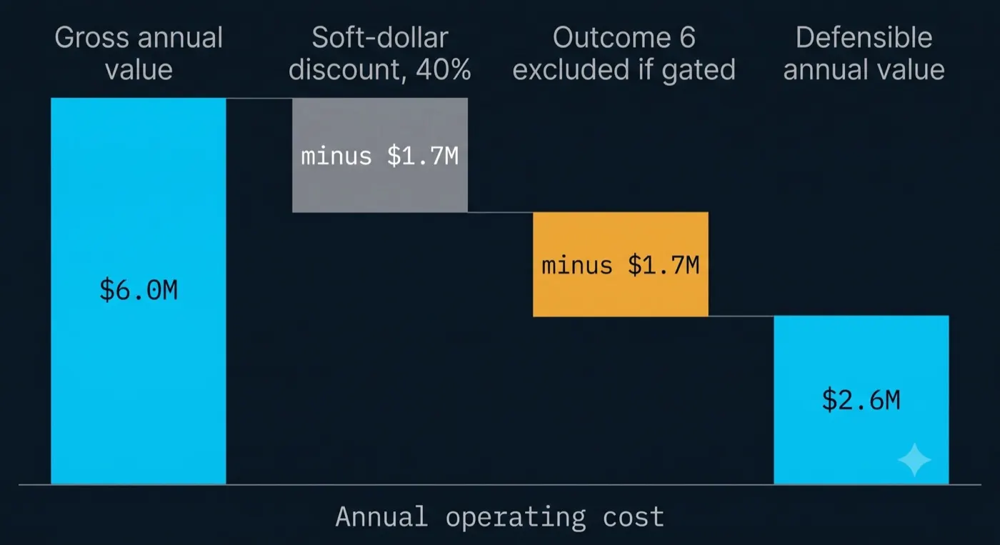
<figcaption>Figure 14: Components available today, integration that must be built, and claims that remain argued rather than proven.</figcaption>
</figure>
Intellectual honesty about maturity is worth more than enthusiasm, so this section is explicit.

### 13.1 Exists today, commercially or as mature open source

- Speech recognition small and fast enough for edge deployment, in multiple open implementations
- Text to speech of adequate quality running on commodity hardware
- Wake-word models trainable on custom phrases from synthetic audio
- Person detection, face recognition, and pose estimation as commodity models
- Inference servers with dynamic batching, concurrent model execution, and native telemetry
- Streaming sensor runtimes with explicit medical-device edge positioning
- Orchestration engines with dynamic planning, tool calling, session memory, and output evaluation
- Standard tool interfaces for connecting systems to agents
- Private cellular networks in shared and licensed spectrum, deployable by a hospital or an operator
- Ultra-wideband positioning at centimeter resolution
- Real-time location, maintenance management, environmental services, scheduling, and workforce systems, already installed in most facilities of any size
- Medical-grade panel computers and an installed base of interactive patient systems

**None of the components in this architecture require invention.**

### 13.2 Built as a working reference implementation

A functioning system exists comprising a terminal running wake-word detection, voice activity detection, and a rendered presence; an attention state machine with formally specified transitions and invariants; identity-mapped sessions where the recognised identity becomes the session identity; a vision client for presence and face matching; speech recognition and synthesis in both remote and local-fallback configurations; a device-code OAuth pairing flow with an on-screen code; a reverse tunnel that exposes terminal-local capabilities to a remote orchestrator without opening a port; and an orchestration engine with dynamic planning, tool integration, session memory, egress redaction with capability removal, and an output verification gate.

It runs on a single-board computer and a workstation GPU in a private residence. It is a proof of the loop, not a product, and its hardware is incidental.

### 13.3 Must be built

- The tool layer to hospital operational systems and EHRs, which is the majority of the outcome-specific work: HL7 v2 and FHIR wrappers, SMART on FHIR where interactive apps are in scope, vendor-neutral middleware, and durable adapters to Epic, Oracle Health, MEDITECH, RTLS, CMMS, EVS, and scheduling platforms that are often slow or expensive to open
- Readiness composition across location, cleaning, service, and reservation state, with confidence propagation and graceful degradation
- Proactive conflict reconciliation as a scheduled orchestration task
- The audit plane, at compliance grade rather than developer grade
- The consent registry
- The capacity model, instrumented and published
- Endpoint hardening, remote management, sterilization-tolerant materials, hardware mute indicators tied to the microphone rail, and watchdog heartbeats so a silent observation device is an alarm rather than a quiet failure
- Fleet lifecycle costs that survive real hospital endpoint failure rates under aggressive cleaning chemicals
- Clinical validation for anything in outcomes 4 through 6

### 13.4 Argued, not demonstrated

- That hospitals will adopt a spoken interface at scale in clinical settings
- That the recovered-time and throughput benefits are as large in practice as the operational literature suggests
- That private cellular economics work at single-facility scale rather than only at system scale
- That the deterministic-cost argument is as persuasive to health system finance leaders as it appears to be
- That the regulatory pathway for outcome 6 is navigable on a reasonable timeline

**The prototype demonstrates feasibility. It does not demonstrate adoption, and no honest paper should claim otherwise.**

---

## 14. KNOWN CONSIDERATIONS AND OPEN QUESTIONS

**Adoption and acoustics.** Clinicians route around spoken interfaces when rooms are loud, when they are tired, or when the device feels like surveillance. Far-field array processing on commodity endpoints is less reliable in clinical acoustics than in lab demos. Hardware mute LEDs wired to the microphone rail, and a positioning as an asset and operational assistant rather than an employee monitor, are adoption requirements.

**Integration friction.** Outcomes 1 through 3 depend on read access, and eventually selective write-back, to systems that are often gated by vendor professional services. Epic, Oracle Health, TeleTracking, Maximo, and peers are partners or blockers depending on the contract. Middleware budget belongs in the capital case.

**Hospital politics.** Procurement, infection prevention, clinical engineering, nursing councils, legal, and labor each hold a veto. "The stack exists" is not a deployment plan.

**Clinical safety and scope.** Anything informing a clinical decision must show its basis, cite its sources, and record the model version that produced it. Scope limitation, specifically the exclusion of bedside diagnosis, must be enforced by an output gate rather than requested in a prompt.

**Reliability posture.** A device that answers questions may fail quietly. A device that observes patients may not, because the failure mode is an unwitnessed event. Silence must be treated as an alarm condition, with heartbeats, watchdogs, and a staff-facing indication when a room goes dark.

**Endpoint cost dominates at scale.** Compute consolidates beautifully; endpoints do not. Installed cost per terminal, not accelerator cost, determines whether a deployment is viable. Every technical audience assumes the opposite.

**Consent for the unconsenting.** A patient in a bed cannot walk away from a sensor, is often not competent to consent, and is in a state of vulnerability that no other deployment of this technology involves. Suppression during examinations, when curtains close, and in bathrooms is not a refinement. Getting it wrong once ends the program.

**Multi-occupancy.** Semi-private rooms and family presence mean any consent mechanism must cover people who never addressed the device.

**Workforce reception.** A system that knows where staff are is a system that can be used to monitor staff. The distinction between locating an asset and surveilling a person is a policy commitment that must be made explicitly, communicated to labor representatives before deployment rather than after, and enforced technically through the same permission model that governs everything else.

**Alarm fatigue.** Hospitals have a well documented crisis of alerts that clinicians have learned to ignore. Any proactive capability must be held to a false-positive standard high enough that clinicians do not learn to dismiss it, and that standard should be defined and measured before the feature ships.

**Interoperability.** Realising this depends on tool access to systems from vendors with varying appetite for integration. Where APIs do not exist, the work is materially harder.

**Environmental.** Infection control, cleaning protocols, physical mounting, and electrical safety all constrain endpoint selection in ways that a prototype does not encounter.

---

## 15. CONCLUSION AND CALL TO ACTION

A hospital is one of the most heavily instrumented buildings a person will ever walk into, and one of the least legible from the inside. The information required to answer almost any operational question already exists, accurately, in a system somebody purchased. It is unreachable because reaching it requires walking to a screen and logging in, and the person who needs it is holding something with both hands.

The proposal in this paper is not a new source of intelligence. It is a new **surface** for the intelligence that is already there: a presence in the room that knows who you are, understands what you asked, calls the systems that hold the answer, and tells you out loud.

Every component required is available now. Most of it is open source. A working reference implementation exists and runs on hardware costing a few hundred dollars. Incumbents already sell pieces of this surface. The contribution argued here is the assembly of on-premise inference, directory-sourced authorization, capability removal, deterministic capacity, readiness composition, and outcome-ordered adoption into one governable package.

**What would demonstrate this.** A single unit in a single hospital, thirty to fifty terminals, asset readiness and room turnover only, no protected health information, no biometrics, no cameras. Ninety days. Measure equipment search time, time from actual-clean to known-clean, and first-case on-time starts. Publish the capacity coefficients and let the hospital verify the scaling model against their own volumes.

If those numbers move, the platform argument makes itself, because every subsequent outcome runs on infrastructure already paid for.

**To hospital leaders:** the systems you have already bought contain most of the answer. The gap is the last hundred feet, and it is closable now.

**To telecom operators:** the companion paper argues that the radio access network edge should become an intelligence layer. This paper describes an anchor tenant for it, in a vertical that values determinism, sovereignty, and auditability more than it values price, and that already understands why regulated infrastructure costs what it costs.

**To architects and security leaders:** the properties that make this defensible are architectural, not contractual. Inference at the edge, identity from the directory, capability removal rather than egress filtering, verification before delivery, and audit as a first-class tier. Those are design decisions available at the beginning and expensive to retrofit.

I started with a boy reading about a network that held a scattered civilization together, and about the idea that the infrastructure might be the most interesting character in the story. Thirty years later, the technology to make a building legible to the people inside it is sitting in an open-source repository and a commodity accelerator.

The parts are on the table. What remains is assembly, and the willingness to start with something unglamorous: finding a wheelchair.

---

## 16. REFERENCES

1. American Hospital Association. *Fast Facts on U.S. Hospitals, 2026* (FY2024 Annual Survey data). Total hospitals, staffed beds, admissions. https://www.aha.org/statistics/fast-facts-us-hospitals

2. Definitive Healthcare. *What is the average number of beds in a U.S. hospital?* HospitalView, average staffed beds and facility square footage. https://www.definitivehc.com/resources/healthcare-insights/us-hospitals-average-beds

3. KFF via Statista. *Number of hospital beds in the United States, by state, per 1,000 population*, 2023.

4. Interactive patient systems and bedside terminals are a contested market category with widely divergent sizing estimates depending on boundary definitions. This paper does not rely on a single aggregator figure. The weaker installed-base claim, that many beds already have an EHR-integrated interactive terminal, should be validated per facility; many beds have a television rather than an integrated clinical terminal.

5. NVIDIA. *Triton Inference Server documentation.* Dynamic batching, concurrent model execution, Prometheus metrics, model repository. https://docs.nvidia.com/deeplearning/triton-inference-server/

6. NVIDIA. *Holoscan*, sensor-processing runtime for continuous streams and medical device edge.

7. Lakisic, Z. *FUSION: Federated Unified Sensor Intelligence on Network*, White Paper v1.1, July 2026. CC BY 4.0.

8. Lakisic, Z. *agentic-orchestration.* Apache-2.0. https://github.com/zlatko-lakisic/agentic-orchestration

9. Lakisic, Z. *COMSTAR.* Apache-2.0. https://github.com/zlatko-lakisic/comstar

10. Lakisic, Z. *COMSTAR Hospital ROI Model*, v1.0, August 2026. Companion workbook to this paper. Every figure in Section 11 is a formula over a labeled assumption; all inputs are editable.

11. U.S. Food and Drug Administration. *Clinical Decision Support Software: Guidance for Industry and Food and Drug Administration Staff*, final guidance, January 6, 2026 (superseding the 2022 guidance).

12. Illinois Biometric Information Privacy Act (740 ILCS 14); Texas Capture or Use of Biometric Identifier Act; Washington biometric privacy statute; note also Washington My Health My Data Act and 42 CFR Part 2 for additional consent regimes.

13. Facility Guidelines Institute, *Guidelines for Design and Construction of Hospitals*, single-patient-room provisions.

14. Vendor and market references for competitive context include Artisight, Stryker Vocera / care.ai, AvaSure, Microsoft Dragon Copilot, Abridge, Nabla, Suki, Ascom, Epic, and Oracle Health. Specific deployment claims should be verified against primary sources at time of reading.

*Operational figures for equipment search time, pump utilization, boarding cost, and documentation burden are drawn from the general operational and health services literature and are cited here as orders of magnitude rather than as specific findings. Any deployment business case should substitute the target facility's own measurements.*

---

## 17. APPENDIX A: REFERENCE HOSPITAL MODEL

Used throughout this paper. Derived from public aggregate data with stated assumptions.

**The average is misleading.** Total US staffed beds divided by total hospitals gives approximately 150, and one commercial dataset reports an average of 130. But the distribution is heavily skewed: roughly half of US hospitals are under 100 beds, while a small number of academic centres above 1,000 beds pull the mean upward. **The average bed sits in a hospital of roughly 400 to 450 beds**, which is the more useful anchor for a platform whose value scales with room count.

### Reference facility: 400 staffed beds

| Metric | Value |
|---|---|
| Staffed beds | 400 |
| Average occupancy | ~70% |
| Inpatient census | ~280 |
| Average length of stay | ~4.7 days |
| Annual admissions | ~21,700 |
| Annual emergency department visits | ~70,000 |
| Total employees | 2,000 to 2,800 |
| Registered nurses (headcount) | 950 to 1,100 |
| Nurses on site, day peak | 70 to 95 |
| Physicians with privileges | 450 to 900 |
| Employed physicians | 60 to 120 |
| Peak badged staff on campus | 550 to 800 |

### Addressable spaces

| Space | Count |
|---|---|
| Inpatient rooms | 350 |
| Outpatient exam rooms | 120 |
| Emergency department bays | 55 |
| Pre-operative and recovery bays | 36 |
| Nurse stations | 28 |
| Consult and family rooms | 24 |
| Infusion bays | 24 |
| Imaging rooms | 22 |
| Operating rooms | 18 |
| Labor and delivery | 16 |
| Procedure rooms | 14 |
| Reception and check-in | 14 |
| Staff report and break rooms | 22 |
| **Total addressable** | **~745** |

**Planning ratio: 1.5 terminals per staffed bed** for clinical-space coverage, approximately 600 terminals. The range across scoping choices is wide, from roughly 0.85 for inpatient rooms only to above 2.0 including all staff and public areas, and outpatient exam room count is the largest source of variance because it has almost no fixed relationship to bed count. **Any real deployment should derive this from the facility's own space inventory.**

### Concurrency

| | Weekday peak | Night |
|---|---|---|
| Engaged terminals | 30 to 35% | 10 to 15% |
| At 600 deployed | ~200 | ~75 |

Concurrency, not total count, sizes network and compute. Total count sizes the capital.

---

## 18. APPENDIX B: VALUE MODEL ASSUMPTIONS

Reproduced for readers without the companion workbook. Every figure is editable there and every downstream number is a formula. Sources are as stated in Section 15; operational figures are orders of magnitude from the health services literature, not specific findings, and should be replaced with the facility's own measurements.

**Facility.** 400 staffed beds. ~70% occupancy as a conservative base; post-pandemic national means are often higher, which strengthens outcome 2 where boarding exists. 4.7-day average length of stay. 70,000 annual emergency department visits. 18 operating rooms at 250 first cases each. $1,500 contribution margin per admission.

**Workforce.** Inpatient bedside RN FTEs approximately 280 for outcome 1 search-time math, consistent with Appendix A day-peak staffing rather than organization-wide RN headcount. 90 employed physicians at $400,000 fully loaded across 220 working days. 60 EVS FTEs at $45,000. Sitters at $22 per hour fully loaded.

**Outcome 1.** 15 minutes of equipment search per inpatient bedside nurse per 12-hour shift, 60% recoverable as an interface increment over existing RTLS. Rental avoidance as annual. Deferred capital as a one-time timing benefit, not an annuity in the NPV.

**Outcome 2.** 20-minute reduction in bed turnaround. 8 minutes of EVS reporting time saved per shift. Half a percentage point reduction in left-without-being-seen at $400 margin per converted visit.

**Outcome 3.** First-case on-time starts from 65% to 80%. 20 minutes of delay avoided per affected case at $40 per operating room minute. 50 same-day cancellations avoided at $4,000 contribution each.

**Outcome 4.** Documentation relief counted as increment over ambient incumbents: primarily subscription differential and on-premise trust-boundary value, with 45 minutes at 40% realization only where the hospital would not otherwise buy a cloud ambient product. FTE-equivalents use the same 40% factor (~3.4, not the undiscounted 8.4).

**Outcome 5.** 8 call lights per patient per day at 4 nurse-minutes each, 25% deflected, half of that realized.

**Outcome 6.** 15 concurrent 1:1 sitters reduced by 50%, net of 3 monitor technician FTEs at $55,000. 20 injurious falls prevented; treat CMS hospital-acquired condition effects as lost incremental DRG severity payment rather than a flat $20,000 unreimbursed cost unless the facility supplies its own excess-cost study.

**Investment.** Terminal installed cost is an exposed input; treat sub-$1,000 figures as prototype-class and test medical-grade install reality ($2,000–$8,000 class is common once mounting, cabling, biomed, and infection control are included). Compute, UWB/RTLS, integration, and optional private cellular are workbook lines. Support should include sterilization-driven endpoint attrition, not only a flat 15%.

**Financial.** Benefit realization 30% in year one, 80% in year two, 100% thereafter. 8% discount rate. Five-year horizon. Soft-dollar discount exposed as an input, shown at 0% and 40%.

---

*Prepared August 2026. Version 1.0. Creative Commons Attribution 4.0 International.*

*"ComStar" and the ComStar starburst are the intellectual property of Topps and Catalyst Game Labs, used affectionately in a personal, non-commercial reference implementation. Any commercial realization would carry a different name.*

---

**White Paper, Version 1.0**

**White Paper, Version 1.0**

**License:** Creative Commons Attribution 4.0 International (CC BY 4.0)  
**Author:** Zlatko Lakisic  
**Portfolio:** [zlatko-lakisic.github.io](https://zlatko-lakisic.github.io/zlatko-lakisic/)  
**LinkedIn:** [linkedin.com/in/zlatko-lakisic](https://www.linkedin.com/in/zlatko-lakisic/)

Companion to [*FUSION: Federated Unified Sensor Intelligence on Network*](./FUSION.md) (v1.1, July 2026)

Full PDF: [COMSTAR-HOSPITAL_WhitePaper_v1.0.pdf](https://github.com/zlatko-lakisic/white-papers-comstar-hospital/raw/main/COMSTAR-HOSPITAL_WhitePaper_v1.0.pdf) · ROI model: [COMSTAR_Hospital_ROI_Model.xlsx](https://github.com/zlatko-lakisic/white-papers-comstar-hospital/raw/main/COMSTAR_Hospital_ROI_Model.xlsx) · Source release: [white-papers-comstar-hospital](https://github.com/zlatko-lakisic/white-papers-comstar-hospital)

