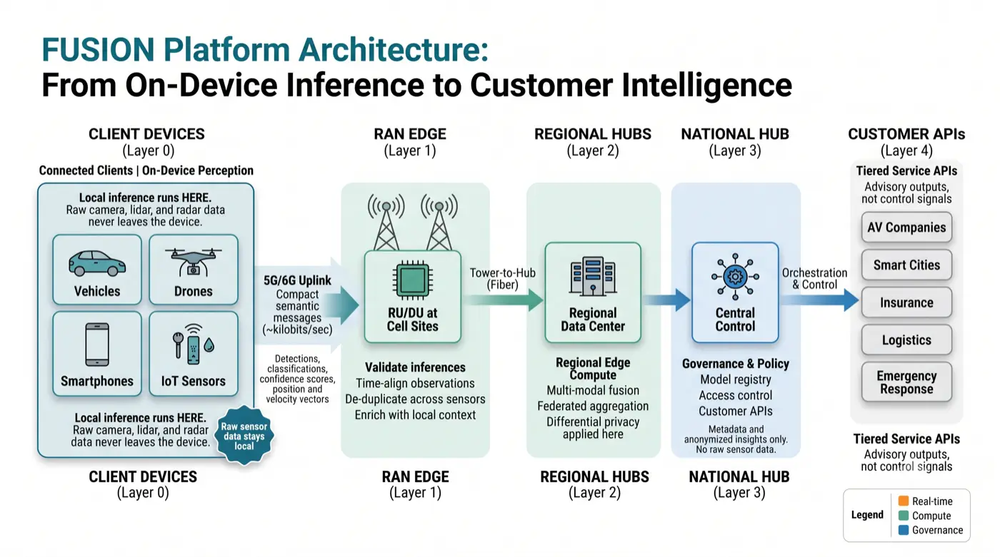
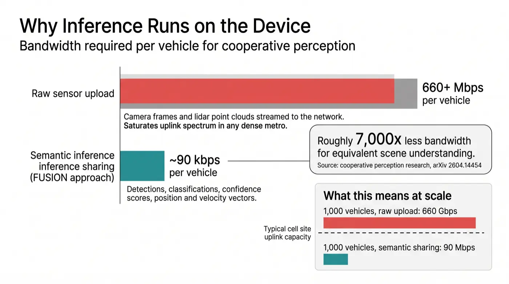
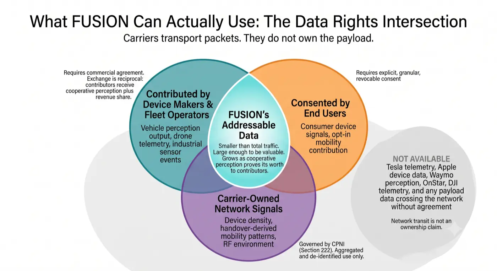
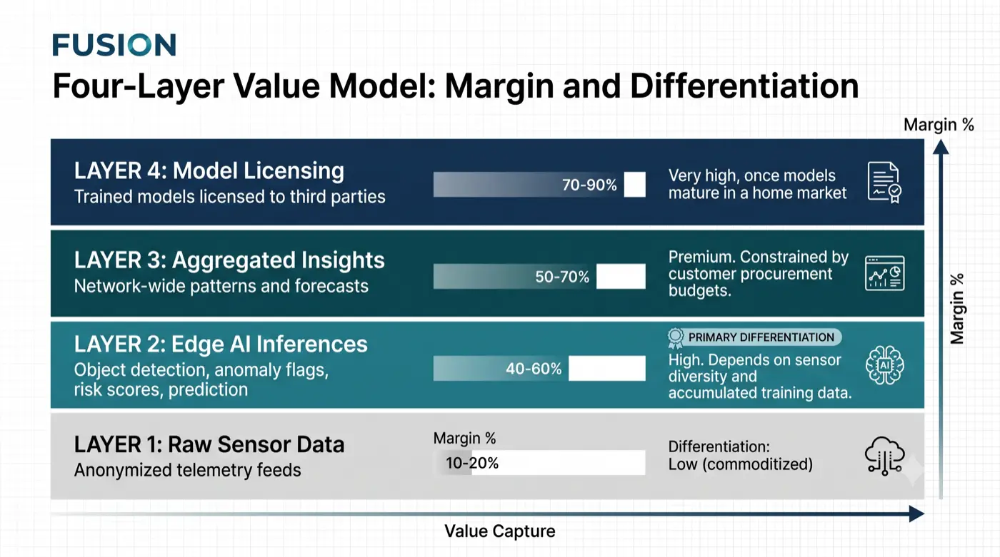
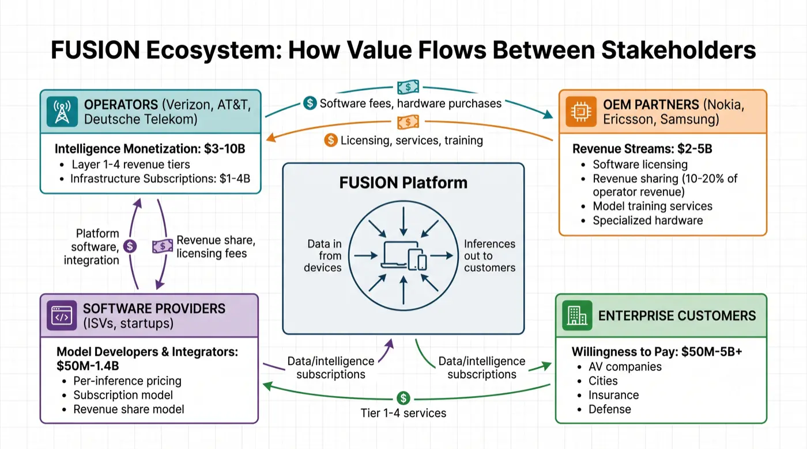
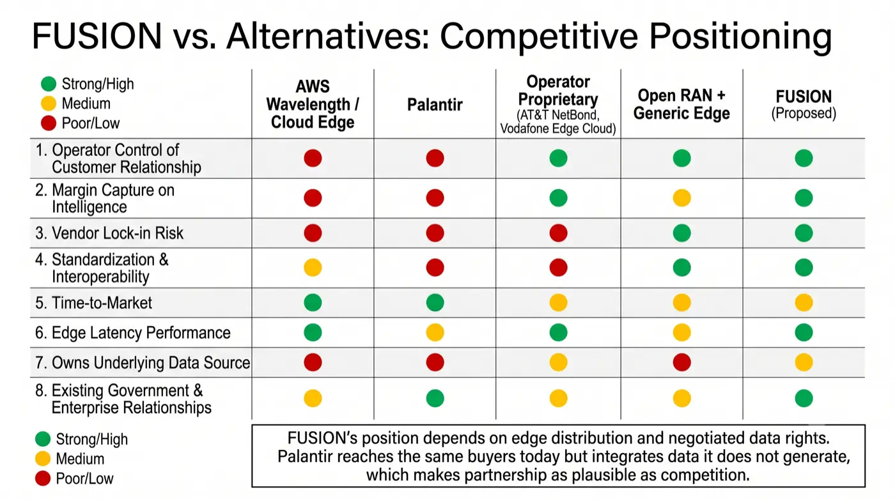
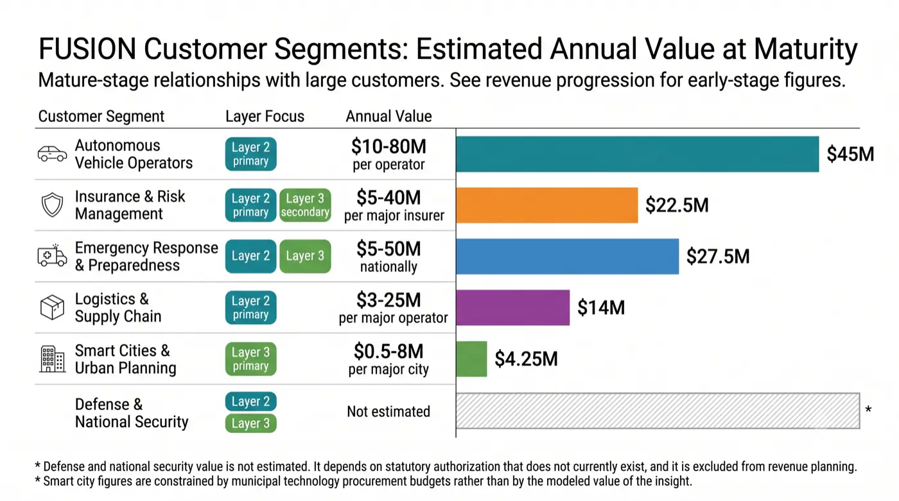
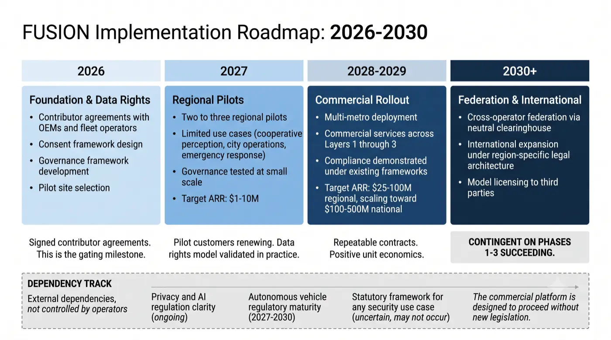

# FUSION: Federated Unified Sensor Intelligence on Network

<em>Transforming Carrier Networks into Real-Time Intelligence Infrastructure</em>

**White Paper, Version 1.1**

**License:** Creative Commons Attribution 4.0 International (CC BY 4.0)  
**Author:** Zlatko Lakisic  
**Portfolio:** [zlatko-lakisic.github.io](https://zlatko-lakisic.github.io/zlatko-lakisic/)  
**LinkedIn:** [linkedin.com/in/zlatko-lakisic](https://www.linkedin.com/in/zlatko-lakisic/)

  

    Listen
    <button type="button" data-listen-play>Play</button>
    <button type="button" data-listen-pause>Pause</button>
    <button type="button" data-listen-stop>Stop</button>
    
  

  

    <a class="whitepaper-download" href="https://github.com/zlatko-lakisic/white-papers-fusion-public/raw/main/FUSION_WhitePaper_v1.1.pdf" download="FUSION_WhitePaper_v1.1.pdf">Download PDF (v1.1)</a>
    <a href="https://github.com/zlatko-lakisic/white-papers-fusion-public">Public release repo</a>
  

<figure class="whitepaper-cover">

</figure>

## TABLE OF CONTENTS

1. [Executive Summary](#executive-summary): the problem, the solution, data rights, why now
2. [The Business Model & Monetization Ecosystem](#the-business-model-monetization-ecosystem): value layers, revenue progression, liability, ecosystem roles
3. [The Concept](#the-concept): principles, capabilities, beneficiaries, competitive field
4. [Architecture Overview](#architecture-overview): layers, data flow, technology maturity, cross-operator federation
5. [Use Cases & Value](#use-cases-value): autonomous vehicles, emergency response, smart cities, security
6. [Known Considerations & Governance](#known-considerations-governance): privacy, CPNI, international regulation, oversight, roadmap
7. [Conclusion & Call to Action](#conclusion-call-to-action)
8. [References](#references)

## ABSTRACT

This white paper introduces a concept for carrier-deployed edge intelligence infrastructure that aggregates sensor inferences and executes AI/ML workloads across distributed network nodes. Rather than treating the telecom network as merely a connectivity layer, this platform reimagines it as an intelligence layer. It enables carriers to offer tiered services (raw telemetry, edge-inferred AI, cross-sensor insights, and model licensing) to vertical markets including autonomous vehicles, logistics, smart cities, and emergency response. The architecture places inference on the device and at the network edge, so that compact structured outputs rather than raw sensor streams traverse the network, which is what makes both the bandwidth economics and the privacy properties work. Participation rests on negotiated agreements with device makers and explicit user consent rather than on the carrier's transit position, since carriers do not own the payload data crossing their networks. The platform is designed with privacy-preserving governance, architectural data segregation, and policy transparency. This is a concept paper: it argues that the opportunity is real and the architecture is buildable, and it identifies the data rights, liability, and regulatory questions that determine whether it can be realized.

---

## EXECUTIVE SUMMARY

Today's telecommunications networks move data; tomorrow's can make sense of it. This white paper proposes a strategic pivot for carriers: transforming edge infrastructure into an active intelligence layer that ingests sensor inferences, executes AI/ML models near the source, and offers actionable insights to enterprise customers under governed terms.

**A note on what this paper is.** This is a concept paper. It argues that the opportunity is real, the architecture is buildable with current technology, and the governance is designable. It is not an investment memorandum: it does not model capital expenditure, return on investment, or break-even, and the market figures it cites are sizing estimates rather than forecasts. Readers evaluating this as a financial proposition should treat the revenue progression in Section 3 as the relevant guide and expect that a full business case would require analysis this document deliberately does not attempt.

---

**DISCLAIMER ON MARKET PROJECTIONS**: This white paper includes estimates for market size, revenue projections, and customer segment values. These estimates are based on: (1) verified vendor announcements and public earnings reports for existing AI-RAN deployments and partnerships; (2) analyst research on adjacent markets (edge compute, 5G slicing, smart city analytics); (3) conservative scaling assumptions based on comparable technology adoption curves. Actual results will depend on operator investment decisions, customer adoption rates, regulatory frameworks, and competitive dynamics. These projections should not be construed as investment recommendations or financial forecasts. All major numerical claims are cited in the References section (end of document).

---

### THE PROBLEM

##### The Immediate Crisis: Revenue Stagnation & Disintermediation

Carriers are actively deploying AI-Native RAN stacks. Nokia offers GPU-accelerated solutions, Ericsson custom silicon, and Samsung vertical integration, all at scale today (T-Mobile, AT&T, Verizon). This represents billions in capex investment and technical capability. Yet carriers have no monetization strategy for this infrastructure beyond improving their own network performance. They capture zero value from the intelligence their edge AI systems generate.

**Today's reality**: Connectivity revenue ($50-100 per subscriber monthly) is flat to declining. Market saturation, price compression, and commoditization are structural. Total addressable market: ~$350B globally. Operators have invested billions in 5G/edge infrastructure, yet that same infrastructure is generating intelligence (thermal imaging, vehicle detection, hazard prediction) that cloud companies and startups are monetizing instead.

**The value leakage**:
- AWS Wavelength: Operators host edge, AWS runs inference, AWS captures the margin (estimated $2-5B/year potential)
- Google Distributed Cloud: Similar model, capturing intelligence value (estimated $1-3B/year)
- Microsoft Azure Stack Edge: Same pattern
- Startups (Anduril, Scale AI, etc.): License perception models trained on device telemetry

**The gap**: Operators today capture connectivity value, which is declining, and essentially none of the intelligence value generated at their own edge. The market-wide opportunity is estimated later in this paper, with the important caveat that market size and achievable revenue are different quantities. Closing the gap requires operators to build the edge intelligence layer and, critically, to secure the data rights that make it lawful and commercially durable.

**The strategic risk**: If carriers do not build this layer, cloud providers are well positioned to. The disintermediation pattern is familiar: AWS, Google, and Azure become the intelligence platform while operators remain the transport layer. Comparable dynamics played out with mobile app stores (Apple, Google), streaming content (Netflix), and digital advertising (Google). Carriers face a similar value capture question with edge AI.

**Why current solutions fail**:
- AWS Wavelength: Operator is still the dumb pipe. AWS sets pricing, owns customer relationship, captures margin.
- Operator proprietary systems (AT&T NetBond, Vodafone Edge Cloud): Billions of capex, no standards, no interoperability, customers must negotiate separately with each operator. Result: High cost, low adoption.
- Open RAN + generic edge compute: Commoditizes infrastructure. Untrained models are worthless. Operator competes on cost, not intelligence value. Result: Margin compression continues.

**The Intelligence Monetization Gap: Current Vendor Approaches (as of 2026)**

Operators ARE actively deploying AI-RAN. Major vendors have commercialized solutions:

**Ericsson's Software-Subscription AI-RAN** (Commercial now):
- Recurring software subscription on existing 5G infrastructure; no new hardware capex required
- Performance: 10-20% spectral efficiency and throughput gains; proven deployments with SoftBank, Bell Canada, SK Telecom, Rogers
- Monetization approach: Internal cost savings only (squeeze more capacity from existing spectrum)

**Nokia's GPU-Accelerated AI-RAN** (Pilots now, commercial 2027-2028):
- NVIDIA-accelerated infrastructure ($1B equity investment from NVIDIA); runs on NVIDIA Grace Hopper servers
- Performance: 20% gains today; targeting 100%+ spectral efficiency gains by 2028; pilots with T-Mobile, SoftBank, Vodafone, Indosat Ooredoo Hutchison
- Monetization approach: Internal performance optimization; emerging capability to use idle GPU compute for external workloads (untested at scale)

**Samsung's Vertical Integration** (Production deployments):
- Integrated chips plus RAN software plus optimization; proven at Rakuten Mobile, Vodafone, KDDI
- Monetization approach: Internal optimization only

**Critical Gap**: All vendor approaches optimize internal network performance (spectral efficiency, capex reduction). Zero strategies for external intelligence monetization to third parties (autonomous vehicles, smart cities, insurance, emergency response, defense). Vendors answer "how do we improve our own network?" but NOT "how do we monetize intelligence to external customers?"

**FUSION's Positioning**: Complementary to existing vendor strategies. Works with all three approaches (Ericsson software, Nokia GPU, Samsung vertical integration) to add the external intelligence monetization layer that vendors have not addressed. FUSION answers: "Now that we have AI-RAN optimizing our network, how do we package and sell that intelligence to enterprise customers?"

**Carriers sit at an unusual intersection**: they operate distributed edge infrastructure (cell sites, RAN), they carry traffic from nearly all connected devices, and they manage spectrum. Yet today's business model captures only connectivity fees, a commodity facing structural margin compression. The window to establish position in edge AI intelligence appears to be 2026 through 2028, and it is a window because the advantage compounds through accumulated data rather than through capital that can be deployed at any time.

An important qualification, developed in the Data Rights subsection below: carrying a device's traffic is not the same as holding rights to its sensor data. The opportunity described here depends on negotiated participation from device makers, fleet operators, and end users, not on the network's transit position alone.

### THE SOLUTION

#### Overview

Deploy federated AI intelligence at the edge, distributed across radio access network (RAN) nodes, central offices, and regional hubs. This platform transforms operators from connectivity providers into intelligence providers. Rather than capture intelligence inside their networks for internal optimization only, operators now package and monetize that intelligence to enterprise customers (autonomous vehicles, smart cities, insurance, emergency response, defense).

#### How FUSION Works: Data Flow

<figure class="whitepaper-figure">

<figcaption>Figure 1: FUSION operates as a distributed four-layer system. Devices run local perception and transmit compact inferences to RAN edge nodes (Layer 1), which validate, time-align, and de-duplicate them. Regional compute hubs aggregate inferences across hundreds of nodes using federated methods (Layer 2). The national intelligence hub manages governance and customer APIs (Layer 3). Enterprise customers access tiered services via APIs.</figcaption>
</figure>
---

The platform operates as a three-stage pipeline:

##### Stage 1. Ingestion (Device to Edge)
Inference begins on the device, not at the tower. Connected clients (vehicles, drones, phones, IoT sensors) already run perception models locally. Modern vehicles process camera, lidar, and radar streams on board; phones run on-device vision models; industrial sensors classify events at the source. FUSION consumes the *output* of that local processing, not the raw feed. What crosses the 5G/6G uplink is a compact semantic message: detected objects with bounding boxes, classifications, confidence scores, position and velocity vectors, and anomaly flags. A 1080p camera feed that would consume megabits per second becomes kilobits per second of structured detections.

This distinction is the difference between a workable architecture and an unworkable one. Continuous raw sensor upload from millions of vehicles would saturate uplink spectrum in any dense metro. Published cooperative perception research makes the same point empirically: semantic sharing between vehicles operates at roughly 90 kbps, while sharing intermediate neural network features requires 660 Mbps or more for equivalent scene understanding [3]. FUSION is designed around the low-bandwidth regime.

<figure class="whitepaper-figure">

<figcaption>Figure 2: Bandwidth required per vehicle for cooperative perception. Streaming raw camera and lidar data upstream would consume 660 Mbps or more per vehicle, which saturates uplink capacity at realistic device densities. Sharing semantic inference output achieves equivalent scene understanding at roughly 90 kbps [3]. This difference is what makes the architecture viable, and it is the reason inference must begin on the device rather than at the tower.</figcaption>
</figure>
---

Edge nodes at cell sites (RU/DU) therefore do not filter raw video. They receive compact inferences from many devices simultaneously, validate and time-align them, resolve duplicate detections of the same object seen by different sensors, and enrich them with local context. Raw sensor data may be uploaded in narrow, bounded circumstances, for example a short buffered clip around a collision event or an explicitly consented model-training contribution, but this is the exception rather than the steady state.

##### Stage 2. Computation (Edge Processing)
Regional edge compute hubs (collocated with RAN-C and CU nodes) receive inferences from dozens to hundreds of cell sites. They execute more complex AI/ML workloads. These include deep neural networks, multi-modal fusion (combining camera, lidar, thermal, radar data), and behavioral prediction. At this stage, inferences are aggregated across multiple sensors without centralizing raw data. Differential privacy and cryptographic aggregation mechanisms add noise and anonymization. The system computes region-wide patterns like traffic flow prediction or supply chain anomalies without recreating individual sensor streams.

##### Stage 3. Access & Monetization (Hub to Customer)
The national intelligence hub manages platform-wide policies, model governance, data access rules, and regulatory compliance. Enterprise customers query this hub via APIs, requesting specific insights. Example queries: "Vehicles detected in downtown Seattle in the last 24 hours," "Energy grid anomalies," "Public safety threat patterns." The hub retrieves pre-computed aggregates from regional nodes or freshly computes them per customer data access contract. All responses are anonymized and governance-audited before delivery.

#### Core Components & Layers

##### Layer 1. Client Devices & RAN Edge
Devices run local perception and transmit structured inferences, not raw sensor streams. RU/DU nodes at cell sites receive these compact messages, normalize formats across heterogeneous device types, time-align observations using network timing references, and perform first-pass spatial fusion (recognizing that three vehicles reporting an obstacle at the same coordinates are describing one object, not three). Result: uplink demand stays in the kilobits-per-device range rather than megabits, and what flows to regional hubs is already de-duplicated and validated.

##### Layer 2. Regional Edge Compute Hubs
Aggregate telemetry and inferences from tens to hundreds of edge nodes. Execute complex inference workloads (deep neural networks, multi-modal fusion). Begin federated aggregation; compute region-wide patterns without centralizing raw data. Embed cryptographic aggregation and differential privacy mechanisms here. This is where privacy guarantees are mathematically enforced.

##### Layer 3. National Intelligence & Governance Hub
Centralized control plane managing platform-wide policies, model governance, data access rules, and regulatory compliance. Orchestrates data pipelines. Enforces privacy guarantees at scale. Audits sensitive streams. Exposes APIs to enterprise customers. NOTE: Does NOT centralize raw sensor data; manages metadata, model versions, access logs, and anonymized insights only.

##### Layer 4. Customer Access & Decision Support
Enterprise customers access intelligence via tiered APIs. Autonomous vehicle companies receive perception feeds. Smart cities receive traffic optimization recommendations. Insurance firms receive risk scores. First responders receive real-time situational awareness. Defense/law enforcement receive threat detection alerts (with judicial oversight). Each customer tier receives data appropriate to their contract and use case.

#### Integration with Existing AI-RAN Infrastructure

FUSION is complementary to, not a replacement for, existing vendor AI-RAN investments:

##### With Ericsson's Software-Subscription AI-RAN:
Ericsson optimizes internal network performance (spectral efficiency, capex reduction) using software-only methods on existing silicon. FUSION uses the same software stack and edge infrastructure to add the external intelligence monetization layer. Carriers get internal performance gains from Ericsson plus external revenue from FUSION without doubling infrastructure investment.

##### With Nokia's GPU-Accelerated AI-RAN:
Nokia uses NVIDIA GPUs to achieve highest spectral efficiency gains (100%+ by 2028). That GPU compute also trains perception models on diverse sensor data. FUSION leverages those same GPU resources and trained models to create inference services sold externally. Idle GPU capacity (used for inference) becomes a revenue stream, not just a cost center.

##### With Samsung's Vertical Integration:
Samsung integrates silicon, RAN software, and optimization across the stack at deployment sites (Rakuten, Vodafone, KDDI). FUSION adds a unified intelligence aggregation layer that works across Samsung and non-Samsung infrastructure, enabling cross-carrier insights and sensor fusion that benefit all operators.

**Key Point**: FUSION's value comes from federation (combining signals across multiple operators, regions, and sensor types) and external monetization. Vendor AI-RAN solutions are optimized for single-operator internal gains. FUSION unlocks value by bridging operators and creating a marketplace for intelligence.

#### Technical Differentiation from Current Approaches

**vs. AWS Wavelength / Cloud Edge**
AWS Wavelength moves inference to the edge but keeps the operator as dumb pipe. AWS owns the customer relationship, sets pricing, controls margins. FUSION positions operator as the service provider. Operator owns customer data, relationship, and pricing. AWS becomes a technology partner, not the value intermediary.

**vs. Operator Proprietary Systems**
AT&T NetBond, Vodafone Edge Cloud, and others require massive capex and create vendor lock-in to individual operators. No standards. No interoperability. Customers must negotiate separately with each operator. Result: High cost, low adoption. FUSION uses open standards (O-RAN, 3GPP) and allows multi-operator federation. Economies of scale kick in. Customers benefit from network effects.

**vs. Open RAN + Generic Edge Compute**
Pure open approaches commoditize infrastructure. Untrained models are worthless. Operators compete on cost. FUSION adds proprietary value at Layers 2 and 3: trained models, aggregation algorithms, and governance frameworks that are difficult to replicate because they require substantial sensor density and historical data.

#### Data Rights: What Carriers Can and Cannot Monetize

This is the foundational commercial question, and it deserves a direct answer rather than an assumption.

**Carriers do not own the sensor data that crosses their networks.** Tesla owns Tesla telemetry. Apple owns iPhone sensor output. Waymo owns its perception stack. GM owns OnStar. DJI owns drone telemetry. Carriers transport packets; they do not, by default, hold rights to the payload. Any proposal that treats network transit as an ownership claim is not viable, legally or commercially.

FUSION therefore rests on negotiated participation, not passive collection. Three mechanisms make this workable:

**1. Contributor agreements with device makers and fleet operators.** OEMs contribute inference output in exchange for something they cannot produce alone: cooperative perception. A single vehicle sees what its own sensors see. A vehicle receiving fused detections from the surrounding network sees around corners, through occlusions, and beyond its own sensor range. Published cooperative driving research reports substantial safety gains from exactly this exchange [3]. The trade is reciprocal access, not one-way data extraction, and revenue sharing accompanies it. OEMs that contribute receive both improved perception for their fleet and a share of downstream service revenue.

**2. Explicit end-user consent for consumer devices.** Where the contributor is an individual rather than a fleet operator, participation is opt-in, granular, and revocable, with plain-language disclosure of what is shared and with whom. Consent obtained by burying terms in a service agreement is not a durable foundation for a platform intended to operate under regulatory scrutiny for decades.

**3. Carrier-owned infrastructure sensing.** A narrower but genuinely operator-owned category: signals the carrier legitimately holds by virtue of running the network, such as aggregate device density, mobility patterns derived from handover events, and RF environment data. This is real and monetizable, but it is a smaller dataset than the OEM-contributed streams, and it is the category most tightly regulated.

**Customer Proprietary Network Information (CPNI).** Section 222 of the U.S. Communications Act restricts how carriers may use and disclose information about a subscriber's use of the network, including location. This is the binding constraint on category three above, and it is not a formality. FUSION's design response is that CPNI-derived signals are used only in aggregated, de-identified form for commercial products, and never resold at individual granularity. Where a use case cannot be served without individual-level network information, it requires either affirmative subscriber opt-in under the applicable CPNI rules or lawful process. Analogous regimes apply elsewhere: ePrivacy and GDPR in the EU, PIPEDA in Canada, APPI in Japan.

**The honest framing.** FUSION's addressable data is the intersection of what OEMs will contribute under commercially attractive terms, what users will consent to, and what carriers may lawfully use from their own network. That intersection is smaller than the total sensor data crossing carrier networks. It is also large enough to be valuable, and it grows as cooperative perception demonstrates its worth to contributors. Operators that treat data rights as an afterthought will find the model does not survive first contact with an OEM legal department.

<figure class="whitepaper-figure">

<figcaption>Figure 3: FUSION's addressable data is the intersection of three sources, each governed by a different mechanism. Device makers and fleet operators contribute inference output under commercial agreement, receiving cooperative perception and revenue share in return. End users contribute consumer device signals under explicit, revocable consent. Carriers contribute network-derived signals, which are governed by CPNI rules and used only in aggregated, de-identified form. Everything outside these three circles, including proprietary OEM telemetry crossing the network without agreement, is unavailable. Network transit is not an ownership claim.</figcaption>
</figure>
---

### WHY NOW

Three converging forces create a narrow strategic window (2026-2028):

##### Technical Readiness (Infrastructure exists today)
- **AI-Native RAN Maturity**: OpenRAN, virtualized base stations, and edge-compute-ready architectures (NVIDIA Aerial, Ericsson Silicon, Nokia GPU partnerships) allow carriers to embed AI workloads at distribution points without massive legacy integration.
- **Enterprise AI Hunger**: Autonomous vehicles, logistics, smart cities, and defense operators desperately need real-time, low-latency, privacy-preserving sensor fusion and inference.
- **Regulatory Momentum**: Governments (EU, US, Japan, Korea) are accelerating edge compute regulations, device data governance, and AI transparency frameworks. This creates tailwinds for carriers positioned to offer compliant, auditable intelligence infrastructure.

##### Market Urgency (Enterprise demand is emerging now)
Autonomous vehicles, smart cities, and emergency response systems are developing requirements for network-level intelligence over the same 2026-2028 period. Operators can position to serve this demand or leave it to cloud platforms.

##### Competitive Window (Early movers accumulate advantages that compound)
- Early adopters build model quality and sensor diversity that later entrants would need years and significant investment to match.
- A delay of 18-24 months could translate into a multi-year disadvantage, since model quality improves with accumulated data rather than with capital alone.
- AWS, Google, and Microsoft are already positioning edge AI as their telecom play. Operators who wait may find the available partnerships are ones where cloud providers control the value layer.

**Financial Framing**: The intelligence opportunity is meaningful but should be understood as a build, not a windfall. Realistic early revenue is measured in single-digit millions during pilots, scaling through regional deployment before national platform revenue becomes material. Section 3 sets out that progression. The strategic argument for acting in this window rests less on the size of the eventual number than on the fact that data advantages accumulate slowly and cannot be bought later.

---

## THE BUSINESS MODEL & MONETIZATION ECOSYSTEM

### Overview

FUSION does not exist in isolation. The intelligence monetization opportunity creates a multi-stakeholder ecosystem, each with different revenue models and competitive positioning. Understanding these dynamics is critical for operators evaluating implementation strategy and for technology partners assessing partnership opportunities.

### 1. Operator Intelligence Monetization (The 4-Layer Model)

#### Core Principle

Rather than compete on connectivity cost (commodity), FUSION inverts the value chain. Revenue derives from edge-computed intelligence, not raw data. The model has four layers, each with distinct margins, customer segments, and defensibility. Only operators with ubiquitous edge infrastructure and sensor density can build this model at scale.

#### The Four-Layer Value Model

##### Layer 1. Raw Sensor Data (Low Margin, Input Layer)

Anonymized telemetry streams such as vehicle counts, environmental readings, GPS traces, and thermal signatures. Mostly commoditized. Used by academic researchers, analytics firms, and some enterprise customers who have data science teams to interpret it.

Characteristics: Low barrier to entry (any edge node can collect this). High volume; low value per unit. Privacy risk; requires strong anonymization.

Indicative pricing: tens of thousands to low hundreds of thousands of dollars per month for a comprehensive metro feed, benchmarked against existing commercial mobility and telematics data products. Example: anonymized vehicle count and flow data for a metropolitan area.

Margin: Low (10-20%). Mostly passes through to hosting and bandwidth costs. This layer is a customer acquisition channel rather than a profit center.

##### Layer 2. Edge AI Inferences (High Margin, Defensible IP)

Pre-computed inferences from edge models. Includes object detection (vehicle type, license plate region, behavioral classification), anomaly detection (accident, debris, hazmat), risk scoring (collision risk, infrastructure damage risk), and predictive models (congestion prediction, supply chain delay prediction).

This is where durable differentiation exists. Model quality at this layer depends on sensor density, geographic coverage, and accumulated training data. An operator with contributor agreements across many device types and thousands of edge sites can train models that a new entrant would need years to match, because the constraint is time and participation rather than capital.

Characteristics: Differentiated IP (models trained on contributed data under negotiated terms). High value; customers integrate outputs into operational decision systems. Meaningful switching costs, since customers tune their own systems around a given inference quality and latency profile.

Indicative pricing: low millions to low tens of millions of dollars annually per major enterprise customer, structured as a platform subscription plus usage-based inference pricing. Examples:
- Autonomous vehicle operator: real-time cooperative perception feeds across a defined operating region
- Insurance carrier: periodic risk scoring across an insured portfolio, with behavioral risk modeling
- Smart city platform: traffic flow prediction, congestion forecasting, and incident detection for a metro area

Margin: High (40-60%). Marginal infrastructure cost per additional customer is modest once models are trained and deployed.

##### Layer 3. Aggregated Insights & Analytics (Premium Tier)

Network-wide patterns, predictions, and strategic recommendations. Includes cross-sensor correlation (temporal patterns, supply chain visibility), anomaly detection at scale (fraud, supply chain disruption, threat patterns), and predictive insights (demand forecasting, infrastructure stress, public safety trends).

Used by C-suite executives, policy makers, and strategic planning teams. High-value decision support.

Characteristics: Premium offering. Requires cross-customer data aggregation with strict privacy/anonymization. Vendors provide custom dashboards and reporting. Executive-grade insights.

Indicative pricing: high six figures to low eight figures annually per major enterprise customer, with public sector contracts anchored to existing municipal software and analytics procurement norms rather than to the theoretical value of the insight. Examples:
- City government: smart city operations dashboard, planning reports, evidence-based policy input
- Insurance consortium: industry-wide risk trends, underwriting model inputs, fraud pattern detection
- Logistics operator: network-wide supply chain visibility, demand forecasting, disruption early warning

Margin: Premium (50-70%). High-value service with significant professional services bundled.

A note on pricing realism: municipal budgets are the binding constraint in the public sector, not the value of better traffic management. A city that spends single-digit millions annually on its entire technology portfolio will not spend more than that on one analytics feed, regardless of the modeled benefit. Public sector pricing must be built from procurement reality upward.

##### Layer 4. Model Licensing & Custom Training (Recurring SaaS)

License trained models to third parties for their own deployments. Or fine-tune existing models on third-party data. Carriers retain model IP; grant usage rights per domain and geography.

Characteristics: Long-tail SaaS revenue. Repeatable. Scales without proportional infrastructure cost. Potential to monetize with non-customers (other carriers, international operators).

Indicative pricing: initial licensing fees in the low millions to low tens of millions, plus recurring subscription. This layer becomes material only after models have proven themselves in a home market, which places it late in the deployment sequence. Examples:
- International operator: licenses a demand-forecasting model trained in one market and adapts it to another, under recurring subscription
- Enterprise (non-carrier): licenses an anomaly-detection model for a private industrial network, fine-tuned on the customer's own data

Margin: Very high (70-90%) once development is amortized, though amortization assumes the model reached maturity in a prior deployment.

<figure class="whitepaper-figure">

<figcaption>Figure 4: Value and differentiation increase moving up the stack. Layer 1 (raw data) commoditizes. Layer 2 (AI inferences) is where durable differentiation emerges, since model quality depends on accumulated contributed data rather than capital alone. Layers 3 and 4 capture premium value through aggregated insights and model licensing. Margin progression: 10-20%, 40-60%, 50-70%, 70-90%. Absolute revenue at each layer depends on deployment stage; see the revenue progression below.</figcaption>
</figure>
---

#### Revenue Progression: What Realistic Growth Looks Like

Market sizing and achievable revenue are different things, and conflating them is the most common failure in platform proposals. The figures below describe a plausible progression for a single operator rather than a total market.

| Stage | Timeframe | Annual recurring revenue | What it looks like |
|---|---|---|---|
| Pilot | Year 1-2 | $1-10M | Two or three anchor customers, one metro, narrow use cases |
| Regional | Year 2-4 | $25-100M | Multiple metros, a working contributor ecosystem, repeatable contracts |
| National platform | Year 4-6 | $100-500M | Coverage across major markets, several verticals, licensing beginning |
| Exceptional outcome | Year 6+ | $1B+ | Requires cross-operator federation and international licensing to materialize |

The total addressable market figures cited later in this paper describe the size of the opportunity across all operators and all verticals at full maturity. They are not a forecast for any single participant, and they should not be read as one. An operator reaching the national platform stage would represent a successful outcome by any reasonable measure.

**A downside scenario, stated plainly.** The progression above assumes several things go right at once: autonomous vehicle deployment continues expanding, OEMs find contributor terms attractive, municipal budgets hold, and privacy regulation lands in a workable place. Any one of these slipping delays the curve. If autonomous vehicle regulatory approval stalls, the largest Layer 2 segment is deferred by years. If OEMs conclude that cooperative perception is better solved through direct vehicle-to-vehicle protocols without a carrier intermediary, the contributor model weakens substantially. If privacy regulation tightens toward strict data localization and processing limits, the aggregation layer narrows. A credible planning posture treats the pilot and regional stages as the decision point: they are inexpensive enough to run as an option on the larger opportunity, and they generate the evidence needed to judge whether the later stages are real.

#### Revenue Tiers by Customer Segment

The model serves distinct customer cohorts, each with different value drivers and willingness to pay. The annual values below describe mature-stage relationships with large customers, not initial contracts:

**Autonomous Vehicle Operators** (Layer 2 primary, Layer 3 secondary)
Value driver: Perception beyond onboard sensor range; validation against an independent source; incident reconstruction; training data.
Annual value: $10-80M per operator at maturity, varying with fleet size, geography, and how central cooperative perception becomes to the operator's safety case.
Example: a fleet operator subscribes to cooperative perception feeds across its operating regions, with pricing scaled to vehicle count and coverage area.

**Insurance & Risk Management** (Layer 2 primary, Layer 3 secondary)
Value driver: Risk modeling; fraud detection; usage-based pricing inputs; claims prediction.
Annual value: $5-40M for a major insurer at maturity, benchmarked against current telematics data spending.
Example: an insurer integrates anonymized mobility signals and behavioral risk scoring into underwriting, where even low single-digit improvements in loss ratio justify the contract.

**Logistics & Supply Chain** (Layer 2 primary, Layer 3 secondary)
Value driver: Fleet visibility; deviation detection; predictive routing; demand forecasting.
Annual value: $3-25M for a major logistics operator at maturity.
Example: a carrier subscribes to route-level congestion prediction and disruption alerts feeding its existing dispatch systems.

**Smart Cities & Urban Planners** (Layer 3 primary, Layer 2 secondary)
Value driver: Traffic optimization; congestion reduction; infrastructure monitoring; policy evidence.
Annual value: $0.5-8M per major city, constrained by municipal technology budgets rather than by modeled benefit.
Example: a large metro procures a traffic optimization feed and planning analytics under a multi-year contract sized comparably to its existing transportation software spending.

**Emergency Response & Disaster Management** (Layer 2 and 3, high priority)
Value driver: Situational awareness; resource allocation; responder coordination.
Annual value: $5-50M nationally through grant programs and public-private partnerships, rather than per-jurisdiction.
Example: a federal preparedness program funds regional situational awareness capability across participating states.

**Defense & National Security** (Layer 2 and 3, government contract)
Value driver: Situational awareness for authorized national security purposes under judicial and statutory oversight.
Annual value: potentially significant but highly uncertain, and dependent on statutory authorization that does not yet exist. This segment is deliberately excluded from the revenue progression above. It should be treated as optional upside rather than as a planning assumption, for reasons discussed below.

#### Sources of Durable Advantage

##### Compounding returns to participation
Each additional contributing device improves model quality, which makes the service more valuable to customers, which funds better terms for contributors. This is a reinforcing cycle rather than an exclusionary one: contributors and competitors can participate, and the advantage accrues to whoever starts accumulating data earliest. An operator that reaches meaningful device participation by 2028 will have trained models on years of real-world data that a 2030 entrant cannot compress into a shorter timeline, regardless of capital available.

##### Structural position of the network edge
Sensor diversity across vehicles, phones, drones, and fixed infrastructure is geographically distributed in exactly the pattern that carrier infrastructure already covers. Operating the edge is a genuine structural advantage over cloud platforms, which would need to replicate physical distribution to match latency. This advantage is available to every operator, and the competitive question is which ones act on it.

##### Integration depth with customers
Customers tune their own systems around a given inference quality and latency profile. Once integrated, switching involves revalidation rather than a simple procurement change. This creates retention, though it also creates obligation: the same integration depth that produces retention means that service degradation propagates into customer operations, which is why the service level commitments discussed below matter commercially as well as legally.

##### Regulatory operating experience
Carriers already function under spectrum licensing, network security obligations, CPNI rules, and lawful process regimes. Operating a governed data platform is closer to existing carrier competence than it is to that of most technology entrants. This is a real advantage in regulated verticals, where procurement often turns on compliance posture.

**On competition and market structure.** These advantages are meaningful but not exclusionary, and the paper's position is that the intelligence layer should develop as a competitive market rather than as a single controlling platform. Interoperability through open standards, portability of customer data between providers, and non-exclusive contributor agreements are design commitments, not concessions. A platform of this kind that positioned itself as a bottleneck would attract regulatory attention it could not survive, and would deserve it.

#### Addressable Market & Scale Projections

##### Conservative Estimate (2028-2030 at 20% market penetration)

- Autonomous Vehicles: 10-20M vehicles × $50-100/year = $500M-2B
- Smart Cities: 100 major cities × $10-20M/year = $1-2B
- Logistics & Supply Chain: 500K commercial vehicles × $100-200/year = $50-100M (conservative; most logistics via AV tier)
- Insurance & Risk: $100-300M
- Emergency Response & Disaster: $100-300M
- Defense & Government: $500M-1B

##### Subtotal: $2.7-5.7B annually

##### Aggressive Estimate (2030+ at 50-60% market penetration)

Same customer segments but higher penetration and higher willingness to pay (as platform value becomes proven):

- Autonomous Vehicles: 100M+ vehicles × $100-500/year = $10-50B
- Smart Cities: 500+ major cities × $20-50M/year = $10-25B
- Logistics & Supply Chain: 5M+ tracked assets × $200-500/year = $1-2.5B
- Insurance & Risk: $300-500M
- Emergency Response & Disaster: $300-500M
- Defense & Government: $1-3B
- Model Licensing & International: $1-5B

##### Subtotal: $23-86B annually

##### Mid-Point Estimate: $20-40B annually at scale (2030+)

This assumes:
- 30-40% market penetration in core use cases (AVs, smart cities, logistics)
- Carrier leadership in most major geographies (US, EU, Asia-Pacific)
- Successful integration with existing AI-RAN deployments (Ericsson, Nokia, Samsung)
- Regulatory framework established for data governance and first responder access

**How to read these figures.** These are total addressable market estimates across all operators, all geographies, and all verticals at full maturity, built from device counts multiplied by plausible per-unit pricing. They describe the size of a market if it develops as described. They are not a revenue forecast, not a share estimate for any participant, and not a basis for investment decisions. The realistic single-operator progression is set out in the Revenue Progression table above, and it is a considerably more modest picture: $1-10M in pilot, $25-100M regional, $100-500M at national platform scale. Both views are useful, and confusing one for the other is the standard way these proposals lose credibility with financial reviewers.

The aggressive scenario in particular assumes near-simultaneous maturity across autonomous vehicles, municipal procurement, logistics, and insurance. Historical technology adoption rarely cooperates that neatly. Treat the conservative figures as the planning case.

#### Why Timing Matters

The favorable window appears to be 2026 through 2028, and the argument for it is narrower than urgency rhetoric usually suggests. It is not that enterprise customers are ready to buy at scale today; many are not. It is that model quality depends on accumulated data, and accumulation cannot be accelerated with capital later. An operator beginning contributor agreements and model training in 2026 will hold a data position in 2030 that a 2029 entrant cannot buy.

Cloud providers are positioning for the same intelligence layer, and they hold advantages in tooling, developer ecosystems, and enterprise sales. Their structural disadvantage is physical distribution at the edge. If operators do not build on that advantage, the likely outcome is not that operators lose a business they had, but that they remain in the position they occupy today while the value accrues elsewhere.

#### Liability, Service Levels, and the Safety Boundary

Selling perception inputs into safety-critical systems raises a question that has to be answered before the first contract is signed: what happens when an inference is late, wrong, or absent, and someone is harmed?

**The design answer is advisory positioning.** FUSION outputs are supplementary inputs to customer systems, not authoritative control signals. An autonomous vehicle must remain safe using its own onboard perception alone. Cooperative intelligence from the network extends the vehicle's awareness beyond line of sight and improves the quality of its decisions, but the vehicle's safety case cannot depend on the network being available. This is not a legal disclaimer bolted on afterward; it is an architectural constraint that shapes what the platform may be sold for. Any use case that would make network intelligence load-bearing for immediate safety, rather than enhancing to it, falls outside what this platform should offer.

**Service levels are tiered by consequence.** Different customers need different guarantees, and pricing should reflect that:

| Tier | Commitment | Typical use | Remedy |
|---|---|---|---|
| Advisory | Best effort, no latency guarantee | Planning analytics, historical insight | Service credits |
| Operational | Availability and latency targets with measurement | Fleet routing, city operations | Service credits, scaled to breach |
| Safety-adjacent | Strict latency bounds, explicit degradation signalling | Cooperative perception feeds | Negotiated, capped, insurance-backed |

The third tier carries a specific technical obligation: when the platform cannot meet its latency bound, it must say so rather than deliver stale inferences silently. A customer system that knows the feed has degraded can fall back to onboard perception. A customer system that receives late data presented as current cannot. Explicit degradation signalling is what makes the advisory boundary real in operation rather than only in contract.

**Apportionment among the parties.** A collision involving a vehicle that consumed FUSION inferences implicates the vehicle manufacturer's safety case, the model developer's training and validation, and the operator's delivery of the service. The workable arrangement follows existing practice in automotive supply chains: the vehicle manufacturer retains primary responsibility for the vehicle's safe operation, since it controls the safety case and the fallback behaviour; the platform operator is responsible for delivering the service it committed to and for accurate degradation signalling; the model developer is responsible for the documented performance envelope of the model, including its known failure modes. Liability caps, insurance requirements, and indemnity flow from that division and are negotiated per contract.

**This is unsettled.** Autonomous vehicle liability law is developing unevenly across jurisdictions, and cooperative perception adds a party that most existing frameworks did not contemplate. Operators entering this market should expect the allocation above to be tested and revised. The point of stating it explicitly is that the question is answerable, not that it is answered.

---

### 2. OEM Business Model (Nokia, Ericsson, Samsung)

##### Current OEM Revenue Streams

Ericsson captures recurring revenue through AI-RAN software subscriptions ($100-500M annually across customer base). Nokia targets similar scale with GPU-accelerated platform licensing plus professional services. Samsung integrates hardware and software as vertical stack.

##### Evolution Under FUSION

OEMs have four paths to participate in intelligence monetization:

##### Path 1. Revenue Sharing on Operator Intelligence Sales
OEM licenses FUSION platform software to operators. When operators sell intelligence (Layer 2 and 3), OEM receives 10-20% of gross revenue. Example: Ericsson licenses inference engine; Verizon sells AV perception feeds; Ericsson gets $100-300M/year if Verizon captures $1-3B annual FUSION revenue. This incentivizes OEM to help operators succeed in intelligence monetization.

Margin: Medium (after software cost, mostly profit). Volume depends on operator success. Naturally aligns OEM and operator interests.

##### Path 2. Model Training-as-a-Service
OEM operates training infrastructure for operators. Operators send raw sensor data; OEM trains domain-specific models on operator infrastructure. Operators own the trained models; OEM charges per training run or per inference volume. Example: Nokia offers "train your perception model on our infrastructure using your data; $10-50M annually depending on model complexity and inference volume."

Margin: High (50-70%). Recurring. Scales across many operators without duplicating infrastructure per customer.

##### Path 3. Advanced Inference Hardware
Nokia and others offer specialized inference accelerators (GPUs, custom ASICs) optimized for FUSION workloads. Operators buy as hardware capex or as managed compute service. Example: "NVIDIA Grace Hopper servers optimized for real-time federated inference; $5-20M per regional hub."

Margin: Medium to high (30-50% on hardware, higher on managed service). Recurring if managed as subscription.

##### Path 4. Model Licensing to Operators
OEM trains foundation models on aggregated operator data (anonymized). Licenses pre-trained models to all operators who want to accelerate time-to-market. Example: Nokia trains "universal perception model" on data from 10 operators; licenses to new operators for $100-500M per region.

Margin: Very high (80%+). Scales to many operators. But requires data governance and privacy safeguards.

##### OEM Economic Projection

A major OEM (Ericsson, Nokia) participating in FUSION ecosystem could capture $2-5B annually by 2030 through combination of:
- Software licensing: $500M-1B
- Revenue sharing on operator intelligence sales: $500M-2B
- Model training / infrastructure services: $300M-800M
- Specialization hardware / managed services: $200M-500M

##### Competitive Dynamic

OEMs benefit from FUSION success (wider TAM, longer customer lock-in through trained models). But they do NOT want operators to become too independent (commoditized software, generic inference hardware). OEMs will try to position themselves as indispensable layers (training infrastructure, foundation models, specialized hardware) rather than generic pipe providers.

### 3. Telecom Infrastructure Subscription Model (Operator's Internal Value Capture)

Beyond FUSION intelligence monetization, operators can extract value by selling infrastructure services to internal and external consumers. This is the "recurring subscription" angle that FUSION infrastructure enables.

##### New Infrastructure Services Enabled by FUSION

##### Network Slicing-as-a-Service
FUSION infrastructure manages network slicing with AI-driven optimization. Operators sell guaranteed latency/throughput SLAs to premium customers. Example: Autonomous vehicle operators pay $50-100M/year for dedicated network slice with sub-50ms latency guarantee. Emergency responders pay $20-50M/year for guaranteed bandwidth and priority routing.

Pricing: Subscription based on SLA guarantees (latency, throughput, availability). $10-100M annually per major customer.

##### Advanced RAN Compute Services
Operators sell edge compute capacity for customer inference workloads. Not just connectivity; actual inference compute at cell sites. Example: Autonomous vehicle company runs custom perception model on operator's edge GPU infrastructure; pays $50-200M/year per region based on compute volume.

Pricing: Per-GPU-hour, per-inference, or flat subscription. $5-50M annually depending on customer compute intensity.

##### Model Training-as-a-Service (Operator-Hosted)
Operators train customer-specific models using their infrastructure and sensor data (with proper data governance). Example: Insurance company wants proprietary risk model trained on anonymized vehicle telemetry; operator charges $10-50M for training run plus per-inference licensing.

Pricing: Training service fees ($1-10M per model) plus per-inference subscription ($0.01-1 per inference). Recurring.

##### Real-Time Data Access
Operators sell raw or partially-processed sensor feeds to customers. Beyond FUSION's Layer 1 (commoditized), operators could offer real-time data APIs (e.g., "vehicle location streams," "traffic flow data," "infrastructure sensor feeds") with SLA guarantees.

Pricing: Subscription based on data freshness, completeness, and SLA. $1-20M annually per customer.

##### Operator Economic Projection

A major operator's infrastructure subscription revenue (separate from intelligence monetization) could reach:
- Network slicing premiums: $500M-2B
- Advanced RAN compute services: $300M-1B
- Model training services: $100M-500M
- Real-time data APIs: $100M-300M

**Subtotal: $1-4B annually in infrastructure subscription revenue (beyond FUSION intelligence monetization)**

This is attractive because:
- High margins (50-70% after infrastructure cost)
- Recurring revenue (subscriptions renew annually)
- Lock-in (customers integrate infrastructure into their operations; switching costs high)
- Complementary to FUSION (same infrastructure, different revenue angle)

##### Competitive Dynamic

Cloud providers (AWS, Google, Azure) will compete for these workloads. Operators' advantage: local presence, regulatory trust, integrated RAN control. Operators' risk: cloud providers offer broader ecosystem (compute, storage, ML platforms) that operators cannot match.

### 4. Software/Solution Provider Business Model (Who Builds FUSION)

FUSION is not a single product; it is an ecosystem of software components. Who builds these components and how do they make money?

##### FUSION Software Components

- **Inference Engines**: Edge AI models (object detection, anomaly detection, risk scoring, predictive models) for specific verticals (AV, smart cities, emergency response, defense)
- **Aggregation Platforms**: Federated learning infrastructure; privacy-preserving aggregation; data fusion across sensors
- **API & Marketplace**: Customer-facing APIs; data catalog; billing and usage tracking; governance dashboards
- **Governance & Compliance**: Privacy enforcement; audit trails; transparency frameworks; regulatory reporting
- **Customer Portals**: Dashboards; analytics; model management; SLA monitoring

##### Who Builds These Components?

##### Option 1. Operator-Built (Vertical Integration)
Operator builds entire FUSION stack in-house. Examples: Verizon's Innovation Labs, AT&T Labs. Advantage: Full control, no licensing fees. Disadvantage: High capex, slow time-to-market, duplicated effort across operators.

##### Option 2. OEM-Led (Ericsson, Nokia)
OEM packages FUSION as managed service atop their RAN infrastructure. Customer buys as bundle. Advantage: Integrated, simpler procurement. Disadvantage: Vendor lock-in, less flexible.

##### Option 3. Independent Software Vendors (ISVs) / System Integrators
Startups or consultancies build FUSION components and sell to operators. Examples: Inference engine vendors, privacy-tech companies, dashboarding platforms. Advantage: Specialized, faster innovation. Disadvantage: Fragmentation, integration risk.

##### Option 4. Hybrid (Most Likely)
Operator selects best-of-breed components from multiple vendors (OEM, ISVs, consultancies) and integrates in-house. Example: Operator uses Ericsson for RAN layer, uses NVIDIA for inference, uses startup for privacy-preserving aggregation, uses Palantir for governance dashboard.

##### Software Provider Revenue Models

##### Model A. Per-Inference Pricing
Software provider charges per inference executed (e.g., $0.001 per inference). Scales with customer success. Example: "Pay per vehicle perception inference; lower cost if usage is bursty, higher if continuous."

Margin: Medium (40-50% after infrastructure cost). Volume-dependent.

Pros: Aligns provider incentives with customer success; customers pay only for what they use.

Cons: Uncertain revenue; requires sophisticated metering; potential for disputes over inference counting.

##### Model B. Inference Subscription
Provider charges monthly subscription per inference type or per customer. Example: a tiered subscription covering perception inference volume for a fleet, with separate pricing for anomaly detection, sized against comparable enterprise AI platform contracts rather than against the value of the underlying insight.

Margin: High (60-80%). Predictable recurring revenue. Customer pays even if usage is low.

Pros: Predictable revenue; simpler billing.

Cons: May not align with customer usage; risk of underutilization resentment.

##### Model C. Revenue Share
Provider charges percentage of operator's intelligence monetization revenue. Example: "You monetize $1B in AV perception feeds; we take 15%; you keep 85%."

Margin: High (70-90%) if scaled. But depends on operator success.

Pros: Aligns all incentives; provider benefits only if operator succeeds.

Cons: Uncertain revenue; requires trust; complex accounting.

##### Model D. Professional Services + Licensing
Provider licenses software; charges for deployment, customization, training, ongoing support. Example: "License inference platform: $50M; deployment/integration: $20M; annual support: $10M."

Margin: Medium (40-60%). Recurring on support; lumpy on services.

Pros: Captures value across software, services, and support layers.

Cons: High touch; scales slowly; time-intensive.

##### Software Provider Economic Projection

A focused ISV building (e.g.) inference engines for FUSION could capture:

##### Scenario A: Single-operator focus
- Per-inference pricing: $100-500M annually if operator scales to $10-20B FUSION revenue
- Margin: 50%; Net $50-250M annually
- Risk: Completely dependent on operator; customer concentration risk

##### Scenario B: Multi-operator focus
- Inference subscription to 5-10 major operators: $100-200M annually per operator = $500M-2B platform revenue
- Margin: 70%; Net $350M-1.4B annually
- Risk: Fragmentation (must support multiple operators' different requirements); integration complexity

##### Scenario C: Ecosystem breadth (privacy, aggregation, governance)
- License to OEMs + direct to operators + consulting: $200M-1B annually
- Margin: 60-70%; Net $120M-700M annually
- Advantage: Multiple revenue streams; less customer concentration
- Risk: Broader scope; harder to excel in all areas

##### Competitive Dynamic

Software providers will fragment into specialized niches:
- **Inference specialists**: Focus on specific verticals (AV perception, smart city traffic, emergency response)
- **Privacy specialists**: Focus on differential privacy, cryptographic aggregation, governance frameworks
- **Platform specialists**: Focus on marketplace, APIs, customer dashboards
- **Integration specialists**: System integrators assembling components into turnkey solutions

No single software provider will "own" FUSION. Instead, a ecosystem of 10-20 specialized vendors will capture value across the stack. Operators and OEMs will integrate these components.

##### Strategic Implication

The software layer is where competitive differentiation will increasingly matter. Raw inference compute becomes commoditized (NVIDIA, TPU, etc.). But custom models trained on operator data, privacy-preserving aggregation algorithms, and governance frameworks are defensible. Smart operators and OEMs will build/acquire IP in these areas.

<figure class="whitepaper-figure">

<figcaption>Figure 5: FUSION creates a multi-stakeholder ecosystem. Operators monetize intelligence services, OEMs participate through revenue sharing and platform services, software providers build components, and enterprise customers pay for tiered access. Each player occupies a distinct value layer with aligned incentives. Figures shown are market-wide at maturity rather than near-term revenue for any single participant.</figcaption>
</figure>
---

## THE CONCEPT

A federated edge intelligence platform reimagines the telecom network as a distributed inference engine. Rather than operate in silos, connected devices, edge nodes, and centralized services work together to capture, process, and monetize sensor intelligence.

### CORE PRINCIPLES

**1. Data Locality**: Process close to the source. Raw sensor streams are converted to actionable inferences (bounding boxes, risk scores, anomalies) at the edge, dramatically reducing upstream bandwidth and latency.

**2. Federated Aggregation**: Combine anonymized insights across multiple distributed nodes without centralizing raw data. This enables network-wide pattern recognition (e.g., detecting congestion, public safety threats, supply chain anomalies) while respecting privacy boundaries.

**3. Privacy by Architecture**: Implement technical controls (differential privacy, cryptographic aggregation, data minimization) as foundational design elements, not afterthoughts. Sensitive streams (law enforcement, medical data) are architecturally segregated and governed separately.

**4. Transparent Governance**: Publish AI models, data practices, and decision logic for external audit. Enable regulatory oversight and public accountability through governance frameworks, not just compliance checkboxes.

### KEY CAPABILITIES

**Real-Time Sensor Ingestion**: Simultaneously handle telemetry from millions of connected devices. These include vehicles, drones, IoT sensors, and smartphones. They operate across diverse protocols and data formats.

**Edge AI Inference**: Execute pre-trained and fine-tuned ML models on distributed edge nodes. Supported tasks include object detection, semantic segmentation, anomaly detection, behavior classification, risk scoring, and predictive maintenance.

**Federated Aggregation Engine**: Combine signals from thousands of devices to compute network-level insights without centralizing raw data. Examples: traffic flow prediction, supply chain visibility, threat detection, public safety situational awareness.

**Tiered Data Marketplace**: Expose data and intelligence through a multi-tier API ecosystem. This includes raw telemetry, edge inferences, aggregated insights, and custom models. Different customer cohorts can subscribe to different service levels.

**Model Governance & Versioning**: Maintain and audit model lineage, performance metrics, fairness indicators, and inference behavior across all distributed nodes. Enable rapid model updates while maintaining operational continuity.

### WHO BENEFITS

**Autonomous Vehicle Operators**: Access real-time 360-degree situational awareness. This includes road conditions, congestion, and hazards synthesized from thousands of vehicles and infrastructure sensors. Operators can reduce perception latency, improve path planning, and enable V2I coordination.

**Insurance & Risk Management (Arity, Allstate)**: Leverage anonymized vehicle telemetry to model accident risk, inform underwriting, and detect fraud. Shift from reactive claims to predictive risk mitigation.

**Logistics & Supply Chain (Amazon, DHL, UPS)**: Track fleet vehicles in real-time, predict arrival times, detect deviations, optimize routing. Reduce fuel costs, improve on-time delivery, and mitigate theft/loss.

**Smart Cities & Urban Planners**: Aggregate anonymized mobility and air quality data to optimize traffic control, energy grids, and public services. Enable evidence-based policy decisions.

**Emergency Response & Public Safety (FEMA, 911, Red Cross)**: Access real-time disaster impact assessment (flooding, earthquakes, accidents) from distributed sensors. Coordinate first responder dispatch and resource allocation.

**Defense & Law Enforcement (DoD, DHS, FBI, Palantir, Anduril)**: Deploy nation-scale threat detection and situational awareness using anonymized and authenticated sensor fusion. Enable lawful interception and investigation support within governance frameworks.

### STRUCTURAL ADVANTAGES AND THE COMPETITIVE FIELD

Carriers hold three advantages that are difficult for others to replicate quickly:

- **Distributed edge footprint**: Hundreds of thousands of cell sites with local compute capacity and fiber backhaul. Physical distribution is what makes low-latency inference possible, and it cannot be replicated in software.
- **Reach across device categories**: Carriers carry traffic from a broad and diverse mix of devices. This creates the opportunity to assemble contributions across sensor types that no single device manufacturer can match, subject to the data rights constraints described earlier. Reach is an opportunity to negotiate participation, not an entitlement to the data.
- **Regulatory operating experience**: Carriers already work under spectrum licensing, network security obligations, CPNI rules, and lawful process regimes. Extending that competence to AI and data governance is a smaller step for a carrier than for most technology entrants, and it matters in verticals where procurement turns on compliance posture.

**The competitive field is broader than cloud providers.** Hyperscalers (AWS, Google, Microsoft) offer edge AI services but depend on operators for physical distribution, which is the constraint they cannot engineer around. Data platform vendors (Databricks, Snowflake) hold the analytics and tooling relationship with many enterprise buyers and could extend downward toward edge sources.

The most direct competitor is arguably neither of these. **Palantir already delivers fused, multi-source situational awareness to defense, public safety, and large commercial customers**, with the government relationships, security accreditations, and delivery organization that these sales require. It reaches the same buyers this paper identifies as Tier 1, and it does so today. Palantir's constraint is that it integrates data it does not generate; it depends on customers and partners for the underlying feeds. That is precisely where carrier-contributed edge intelligence would be complementary, which suggests partnership is at least as plausible an outcome as displacement. An operator entering this market that has not thought carefully about how it relates to Palantir has not finished its competitive analysis.

Carriers, if they move deliberately, can occupy a defensible middle position: distributed, low-latency, governed, and neutral. That position is available to any operator, and to several at once.

<figure class="whitepaper-figure">

<figcaption>Figure 6: Comparison across five approaches. Cloud edge services deliver quickly but leave the operator as transport. Palantir already reaches the same defense, public safety, and enterprise buyers, with the relationships and accreditations those sales require, but integrates data it does not generate. Operator proprietary systems capture margin at the cost of interoperability. Open RAN with generic edge compute is standards-friendly but undifferentiated. FUSION's position is not uniformly strong: time to market is constrained by the pace of contributor negotiation, and data source ownership is qualified, since carriers depend on negotiated participation rather than transit position.</figcaption>
</figure>
---

### THE BUSINESS MODEL: FOUR-LAYER VALUE ARCHITECTURE

Rather than compete on connectivity cost, FUSION shifts revenue toward edge-computed intelligence. Section 3 develops this in full; in summary:

**Layer 1, Raw Sensor Data**: Anonymized telemetry streams used by researchers and analytics firms. Commoditized, low margin, and best understood as an entry point rather than a business.

**Layer 2, Edge AI Inferences**: Pre-computed inferences (object detection, anomaly detection, risk scoring, prediction) consumed by autonomous vehicle operators, logistics companies, and city platforms. This is where durable differentiation sits, because model quality depends on sensor diversity, geographic density, and accumulated training data, none of which can be assembled quickly.

**Layer 3, Aggregated Insights**: Network-wide patterns and forecasts for planning and executive decision support. Premium pricing, constrained in the public sector by procurement budgets.

**Layer 4, Model Licensing**: Trained models licensed or fine-tuned for third-party deployment, generating recurring revenue once models have matured in a home market.

**Where the advantage comes from**, relative to cloud platforms: hyperscalers can serve Layers 1, 3, and 4 competently, but Layer 2 depends on physical distribution at the edge and on contributor relationships across device categories. That combination is closer to a carrier's existing position than to a cloud provider's. The advantage compounds with time rather than with capital, which is why sequencing matters, and it is available to any operator that acts on it rather than to one exclusively.

**On early positioning**: the first operators to establish contributor agreements and demonstrate service quality will build relationships with autonomous vehicle companies, city governments, and emergency agencies that later entrants must displace rather than simply match. Integration depth creates retention, and retention creates the obligation to maintain the service levels discussed in Section 3.

---

## ARCHITECTURE OVERVIEW

The platform operates as a distributed, multi-tier system spanning edge, regional, and national control layers. This section describes the logical architecture and key design decisions.

### CONCEPTUAL ARCHITECTURE LAYERS

#### Layer 1 – Client Devices & RAN Edge

Connected clients (vehicles, drones, smartphones, IoT sensors) transmit telemetry to RAN infrastructure via 5G/LTE. Raw sensor streams include camera frames, lidar point clouds, accelerometer readings, and GPS data. Radio Unit (RU) and Distributed Unit (DU) nodes at cell sites perform real-time preprocessing (frame buffering, format normalization) and light inference tasks (edge filtering, low-latency object detection). These tasks cannot tolerate cloud latency.

#### Layer 2 – Regional Edge Compute Hubs

Collocated with Central Units (CU) and radio access network controllers (RAN-C) at regional data centers, these hubs aggregate telemetry and inferences from dozens to hundreds of edge nodes. They execute more complex inference workloads (deep neural networks, multi-modal fusion) and begin federated aggregation. This involves computing region-wide patterns; for example, traffic flow or supply chain status; without centralizing raw data. Cryptographic aggregation and differential privacy mechanisms are embedded here.

#### Layer 3 – National Intelligence & Governance Hub

A centralized control plane manages platform-wide policies, model governance, data access rules, and regulatory compliance. It orchestrates data pipelines, enforces privacy guarantees at scale, audits sensitive streams, and exposes APIs to enterprise customers. This layer does NOT centralize raw sensor data; it manages metadata, model versions, access logs, and anonymized insights.

### DATA FLOW PRINCIPLES

**Ingestion Path (Device to Edge)**: Sensors transmit streams to RAN infrastructure. RU/DU nodes apply lightweight inference (e.g., frame filtering, object detection) and forward results upstream, not raw data. This dramatically reduces bandwidth. A 1080p video stream becomes a set of detected objects and confidence scores; kilobytes instead of megabytes.

**Aggregation Path (Edge → Regional Hub)**: Inferences from multiple RAN nodes are combined at regional hubs using cryptographic techniques (secure multi-party computation, differential privacy) to compute insights without recreating the raw data. Example: "What is the average vehicle count on Interstate 90 in the past hour?" is answered by aggregating object counts from 50 edge nodes, each of which has independently applied privacy masking.

**Query Path (Hub → Customer)**: Enterprise customers query the national hub via APIs, requesting specific insights (e.g., "vehicles detected in downtown Seattle in the last 24 hours," "energy grid anomalies"). The hub retrieves pre-computed aggregates from regional nodes or freshly computes them, then filters results according to the customer's data access contract. All responses are anonymized and governance-audited.

### PRIVACY & GOVERNANCE ARCHITECTURE

**Data Segregation**: Commercial streams (autonomous vehicles, logistics) are architecturally separated from law enforcement and defense streams. Each stream has its own governance, audit trail, and access control matrix. A law enforcement query cannot inadvertently touch commercial mobility data.

**Differential Privacy by Default**: Statistical noise is added to aggregated results to prevent re-identification of individuals. Example: instead of reporting "17 vehicles passed intersection X," the system reports "approximately 15–20 vehicles" (with noise calibrated to epsilon parameters). Carriers publish privacy budgets transparently.

**Consent & Opt-Out**: Devices can signal consent preferences or opt out of specific data streams. The platform respects these signals by excluding opted-out data from aggregations.

**Model Transparency**: All deployed models are versioned, logged, and available for external audit. Carriers publish model cards (performance metrics, fairness indicators, known limitations) for customer and regulatory review.

### TECHNOLOGY STACK ASSUMPTIONS

The platform leverages existing telecom and AI infrastructure, with minimal bespoke development:

- **OpenRAN & AI-Native RAN**: Vendors like Nokia (GPU-accelerated NVIDIA Blackwell), Ericsson (custom silicon with embedded matrix cores), and Samsung (vertical integration) already support edge AI inference. The platform uses their inference engines as foundational building blocks.
- **Federated Learning Frameworks**: Libraries like OpenFL, TensorFlow Federated, and PySyft enable model training and aggregation without centralizing raw data.
- **Cryptographic Aggregation**: Libraries like CryptoDome and homomorphic encryption frameworks (HElib, SEAL) enable secure multi-party computation for privacy-preserving aggregation.
- **Metadata & Governance**: Distributed databases (Cassandra, Apache Kafka) and metadata registries (Apache Atlas, Collibra) track lineage, versioning, and access policies.
- **API Exposure**: Cloud-native API management platforms (Kong, Apigee, AWS API Gateway) expose tiered data services to enterprise customers.

This stack is not proprietary to any single carrier, reducing lock-in risk and enabling interoperability.

### MATURITY: WHAT IS PROVEN AND WHAT IS NOT

Platform proposals tend to present components at very different maturity levels as though they were uniformly ready. Distinguishing them is more useful, and more persuasive to technical readers, than blurring them.

**Deployed and proven today.** On-device perception inference in vehicles and phones. Edge compute at cell sites, running in commercial AI-RAN deployments from Ericsson, Nokia, and Samsung. Network slicing with differentiated quality of service under 3GPP specifications. High-throughput event streaming and API management. Single-site model inference at low latency. None of this requires invention.

**Working but operationally demanding.** Federated learning across many nodes is real and has production deployments, but it is not free. Training coordination is complex, model drift requires active management, and differential privacy imposes a measurable accuracy cost that has to be tuned per use case rather than set once. Cryptographic aggregation techniques including secure multi-party computation and homomorphic encryption are mathematically sound but carry computational overhead that constrains which workloads they suit. Multi-modal sensor fusion across heterogeneous device types works well within a single vendor ecosystem and becomes harder across many.

**Not yet solved at the scale described.** Federated learning coordinated across multiple independent carriers, with differing infrastructure, data schemas, commercial interests, and regulatory obligations, has no production precedent. National-scale federated aggregation with strong privacy guarantees and consistent low latency remains a research and engineering frontier rather than a procurement decision. Standardized cross-operator data schemas for sensor inference do not exist and would need to be developed through a standards process.

The practical consequence shapes deployment sequencing. A single-operator FUSION deployment rests almost entirely on the first two categories and is buildable with current technology. Cross-operator federation, which is where the largest projected value sits, depends on the third. It belongs in a later phase, contingent on the earlier phases succeeding, and it should not be treated as a premise of the initial business case.

### CROSS-OPERATOR FEDERATION: A LATER-PHASE QUESTION

Federating intelligence across carriers would improve coverage and model quality for everyone participating. It is also the hardest part of this proposal, and not primarily for technical reasons.

Operators compete for the same subscribers, hold different views on data rights, and have historically resisted real-time operational data sharing. Revenue attribution across a federated model is genuinely difficult: if a model trained partly on one operator's contributed data generates revenue for another, apportionment requires a mechanism that does not currently exist. Antitrust considerations also apply, since coordination among competitors on a shared data platform requires careful structuring.

The precedent worth building on is the neutral intermediary. Telecom has repeatedly solved competitor coordination problems through independent clearing and settlement bodies, roaming being the clearest example: operators who compete for customers nonetheless settle traffic between one another through standardized agreements and neutral clearinghouses. A federated intelligence consortium would follow a similar shape, with a neutral entity holding the aggregation function, standardized contribution and settlement terms, published governance, and non-discriminatory access for participating operators. Existing bodies including the GSMA and the O-RAN Alliance offer plausible institutional homes for the standards work.

This paper's position is that federation is worth pursuing but should not gate the initial business case. Single-operator deployment delivers real value on its own. Federation is an expansion path, and treating it as a prerequisite would delay everything behind a problem that will take years of institutional work to resolve.

---

## USE CASES & VALUE

This section details four primary use cases, articulating how the platform delivers tangible value to each customer cohort.

### USE CASE 1: AUTONOMOUS VEHICLES & COOPERATIVE PERCEPTION

#### The Challenge

Autonomous vehicles (AVs) rely on onboard sensors (cameras, lidar, radar) for perception. However, individual vehicles have limited sensor range (~100 meters) and line-of-sight constraints. Occluded vehicles, sudden road hazards, and weather events remain blind spots. Centralizing all sensor data to the cloud introduces unacceptable latency (>100ms) for safety-critical decisions.

#### The Solution

The federated platform enables vehicle-to-infrastructure (V2I) cooperative perception. Each vehicle transmits its camera/lidar feeds to nearby RAN infrastructure. RAN edge nodes run shared object detection models, fusing detections from 10–50 vehicles in a geographic area. Results are aggregated and pushed back to participating vehicles, extending perception range to 500+ meters and eliminating occlusions.

#### Impact Metrics (Based on Toyota COOPERDRIVE research, arXiv 2604.14454)

- **Time-to-Collision (TTC) improvement**: +223%
- **Deceleration Rate to Avoid Crash (DRAC) reduction**: -80.8% (fewer panic brakes)
- **Safety violation rate reduction**: -89%
- **Bandwidth efficiency**: 90 kbps vs. 660+ Mbps for feature-sharing

#### Monetization

AV operators (Waymo, Cruise, Tesla, traditional automakers) pay per-vehicle monthly subscription ($10–50/month) for access to aggregated perception data. At 10 million AV-months, this represents **$100–500M+ annual revenue**. Premium tiers (real-time inference, geographic priority) command higher rates.

### USE CASE 2: EMERGENCY RESPONSE & DISASTER MANAGEMENT

#### The Challenge

During natural disasters (earthquakes, floods, hurricanes), emergency responders have minutes to assess impact and dispatch resources. Traditional approaches rely on satellite imagery (delayed, weather-dependent) and ad-hoc reports from 911 calls. This lag costs lives.

#### The Solution

The federated platform aggregates anonymized telemetry from smartphones, connected vehicles, and IoT sensors in the affected region in real-time. AI models detect unusual activity signatures (sudden mobility patterns, power outages, damage indicators). Within seconds, emergency coordinators see a live heat map of impact severity, enabling optimal resource allocation.

#### Example Scenario: Earthquake in San Francisco

- **T+10 seconds**: Platform detects 100,000 simultaneous acceleration/orientation changes in smartphones in the Marina District.
- **T+30 seconds**: Inferences flag collapsed buildings (no mobile signals in specific geographic clusters), fires (spike in 911 calls collocated with ambulance activations), and damaged roads (vehicle traffic patterns cease on specific corridors).
- **T+2 minutes**: Emergency coordinators see a color-coded map: Red zones (severe damage), Yellow zones (moderate), Green zones (safe). Dispatch prioritization is automated.

#### Monetization

Government agencies (FEMA, DHS, state emergency management) pay via grant/contract funding. Pilot programs with major cities (Los Angeles, New York, San Francisco) could be launched with $50–200M annual commitments. At scale (nationwide adoption), this becomes a core public safety service bundled into carrier licensing.

### USE CASE 3: SMART CITIES & URBAN OPTIMIZATION

#### The Challenge

City planners struggle to optimize traffic, energy, water, and air quality in real time. Decisions are made on historical data (census, traffic studies from 5 years ago). Inefficiencies cost billions in lost productivity, pollution, and congestion.

#### The Solution

The federated platform aggregates anonymized mobility (vehicle/pedestrian counts), environmental (air quality sensors), and grid (energy consumption patterns) data across a city. AI models identify bottlenecks, predict demand, and recommend dynamic pricing, signal timing, and resource allocation.

#### Example Applications

- **Dynamic Traffic Management**: Predict congestion 30 minutes ahead; adjust signal timing, parking pricing, and transit routing in real-time.
- **Energy Grid Optimization**: Aggregate anonymized consumption patterns to predict peak demand and balance renewable generation.
- **Air Quality Management**: Correlate vehicle counts with pollution sensors; implement targeted emissions restrictions during high-pollution periods.
- **Public Safety**: Detect crime hotspots (aggregated 911 data, traffic camera feeds) to guide police patrol optimization.

#### Monetization

Cities and metropolitan planning organizations (MPOs) pay subscription fees ($5–50M annually, depending on population) for access to insights and optimization recommendations. Savings from congestion reduction, energy efficiency, and safety improvements often exceed the subscription cost within months. At 500 major cities globally, this represents **$2.5–25B+ annual opportunity**.

### USE CASE 4: DEFENSE & NATIONAL SECURITY

#### The Challenge

The U.S. Department of Defense (DoD), Department of Homeland Security (DHS), Federal Bureau of Investigation (FBI), and allied intelligence agencies require nation-scale situational awareness for legitimate national security purposes. Current systems rely on siloed intelligence feeds with poor integration and limited real-time capability.

#### The Solution

Under proper statutory authorization and with strict judicial oversight (FISA warrants, Title III orders, other court orders), the federated platform can serve as a backbone for lawful threat detection. Authorized agencies can, under judicial authorization, query aggregated and anonymized intelligence to detect legitimate threat patterns. The platform enforces strict authentication, comprehensive audit trails, and architectural data segregation to prevent unauthorized access or mission creep.

**Legal Safeguards (MANDATORY)**:
- Judicial authorization required for EVERY query to law enforcement or defense streams
- No queries without written warrant or court order
- Warrants must specify: scope, time period, authorized agencies, permissible use
- Queries outside warrant scope are technically blocked and logged as incidents
- No mission creep: Any expansion beyond initial authorization requires Congressional action

#### Governance Safeguards (MANDATORY & STRICTLY ENFORCED)

##### Judicial Oversight (Technical Requirement)
All queries to sensitive defense/law enforcement streams require a warrant or court order. Technical controls prevent any query without valid authorization credentials. Warrants must specify: authorized agencies, time period, geographic scope, permissible use cases, and data types. Queries outside warrant parameters are automatically rejected and logged.

##### Audit Trails (Comprehensive & Immutable)
Every query, every data access, every result export, and every authorization check is logged with: timestamp, requester identity, authorization code, scope, result summary, and any denials. Audit logs are cryptographically protected and available for congressional oversight, inspector general reviews, and judicial examination.

##### Data Segregation (Architectural Boundary)
Defense/law enforcement streams are architecturally separated from commercial streams at the database level. A defense agency query technically cannot access commercial autonomous vehicle data. A commercial customer cannot inadvertently receive government intelligence. This is enforced through role-based access control and cryptographic isolation.

##### Transparency Requirements (Mandated Public Reporting)
Carriers publish annual transparency reports (public version) showing: number of government requests by agency, number of warrants granted/denied, geographic scope, use cases approved, any misuse incidents detected, and public complaints. Restricted versions sent to congressional oversight committees detail classified and sensitive operations.

##### Prohibition on Mission Creep (Statutory Hard Stop)
Initial authorization limits use cases (counterterrorism, major crime, espionage). Any expansion to new use cases requires new Congressional authorization. Platform has technical controls to prevent unauthorized expansion. Violations trigger automatic incident reporting to PCLOB and Congress.

##### Privacy Guardrails (Even Under Authorization)
Even when law enforcement queries are authorized, results are aggregated and anonymized. Individual-level tracking is prohibited. Differential privacy mechanisms add calibrated noise to prevent re-identification. Query results do not reveal specific device identities, home addresses, or individual names without additional explicit authorization.

##### Third-Party Oversight
Independent auditors (civil rights organizations, privacy organizations) audit governance compliance semi-annually. PCLOB and inspector general offices conduct unannounced inspections. Findings are published and incorporated into platform updates.

#### Positioning and Risk

Federal security contracts are typically fixed-price or cost-plus and can be substantial. They are also the least predictable segment in this paper, because the statutory authorization they depend on does not currently exist and would require legislative action that may not come, or may come with conditions that narrow the use case considerably. No revenue figure is offered here, and this segment is excluded from the revenue progression in Section 3.

**The reputational consideration deserves stating directly.** A carrier serving consumer subscribers, municipal governments, and commercial fleets operates on public trust. Building nation-scale situational awareness capability for security agencies sits uneasily alongside that, and a city procurement officer evaluating a traffic optimization contract will reasonably ask what else the platform does and who else can see it. The concern is not hypothetical; it is the predictable public reaction, and it can damage the commercial business regardless of how carefully the governance is constructed.

Three implications follow. First, the architectural separation described in the governance section is not only a legal requirement but a commercial necessity, and it must be demonstrable to a skeptical outside auditor rather than merely asserted. Second, an operator may reasonably conclude that this segment is not worth its cost to the commercial franchise, and that conclusion is compatible with everything else in this paper; the commercial case stands without it. Third, emergency response and disaster management, which involve fire, EMS, and civil preparedness agencies, are a distinct category from intelligence and law enforcement, and conflating them serves neither well.

This paper includes the security use case because it is a real potential application and omitting it would be less honest than examining it. It does not treat it as a foundation of the business case.

### REVENUE MODEL & TIERING

**Tier 1 – Raw Sensor Data**: Anonymized, timestamped telemetry streams (vehicle counts, environmental readings). Used by researchers, analytics firms, and enterprise customers with their own data science capability. Lowest cost; basic privacy masks applied. Priced in the tens to low hundreds of thousands of dollars monthly for a metro feed.

**Tier 2 – Edge AI Inferences**: Pre-computed inferences from edge models (object detection, anomaly flags, risk scores). Used by AV operators, logistics companies, smart city platforms. Moderate cost; model-specific privacy guarantees. Priced in the low millions to low tens of millions annually per major customer, combining subscription and usage-based components.

**Tier 3 – Aggregated Insights & Analytics**: Network-wide patterns, predictions, and recommendations. Used by executives, policy makers, and strategic planning teams. Higher cost; premium support and custom dashboards. Priced from high six figures to low eight figures annually, constrained in the public sector by procurement budgets rather than by modeled value.

*See the Revenue Progression table in Section 3 for how these tiers accumulate across deployment stages. Early-stage revenue is materially smaller than mature-stage pricing suggests.*

**Tier 4 – Model Licensing & Custom Training**: Enterprise customers license or fine-tune models for their own deployments. Carriers retain rights but grant usage rights on a per-domain basis. Example: A logistics company licenses a demand-forecasting model trained on anonymized carrier data; **$50–500M one-time licensing deal**.

<figure class="whitepaper-figure">

<figcaption>Figure 7: Estimated annual value for mature-stage relationships with large customers: autonomous vehicle operators ($10-80M per operator), insurance ($5-40M per major insurer), emergency response ($5-50M nationally), logistics ($3-25M per major operator), and smart cities ($0.5-8M per city, constrained by municipal procurement budgets rather than by modeled benefit). Defense and national security is deliberately not estimated, since it depends on statutory authorization that does not currently exist. These are mature-stage figures; see the revenue progression in Section 3 for realistic early-stage revenue, which is substantially smaller.</figcaption>
</figure>
---

### PROJECTED ADDRESSABLE MARKET

- **Autonomous Vehicles**: 10–100 million vehicles × $10–50/month = **$1.2–60B annually**
- **Smart Cities & Urban Planning**: 500+ major cities × $5–50M annually = **$2.5–25B annually**
- **Logistics & Supply Chain**: 1–5 million commercial vehicles × $5–20/month = **$0.6–12B annually**
- **Emergency Response & Disaster Management**: Governments, grants, public-private partnerships = **$0.5–2B annually**
- **Defense & National Security**: DoD, DHS, FBI, allied nations = **$1–5B annually** (not civilian-facing)

**Total Addressable Market (TAM)**: **$5.8–104B annually** at full maturity (2030+), across all operators and geographies. **Conservative mid-market estimate: $20–40B**. This is market size, not attainable revenue for any single participant; see the Revenue Progression table in Section 3 for realistic single-operator figures, which are one to two orders of magnitude smaller in the near and medium term.

---

## KNOWN CONSIDERATIONS & GOVERNANCE

This platform touches sensitive data (vehicle location, personal mobility patterns, biometrics) and intersects with national security. Governance is not optional; it is foundational. This section articulates known concerns and proposed governance structures.

### PRIVACY GUARDRAILS

#### 1. Data Minimization

The architecture minimizes by construction rather than by policy. Because inference runs on the device and only structured outputs cross the network, raw sensor streams largely never enter the platform at all. There is no repository of video frames or lidar point clouds to secure, leak, or subpoena, because the platform does not receive them in normal operation. Where narrow exceptions apply, such as a short buffered clip retained around a collision event or an explicitly consented training contribution, they are bounded in scope, time-limited, and separately logged.

This is a stronger privacy property than filtering raw data after collection, since it removes the raw data from the trust boundary entirely rather than relying on the operator to discard it correctly.

#### 2. Differential Privacy

Aggregated results are mathematically guaranteed to not reveal individual-level information. Example: "7 vehicles were detected in downtown Seattle on July 24" is adjusted to "approximately 6–9 vehicles" with calibrated noise. Carriers publicly commit to specific epsilon-delta privacy budgets and audit them quarterly.

#### 3. Consent & Opt-Out

Consumers and enterprises can opt specific devices or data types out of the platform. The technical architecture respects these signals. Opted-out data is excluded from aggregations, not just flagged in metadata.

#### 4. Encryption in Transit & at Rest

All data is encrypted end-to-end, with separate encryption keys for different data streams (commercial, law enforcement, medical). Regional and national hubs use hardware security modules (HSMs) and key management services.

#### 5. Customer Proprietary Network Information (CPNI)

Section 222 of the U.S. Communications Act governs how carriers may use, disclose, and permit access to information about a subscriber's use of the network, including location information. This is the most immediate legal constraint on the operator-owned portion of FUSION's data, and it applies regardless of how the resulting product is packaged.

The design response has three parts. Network-derived signals enter commercial products only in aggregated, de-identified form, never at individual granularity. Any use case requiring individual-level network information depends on affirmative subscriber opt-in obtained under the applicable rules, or on lawful process. And CPNI-derived signals are maintained under access controls separate from OEM-contributed inference data, so that the two categories remain distinguishable for audit purposes rather than merging into an undifferentiated pool.

Carriers have decades of operating experience with CPNI obligations, which is an advantage relative to technology entrants encountering these rules for the first time. It is not a reason to treat the constraint lightly.

### INTERNATIONAL REGULATORY LANDSCAPE

The governance framework described above is grounded in U.S. law. Any deployment beyond the United States, including the allied-nation expansion contemplated in the implementation roadmap, encounters materially different requirements. Treating international expansion as a straightforward extension of a U.S. platform would be a significant planning error.

**European Union.** The GDPR establishes a lawful basis requirement for processing personal data, and inference outputs derived from vehicles and devices may constitute personal data even where they are not obviously identifying, particularly when location is involved. Consent must be freely given, specific, informed, and as easy to withdraw as to grant. The ePrivacy framework adds separate rules for terminal equipment and communications metadata. The AI Act imposes obligations by risk category, and systems used in critical infrastructure, law enforcement, or safety-relevant applications attract the heaviest requirements, including conformity assessment, technical documentation, and human oversight provisions. Data localization expectations further constrain where processing may occur, though FUSION's edge-first architecture is comparatively well suited to this, since processing near the source is the architecture rather than a compliance retrofit.

**Other jurisdictions.** The United Kingdom operates a broadly similar regime post-departure from the EU, with divergence emerging. Canada's PIPEDA and Japan's APPI impose consent and purpose-limitation requirements that differ in detail from both U.S. and EU models. Several jurisdictions restrict cross-border transfer of the categories of data FUSION handles.

**The practical implication.** The platform must support jurisdiction-specific policy enforcement as a first-class capability rather than as regional configuration: different lawful bases, different retention limits, different processing locations, different oversight bodies, all enforced technically rather than procedurally. It also means the security and law enforcement use cases described in this paper are substantially U.S.-specific and would need to be reconceived, or omitted, in other markets. An operator should assume that international expansion requires separate legal architecture per region and should sequence accordingly.

### GOVERNMENT TRANSPARENCY & OVERSIGHT

#### 1. Legislative Clarity

Existing law was not written with platforms of this kind in mind. Section 702 of FISA, the Stored Communications Act, and Section 222 of the Communications Act each govern adjacent territory without squarely addressing carrier-operated inference platforms. Clarifying statute would define permissible uses, require judicial authorization, prohibit expansion without new legislation, and mandate transparency reporting.

**This is a dependency, not a plan, and it should be treated as one.** Legislation of this kind is slow, contested, and may not arrive; if it does arrive, it may impose conditions narrower than what is described here. A proposal that assumes favorable statute is assuming away the hardest part.

The workable posture is to build so that the commercial platform does not require new law. Commercial use cases (autonomous vehicles, logistics, smart cities, insurance) operate under existing privacy, consumer protection, and CPNI frameworks. They are constrained by those frameworks, but they are legal today and require no legislative action. Security and law enforcement applications are the part that depends on new authority, which is a further reason to treat them as optional rather than foundational.

If clarifying legislation does not materialize, the commercial platform proceeds and the security use case does not. If legislation arrives with tight constraints, the platform operates inside them. Neither outcome invalidates the concept. Sequencing the commercial business ahead of the statutory question is what makes the proposal robust to an outcome nobody controls.

**Compliance requirement**: Before operating any law enforcement or defense stream, carriers must obtain written legal authorization and establish independently verifiable compliance certification.

#### 2. Congressional Oversight

The Senate and House Intelligence Committees, along with the Privacy and Civil Liberties Oversight Board (PCLOB), will have access to audit all queries to sensitive streams. Annual briefings will detail the number of requests, geographic scope, success rate, and any incidents.

#### 3. Transparency Reports

Carriers publish detailed transparency reports (public-facing) and restricted reports (to oversight boards) showing:

- Number of government requests by agency and use case
- Geographic scope and time periods covered
- Warrants granted vs. denied
- Incidents or misuse detected
- Customer complaints and resolution

These reports set industry standards and enable meaningful public debate.

### PUBLIC-FACING AI GOVERNANCE

#### 1. Model Transparency

All models deployed in the platform are published in an open registry, including:

- Model card with performance metrics, fairness indicators, and known limitations
- Training data attribution (what datasets were used, geographic scope, any known biases)
- Version history and audit logs
- Inference behavior on test cases, including edge cases and potential failure modes

#### 2. External Audits

Independent third parties (universities, civil rights organizations, AI safety labs) are invited to audit models and data practices. Carriers fund audit programs and incorporate findings into public-facing reports.

#### 3. Fairness & Bias Mitigation

Models are tested for disparate impact across demographic groups (race, gender, age, geography). If biases are detected, carriers implement mitigation strategies (retraining, threshold adjustments, segregated models for sensitive use cases) and document decisions.

### COMMERCIAL & LAW ENFORCEMENT DATA SEGREGATION

#### 1. Architectural Separation

The platform maintains distinct, independently auditable data streams:

- **Commercial Stream**: Autonomous vehicles, logistics, smart cities, insurance. No law enforcement or defense access without explicit authorization per case.
- **Law Enforcement Stream**: Lawful interception, court-ordered surveillance. Limited to authorized agencies and use cases. Segregated from commercial data.
- **Defense/National Security Stream**: Authorized uses under executive authority and treaties. Most sensitive; most restricted access.

#### 2. Cross-Stream Access Controls

A law enforcement agency cannot query commercial vehicle data without a court order. A commercial customer cannot see any government-related data. Technical controls (role-based access control, cryptographic isolation) enforce these boundaries.

#### 3. Audit Trails

Every query, every data access, and every export is logged with timestamp, requester identity, authorization, and result. These logs are available for regulatory review and can trigger alerts if anomalies are detected (e.g., unusual access patterns).

### STAKEHOLDER ENGAGEMENT & TRUST BUILDING

#### 1. Public Comment & Feedback

Before deploying the platform in any region, carriers will conduct public hearings, publish governance frameworks, and solicit feedback from civil rights organizations, privacy advocates, and the public.

#### 2. Advisory Boards

Establish multidisciplinary advisory boards. These include technologists, ethicists, lawyers, civil rights advocates, and industry representatives. They guide ongoing governance decisions.

#### 3. Incident Response

Establish clear protocols for detecting, responding to, and disclosing data misuse, breaches, or governance violations. Include timelines for public notification and remediation.

### IMPLEMENTATION ROADMAP & RISK MITIGATION

<figure class="whitepaper-figure">

<figcaption>Figure 8: FUSION deployment follows four phases. Phase 1 (2026): foundation, contributor agreements, and regulatory engagement. Phase 2 (2027): regional pilots with limited use cases. Phase 3 (2028-2029): national rollout of commercial services. Phase 4 (2030+): international expansion and cross-operator federation, contingent on the earlier phases succeeding. Each phase builds incrementally, and governance frameworks are tested at smaller scale before expansion.</figcaption>
</figure>
---

#### Phase 1 (2027): Pilot Deployments

Launch 2–3 regional pilots (e.g., California, Texas, New York) with limited use cases (AV cooperation, smart city pilots, emergency response). Governance frameworks are tested on small scale; refinements are incorporated before national expansion.

#### Phase 2 (2028–2029): National Rollout & Legal Clarification

Engage Congress to establish statutory frameworks. Launch national platform with commercial use cases (Tier 1–3 services). Defense/law enforcement access is authorized on a case-by-case basis with transparency reporting.

#### Phase 3 (2030+): International & Allied Nations

Extend platform to allied nations (Canada, UK, Australia, Japan, Korea) with reciprocal governance agreements. International treaties govern cross-border data flows.

---

## CONCLUSION & CALL TO ACTION

Telecommunications carriers have arrived at a strategic inflection point. The century-old model of connectivity-only services faces structural margin compression as fiber, 5G, and satellite technologies commoditize transmission. Simultaneously, enterprise customers need real-time, privacy-preserving, trustworthy AI-driven intelligence. These customers include autonomous vehicle operators, smart city planners, logistics companies, and government agencies.

The FUSION platform represents a plausible evolution for carriers. By building on their distributed edge infrastructure, their reach across device categories, and their experience operating under regulatory obligation, carriers can move from transport toward governed intelligence services. The market-wide opportunity is substantial; the realistic path for any single operator runs from single-digit-million pilots through regional deployment before national platform revenue becomes material, and that progression is the honest planning basis.

This shift is economically meaningful and strategically consequential. Nations whose carriers establish position in edge AI infrastructure may gain advantage in autonomous mobility, smart cities, and infrastructure resilience. Carriers that move deliberately over 2027 and 2028 have the opportunity to establish both market position and regulatory credibility.

### SUCCESS CRITERIA & METRICS

For this platform to prove itself, the following are reasonable things to track:

- **Contributor participation**: signed agreements covering a meaningful share of connected devices in each pilot region. This is the leading indicator, and if it does not materialize, nothing downstream does.
- **Pilot enrollment**: five to ten enterprise customers per pilot region within eighteen months of launch
- **Inference latency, by function**: edge inference under 10ms; regional fusion 20 to 50ms; customer API response 100 to 500ms. A single end-to-end figure obscures more than it reveals, since these stages have different constraints and different consumers.
- **Privacy compliance**: zero unauthorized access incidents; annual independent audits with published findings
- **Revenue realization**: $1-10M annual recurring revenue during pilot phase; $25-100M at regional scale. Figures beyond that depend on outcomes not yet demonstrated.
- **Regulatory engagement**: substantive dialogue with privacy regulators and, for the commercial platform, demonstrated compliance under existing frameworks rather than dependence on new statute
- **Public trust**: measured confidence in governance among affected populations, tracked independently rather than self-reported

### CALL TO ACTION

**For Carriers**: Build on existing AI-RAN investment (NVIDIA Aerial, Ericsson Silicon, Nokia GPU partnerships) rather than alongside it. Begin contributor negotiations with device makers and fleet operators early, since these determine whether anything else is possible. Establish governance and transparency frameworks before scale rather than after. Run a narrow pilot that tests the data rights model, not just the technology.

**For Enterprise Customers**: Engage with carriers on pilots. Articulate use cases, performance requirements, and governance expectations. Early participants will shape what the platform becomes.

**For Device Makers and Fleet Operators**: The reciprocal exchange, contributed inferences for cooperative perception and revenue share, is the mechanism that makes this work. Evaluate whether network-mediated cooperation offers something your own fleet cannot produce alone.

**For Policymakers & Regulators**: Existing frameworks were not written with carrier-operated inference platforms in mind. Clarifying how CPNI, privacy law, and AI regulation apply to this category would reduce uncertainty for everyone, including the public. International coordination through the ITU, OECD, and standards bodies would help prevent regulatory arbitrage.

**For Civil Society & Advocates**: Participate in governance review. Test the claims. Hold operators to published commitments. The privacy properties described here are architectural, which means they are verifiable, and they should be verified rather than accepted.

### FINAL REMARKS

The underlying infrastructure is not speculative. AI-native RAN is being deployed today by Nokia, Ericsson, Samsung, and NVIDIA. What remains open is whether the intelligence generated at that edge is monetized by operators under governed terms, captured by cloud intermediaries, or left unrealized. That outcome is not predetermined, and this paper argues for the first option while acknowledging that it depends on data rights, liability frameworks, and regulatory clarity that are not yet settled.

With deliberate attention to privacy, transparency, and regulatory partnership, this platform could support safer autonomous vehicles, better-run cities, more resilient supply chains, and more effective emergency response, while respecting individual privacy and democratic oversight. Without that attention, it would deserve the objections it would attract.

**On timing.** The case for acting in this window rests on a narrow claim: model quality depends on accumulated data, and accumulation cannot be compressed later with capital. Beginning contributor agreements and pilots in 2026 and 2027 is inexpensive relative to the option it creates. That is a better reason to move than urgency for its own sake.

---

## REFERENCES

### Verified Sources (Direct Citations)

[1] Ericsson. (2026). Q1 2026 Earnings Report: AI-RAN Subscription Segment Performance. Retrieved from https://www.ericsson.com/investor-relations/

[2] NVIDIA. (2026). Investor Call Q2 2026: Nokia Strategic Partnership Announcement. Retrieved from https://investor.nvidia.com/

[3] Toyota InfoTech & MIT CSAIL. (2026). Cooperative perception for 6G V2X: Distributed deep learning at RAN edge via LLM-mediated path planning. arXiv:2604.14454. Retrieved from https://arxiv.org/abs/2604.14454

[4] SoftBank. (2026). MWC 2026 Presentation: AI-RAN Trial Results and 24% Throughput Improvement at Expo 2025 Osaka. Retrieved from https://www.softbank.jp/

[5] SK Telecom. (2026). 2026 Annual Strategy Briefing: AI-Native 6G Preparation Initiative. Retrieved from https://www.sktelecom.com/

[6] T-Mobile & Ericsson. (2026). Joint Announcement: AI-RAN Network Optimization Results (15% DL, 10% SE Gains). Q2 2026. Retrieved from https://www.t-mobile.com/

[7] NTT DOCOMO. (2026). 2026 Annual Report: Nationwide AI-RAN Optimization Results. Retrieved from https://www.nttdocomo.co.jp/

[8] Samsung. (2026). Samsung NewsRoom: AI-RAN Deployments at Rakuten, Vodafone, KDDI. Retrieved from https://samsung.com/newsroom/

[9] Rakuten Mobile. (2026). 2026 Annual Report: Open RAN Deployment & AI Integration Progress. Retrieved from https://rakuten-mobile.co.jp/

[10] Vodafone Group. (2026). 2026 Annual Report: AI-Native RAN Trials and Deployments. Retrieved from https://www.vodafone.com/

[11] KDDI. (2026). 2026 Annual Report: Network Evolution and AI-RAN Strategy. Retrieved from https://www.kddi.com/

[12] GTI Alliance. (2026). Mobile Intelligence Integration White Papers. Retrieved from https://www.gtialliance.org/

### Market & Industry Data (Analyst Reports)

[13] Gartner. (2026). Magic Quadrant for AI-Powered Network Automation. Research Report.

[14] IDC. (2026). Edge AI and Machine Learning Market Forecast, 2024-2030. Market Research Report.

[15] Dell'Oro Group. (2026). Radio Access Network (RAN) Market Analysis and Forecasts. Market Intelligence Report.

[16] Omdia. (2026). Open RAN Ecosystem: Market Trends and Adoption Analysis. Technology Research.

[17] Verra Mobility. (2026). Traffic Management Software Market Analysis. Industry Report.

[18] Inrix. (2026). Smart City Analytics and Traffic Optimization Market. Industry Analysis.

### Standards & Technical References

[19] 3GPP. (2024). Release 18: 5G-Advanced with AI-Native RAN Features (TS 38.xxx series). International Standard. Retrieved from https://www.3gpp.org/

[20] O-RAN Alliance. (2025). Open RAN Architecture Specification (ORAN-WG0). Technical Standard. Retrieved from https://www.o-ran.org/

### Comparable Service Pricing (Public Announcements)

[21] AWS. (2025-2026). AWS Wavelength: Edge Computing Service Pricing. Retrieved from https://aws.amazon.com/wavelength/pricing/

[22] Google Cloud. (2025-2026). Google Distributed Cloud Edge: Edge Compute Pricing. Retrieved from https://cloud.google.com/products/distributed-cloud-edge

[23] Databricks. (2026). Databricks SQL & MLflow Inference Pricing. Retrieved from https://databricks.com/pricing

[24] Snowflake. (2026). Snowflake ML & Inference Pricing. Retrieved from https://www.snowflake.com/pricing/

### Government & Public Agencies

[25] U.S. Federal Emergency Management Agency (FEMA). (2025). Annual Budget & Strategic Plan. Retrieved from https://www.fema.gov/

[26] U.S. Department of Homeland Security (DHS). (2025). Budget Justification & Strategic Initiatives. Retrieved from https://www.dhs.gov/

[27] U.S. Department of Defense (DoD). (2025). Budget Request & R&D Priorities. Retrieved from https://www.defense.gov/

### Industry Standards Organizations

[28] International Telecommunication Union (ITU). (2025). IMT-2020 (5G) and IMT-2030 (6G) Specifications. Retrieved from https://www.itu.int/

[29] European Telecommunications Standards Institute (ETSI). (2024). 5G and Beyond Standards (TS 103 xxx series). Retrieved from https://www.etsi.org/

---

##### End of Document

**Version:** 1.0 (Beta)
**Last Updated:** July 25, 2026
**Status:** Ready for stakeholder review

---

<strong>License:</strong> <a href="https://creativecommons.org/licenses/by/4.0/">CC BY 4.0</a> · Full PDF: <a href="https://github.com/zlatko-lakisic/white-papers-fusion-public/raw/main/FUSION_WhitePaper_v1.1.pdf">FUSION_WhitePaper_v1.1.pdf</a> · Source release: <a href="https://github.com/zlatko-lakisic/white-papers-fusion-public">white-papers-fusion-public</a>

