

  

    Listen
    <audio class="whitepaper-audio" controls preload="metadata" src="../assets/white-papers/grid-intelligence/grid-intelligence-v1.0-narration.mp3">
      Your browser does not support audio playback.
    </audio>
    
  

  

    <a class="whitepaper-download" href="https://github.com/zlatko-lakisic/white-papers-grid-intelligence-public/raw/main/GRID-INTELLIGENCE_WhitePaper_Beta_v1.0.pdf" download="GRID-INTELLIGENCE_WhitePaper_Beta_v1.0.pdf">Download PDF (v1.0)</a>
    <a href="https://github.com/zlatko-lakisic/white-papers-grid-intelligence-public">Public release repo</a>
  

# Grid Intelligence: The KPI Is the Specification

<em>A Loss-Driven Method for Technology Selection</em>

<figure class="whitepaper-cover">
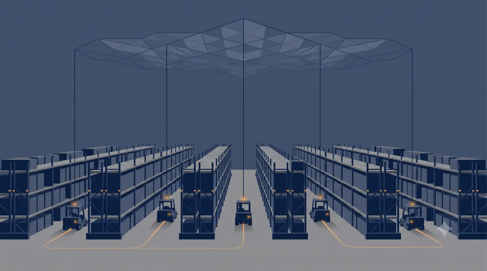
</figure>

## TABLE OF CONTENTS

1. [Executive Summary](#executive-summary)
2. [The Failure Mode](#1-the-failure-mode)
3. [Blueprinting the Operation](#2-blueprinting-the-operation)
4. [Deriving the Specification](#3-deriving-the-specification)
5. [Prior Art and Evaluation](#4-prior-art-and-evaluation)
6. [The Resulting Architecture](#5-the-resulting-architecture)
7. [Adoption Is an Architectural Constraint](#6-adoption-is-an-architectural-constraint)
8. [From Visibility to Prediction](#7-from-visibility-to-prediction)
9. [Results](#8-results)
10. [Known Considerations](#9-known-considerations)
11. [Why the Method Survives Procurement](#10-why-the-method-survives-procurement)
12. [What Would Change Today](#11-what-would-change-today)
13. [Conclusion](#12-conclusion)
14. [Appendix A: De-Identification Applied](#appendix-a-de-identification-applied)
15. [Appendix B: License and Citation](#appendix-b-license-and-citation)

## EXECUTIVE SUMMARY

Most operational technology programs begin with a capability and search for a problem. The better ones begin with a loss and search for a specification.

This paper documents a deployment that took the second path. Working with a national third-party logistics provider, three warehouse workflows were mapped before a single vendor was evaluated. The analysis identified roughly one million dollars in annual loss concentrated in one workflow, and it produced a single number that governed everything downstream. A picker had to complete a pick every ninety seconds for the operation to hold against its labor cost.

That number became the specification. It determined the positional accuracy required, the reporting frequency required, and the integration surface required. It disqualified seven of the eight technologies assessed, including several that were superior on paper and attractive on price. The technology that survived was not the most capable. It was the one that met the cadence.

The deployment moved picking from 32 to 36 picks per hour to 40 to 42 picks per hour, crossing the threshold the loss analysis had identified. The gain was sustained, it was verified by the client against their own historical records, and the system expanded from a pilot zone to the full facility.

<figure class="whitepaper-figure">
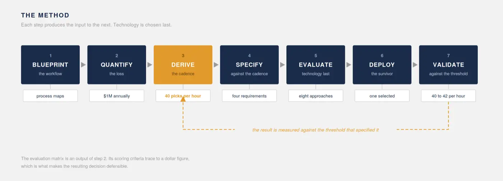
<figcaption>Figure 1: Each step produces the input to the next. The result is measured against the threshold that specified it.</figcaption>
</figure>
##### WHAT THIS PAPER ARGUES

Technology selection in operations is routinely inverted. Vendors demonstrate capability, buyers imagine application, and requirements are reconstructed afterward to justify a decision already made. The result is a pilot that measures what the technology measures well rather than what the business is losing.

The alternative is a sequence. Map the work. Price the loss. Derive the cadence. Specify against the cadence. Choose last.

Under this sequence the evaluation matrix becomes an output of the loss analysis rather than a procurement artifact. Its scoring criteria trace back to a dollar figure, which is what makes the resulting decision defensible to a board.

##### WHAT THIS PAPER DOES NOT CLAIM

It does not claim the method is validated at scale. There is one fully documented implementation.

It does not claim the causal mechanism is isolated. This was production, not experiment, and observation effects cannot be fully separated from supervisory action.

It does not claim the technology selected in 2020 would be selected today.

It also does not claim the method is complete. It answers what to build. It is silent on whom the result observes, and that silence has a cost this paper documents.

> A specification that answers what to build and is silent on whom it observes is not a complete specification.

---

**DISCLOSURE**

This paper is based on a real deployment carried out between 2020 and 2021 at a distribution center operated by a national third-party logistics provider, delivered by a large United States enterprise. The client, the facility, and the participating vendors are not named. Figures relating to facility size, device counts, and investment have been generalized. Operational performance figures are reported as measured by the client against their own historical records.

Nothing here discloses confidential commercial terms or proprietary implementation detail. The contribution is methodological, and the argument does not depend on the identity of the parties.

## 1. THE FAILURE MODE

Operational technology programs fail in a predictable pattern, and the pattern is not technical.

A vendor demonstrates a platform. A buyer recognizes something adjacent to a problem they have. A pilot is scoped around the demonstration. The pilot produces metrics, the metrics describe the pilot, and eighteen months later the program is quietly not renewed because nobody can connect what was measured to what the business was losing.

The defect is sequencing. Capability came first, and every subsequent decision inherited its frame. The pilot could only measure what the platform measured. The success criteria could only reflect what the pilot could measure.

This is not a vendor problem. It is a requirements problem, and it is solvable before any vendor enters the room.

<figure class="whitepaper-figure">
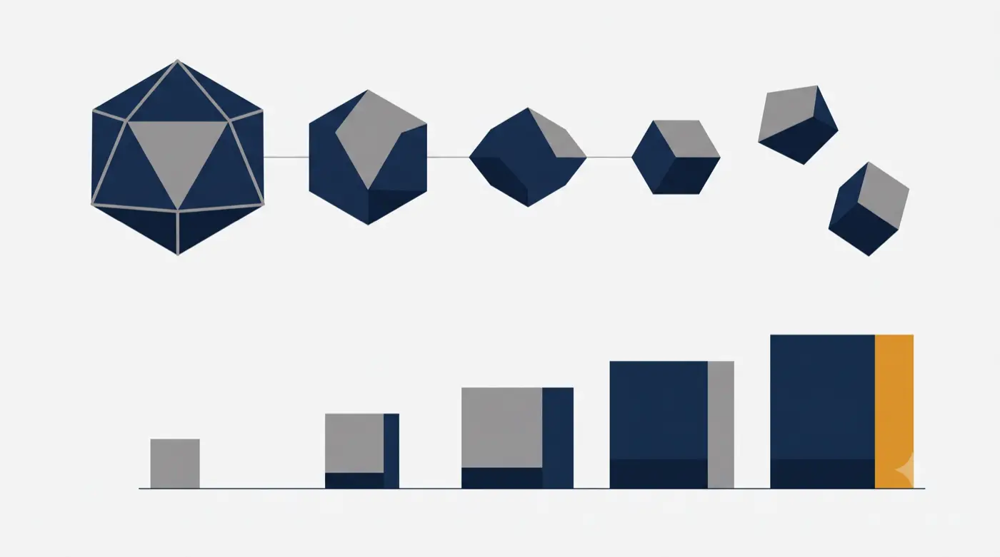
<figcaption>Figure 2: Two orderings of the same decisions. A sequence that begins with capability loses coherence as it proceeds. A sequence that begins with a quantified loss accumulates it.</figcaption>
</figure>
## 2. BLUEPRINTING THE OPERATION

The engagement began with process mapping, not technology evaluation.

Three workflows were documented with the client operation: bulk outbound picking, inbound put-away, and direct-to-consumer fulfillment. Each was mapped as a process flow with decision points, exception paths, and the time cost of each exception. Each was then subjected to cause and effect analysis to separate symptoms from drivers.

The analysis produced a documented failure threshold for each workflow.

| Workflow | Documented failure threshold |
|---|---|
| Bulk outbound picking | Under 40 picks per hour |
| Inbound put-away | Under 25 pallets per hour |
| Direct to consumer | Under 200 picks per hour |

For picking, the drivers grouped into five categories. Items missing from their designated locations, whether misplaced during put-away, fallen between racks, or consumed without replenishment. Physical obstruction and congestion in aisles, including the traffic created by pickers assisting one another. Replenishment executed reactively rather than on schedule, so that a picker discovered an empty location rather than being routed around one. Excessive traversal caused by orders split across distant locations. And errors introduced upstream during put-away that did not surface until a picker could not find what the system said was there.

None of these are technology problems. Each of them is measurable, and each of them costs time that can be priced.

The client selected picking as the first target. Loss attributable to picking inefficiency was quantified at approximately one million dollars annually.

<figure class="whitepaper-figure">
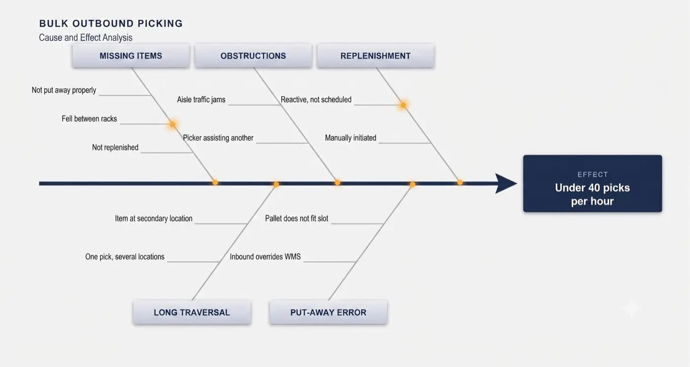
<figcaption>Figure 3: Cause and effect analysis for bulk outbound picking. Five driver categories converge on a single documented failure threshold.</figcaption>
</figure>
##### A NOTE ON SCOPE

Put-away and direct-to-consumer were blueprinted and their failure thresholds documented. Neither was carried through to dollar quantification, because the client did not fund that analysis. This paper does not present them as costed.

## 3. DERIVING THE SPECIFICATION

A threshold of 40 picks per hour is a ninety second pick cadence. That translation is the pivot of the entire program.

The figure originated as a statement from the facility's senior operations manager, who knew what the operation needed to sustain, and it was corroborated afterward against operational data. It is worth noting that the number came from the floor before it came from the analysis. The analysis confirmed it rather than discovering it.

Once stated as a cadence, the requirement generates its own technical specification. To make a ninety second cadence observable and correctable while a shift is still in progress, a system must satisfy four conditions.

##### POSITIONAL ACCURACY WITHIN PHYSICAL TOLERANCE

Not accuracy to an abstract figure, but accuracy sufficient to distinguish one rack and bay from its neighbor.

This is the formulation that survives contact with a warehouse. The requirement was never sub-meter accuracy in principle. It was accuracy inside rack and bay tolerance, which is a property of the building rather than of the technology.

##### REPORTING FREQUENCY WELL INSIDE THE CADENCE WINDOW

A pick that has stalled must be visible while there is still time to intervene.

Reporting every ninety seconds tells you the cadence was missed. Reporting every two to three seconds tells you it is being missed now. That is the difference between a report and an instrument.

##### ATTRIBUTION WITHOUT OPERATOR BURDEN

Position must resolve to a specific operator and a specific task.

Any requirement that an operator scan, tap, or log something consumes the cadence it was meant to protect. A system costing five seconds per pick to feed has spent more than five percent of the budget it exists to defend.

##### INFRASTRUCTURE COST BELOW THE RECOVERY CEILING

The program was recovering roughly one million dollars annually. Any solution requiring facility rewiring, structural modification, or a permitting cycle inside an operating distribution center was disqualified on arithmetic rather than on merit.

<figure class="whitepaper-figure">
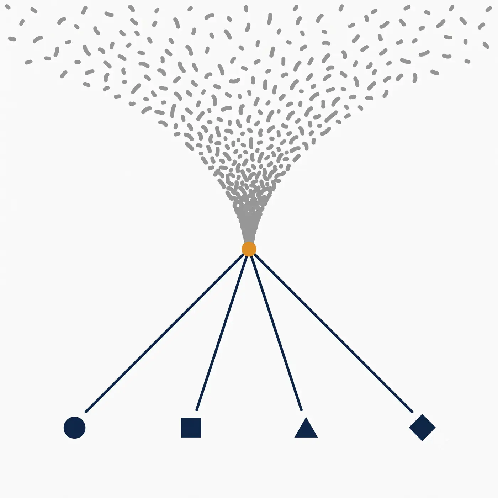
<figcaption>Figure 4: Dispersed operational loss resolves into a single quantified cadence, and that cadence generates four precise technical requirements.</figcaption>
</figure>
These four conditions are not preferences. Each traces back to the ninety second figure, which traces back to the loss analysis, which traces back to a dollar amount the client's own finance organization recognized.

That chain of traceability is the point. It is what allows an architect to tell an executive why a technically superior option was rejected, and to be believed.

## 4. PRIOR ART AND EVALUATION

Real-time location systems were an established product category well before this deployment. Multiple vendors offered warehouse tracking, and any claim that the category did not exist would be trivially refuted.

The category, however, is broad, and implementations within it are not equivalent. Products marketed under the same label differ by an order of magnitude in the properties that mattered here. Several established warehouse offerings deliver location through handheld scanning infrastructure operating in sub-gigahertz bands. These satisfy zone level requirements well. They do not resolve position within rack and bay tolerance, and they do not report at a frequency that makes a ninety second cadence observable as it degrades.

That distinction is the point of this section. The requirements were not written to favor an outcome. They were derived before any vendor was evaluated, and they disqualified products occupying the same category on the basis of measured capability against a stated threshold.

##### THE CLAIM, SCOPED

No product identified during the evaluation met all five of the following criteria.

1. On-device position resolution at rack and bay tolerance, reporting on a two to three second cadence
2. Transport over a cellular network with no facility cabling or infrastructure approval dependency
3. Fusion with warehouse management, resource planning, and time tracking systems sufficient to attribute position to operator and task
4. Role-differentiated operational dashboards distinguishing supervisory use from managerial use
5. Next-day predictive exception forecasting derived from the resulting operational record

Components one through three were individually available from multiple vendors. The combination, delivered end to end, was not found in the market survey conducted at the time.

That is a statement about a specific search under specific requirements, not a claim about the state of the industry. Readers who can identify a product of that era meeting all five criteria are invited to say so.

##### THE EVALUATION

Eight approaches were assessed: on-device Bluetooth Low Energy positioning, alternative Bluetooth architectures, ultrasonic positioning, stereoscopic camera tracking, camera tracking with computer vision, wheel rotation odometry, ultra-wideband, and internal build.

The scoring criteria are the derived requirements from Section 3, plus two constraints routinely omitted from published evaluations that were decisive here.

| Criterion | Derived from |
|---|---|
| Positional accuracy within rack and bay tolerance | Pick location granularity |
| Reporting cadence of two to three seconds | Ninety second pick cadence |
| No added operator touchpoint | Cadence protection and adoption risk |
| Infrastructure capital cost | Recovery ceiling of roughly one million dollars annually |
| Approval and permitting burden | Deployment timeline inside an operating facility |
| Vendor onboarding lead time | Enterprise procurement reality |

<figure class="whitepaper-figure">
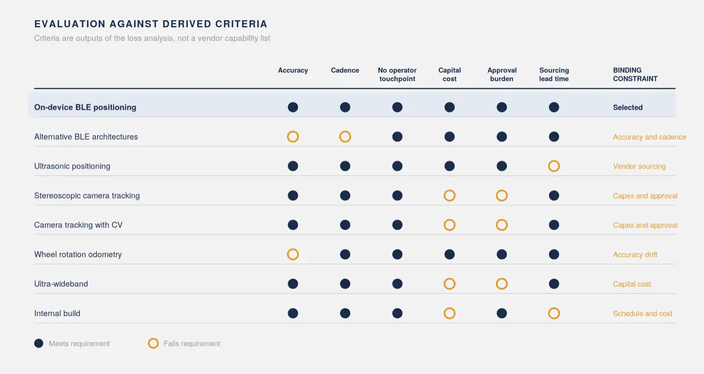
<figcaption>Figure 5: Eight approaches assessed against six derived criteria. Every criterion traces to the loss analysis rather than to a vendor capability list.</figcaption>
</figure>
Ultra-wideband was disqualified on cost. Stereoscopic camera tracking could meet the accuracy requirement but required cabling throughout an operating warehouse, which carried both capital cost and an approval cycle exceeding the program timeline. Ultrasonic was disqualified because the vendor could not be sourced through the delivering organization's procurement process, and onboarding a new vendor would have consumed more calendar time than the deployment itself.

This is worth stating plainly to an executive audience. In a large enterprise, procurement lead time is a technical constraint. Treating it as an administrative afterthought produces architectures that cannot be built.

## 5. THE RESULTING ARCHITECTURE

What follows is presented as reference architecture. Vendors are described by category. The architecture is evidence for the method rather than the contribution itself, and it is summarized accordingly.

<figure class="whitepaper-figure">
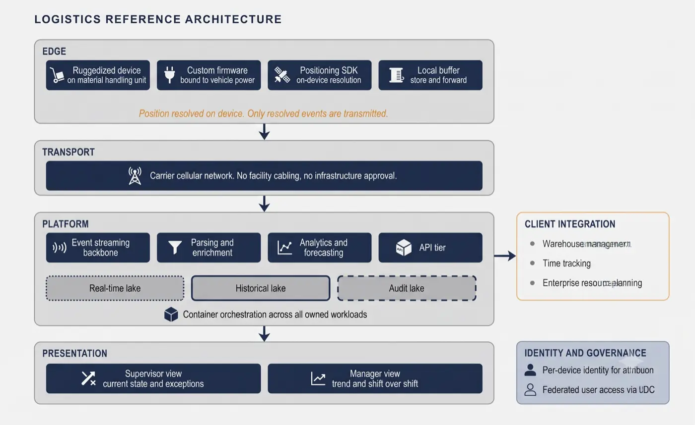
<figcaption>Figure 6: Reference architecture across four tiers, with the client integration surface entering at the platform tier.</figcaption>
</figure>
##### EDGE

Ruggedized Android devices were mounted to material handling equipment, running a custom firmware image whose power lifecycle was bound to the vehicle's own power state. Devices powered on and off with the forklift and charged from it, which eliminated both the burden of a charging regime and the failure mode of a discharged tracker.

The decisive architectural choice sits here. Positioning computation ran on the device. The positioning vendor's cloud service supplied only the facility map and the path and grid reference data. The device resolved its own position against that grid and emitted resolved location events upstream.

This is what made the cadence achievable at acceptable cost. Raw signal data never left the device, so reporting frequency was constrained by what the device could compute rather than by what the network could carry. Architectures that resolve position in the cloud invert this, and pay for it in both latency and transport cost.

##### HOW THE ENVIRONMENT WAS HANDLED

A warehouse is a hostile radio environment. Steel racking, dense inventory, moving metal masses, and heavy multipath all degrade raw signal quality, and any positioning approach that reports a raw estimate will produce a track that wanders through solid racking.

The mechanism that made this tolerable was constraint rather than filtering. The facility floor plan was surveyed and the traversable paths were blueprinted in advance, so the device was not resolving position in open space. It was resolving position against a known grid of aisles, bays, and permitted routes, and estimates were snapped to that grid. A reading that implied a vehicle inside a rack was resolved to the nearest legitimate position on the path instead.

The practical result in production was accuracy between half a metre and two metres. That range is wider than a specification sheet would advertise, and it was sufficient, because the requirement was never an accuracy number. It was rack and bay tolerance, and the achieved range sat inside it.

The lesson generalizes. In a constrained physical environment, prior knowledge of the environment is worth more than raw sensor precision. A less accurate sensor with an accurate map outperforms a more accurate sensor without one.

##### TRANSPORT AND PLATFORM

Transport was a public cellular network, with no facility network dependency, no cabling, and no additional infrastructure approvals. This choice was made for the reasons set out in Section 4 rather than for reasons of preference, and it is a substantial part of why the deployment was possible on the timeline it had.

The application buffered locally during connectivity loss and delivered in batches once connectivity was restored, so network gaps produced delay rather than data loss.

The platform ran on public cloud with container orchestration across all owned workloads: the event streaming backbone, the parsing and enrichment pipelines, the analytics engines, the interface tier, and the dashboards. Independent scaling mattered because ingest scaled with device count while the presentation tier scaled with concurrent supervisory users. Storage was separated by purpose across real-time, historical, and audit stores.

<figure class="whitepaper-figure">

<figcaption>Figure 7: Cloud resolved positioning transmits continuous raw signal. Edge resolved positioning transmits only resolved events. The difference in channel weight is the difference in cost.</figcaption>
</figure>
##### INTEGRATION, IDENTITY, AND GOVERNANCE

The system fused its own location record with three client systems: the warehouse management system for task and location context, an existing time tracking system for operator to vehicle assignment, and the enterprise resource planning system. No new operator touchpoint was introduced. The system read from what the operation already ran.

Every device carried its own identity, providing both attribution for the data it produced and a governance surface for its lifecycle. User access was federated to the client's own identity provider, so supervisors and managers reached the system with corporate credentials and every access produced an auditable record.

For a system that measures individual work, federated and audited access is not a convenience feature. It is the mechanism by which access to that measurement is constrained and reviewable, and it is the subject of the next section.

## 6. ADOPTION IS AN ARCHITECTURAL CONSTRAINT

The most durable finding from this deployment is not technical. It is that the adoption surface was split, and the population that was not consulted set the hardware requirements.

##### SUPERVISORS WERE CO-DESIGNERS

No reference design existed for what these dashboards should contain, because the capability had not been assembled this way before. Views were therefore developed iteratively with a small group of supervisors over successive cycles.

What emerged was a split by role that would not have been predicted from a requirements document.

Supervisors are mobile. They are on the floor directing pickers, and they do not have the attention budget to interpret a map. They needed current state and exceptions, delivered in a form readable in seconds.

Managers work at a desk and review after the fact. They needed historical trend and shift over shift comparison.

A single view serving both would have failed both. This is why the platform migrated from geospatial visualization to a real-time dashboarding platform with role-differentiated views. The first generation answered where. The second generation answered what to do now, and separately, what happened last week.

<figure class="whitepaper-figure">
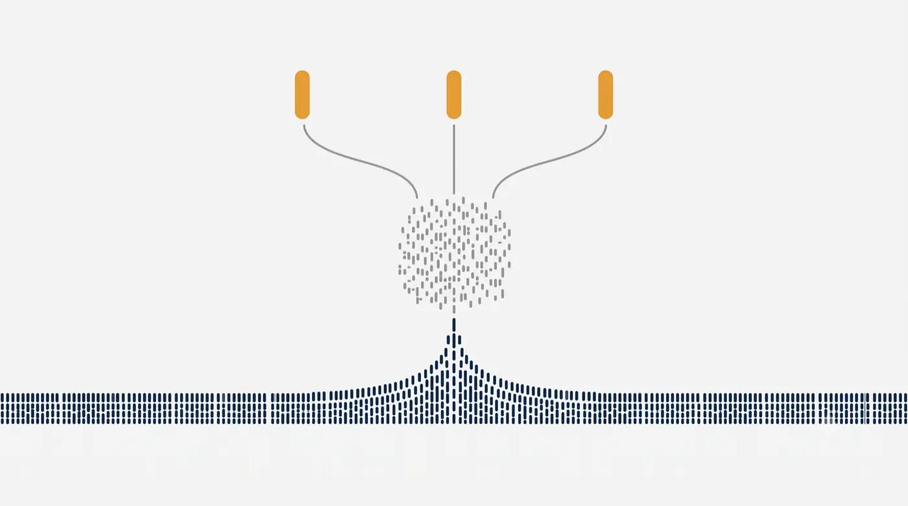
<figcaption>Figure 8: One underlying record resolving into two distinct visual grammars for two distinct working contexts.</figcaption>
</figure>
##### FLOOR STAFF WERE SUBJECTS

Some operators objected to being tracked, and some interfered with the devices.

The response was progressive physical hardening. First software lockdown of the device. Then a tamper-resistant enclosure. Then alerting on three conditions: enclosure opened, device interfered with, and device not reporting while the warehouse management system showed its vehicle in active use.

That third alert is a genuinely useful piece of engineering, and it exists only because of a social problem rather than a technical one. It works by cross-referencing silence in one system against activity in another, which is a pattern worth borrowing regardless of context.

##### THE CLAIM, STATED PRECISELY

The system was transparent in the operational sense. It required no additional operator action and it changed no operator procedure.

It was not thereby accepted. Those are different claims, and conflating them is dishonest.

Tamper resistance was the cost of an asymmetry in the design process. Supervisors were consulted because they were users. Operators were not consulted because they were subjects. Nobody co-designs with subjects, and the hardware budget absorbed the difference.

##### CONSULTATION IS RISK MANAGEMENT, NOT SENTIMENT

The temptation is to file this under ethics and move on. That framing is both incomplete and, for an executive audience, easy to dismiss.

Consider what the omission actually cost. Devices were disabled, which meant unmeasured vehicles and gaps in the record the analysis depended on. Enclosures were designed, sourced, and fitted, which was unbudgeted hardware work. Tamper detection was specified and built, which was unplanned engineering. Attention went to defending the instrument rather than improving it.

Every one of those is a schedule and budget item, and every one of them was avoidable. A system that measures individual work has a workforce acceptance dependency in exactly the way it has a network dependency or a power dependency. Leaving it unmanaged does not make it disappear. It converts it into hardware spend and delay.

So the position this paper takes is not primarily a moral one, though the moral reading also holds.

Three commitments follow, and this deployment met two of them. Visualization should be aggregate first, so that the default view answers where the operation is losing time rather than who is slowest. Access should be role-scoped and audited, so that individual detail is reachable only for a legitimate supervisory reason and every retrieval leaves a record. And the measured population should be consulted during blueprinting rather than hardened against after go-live.

The first two were designed in. The third was not, and the tamper incidents are the record of that omission. Run again, workforce consultation would sit in Section 2 alongside the process mapping, because that is where it belongs and that is where it is cheapest.

<figure class="whitepaper-figure">
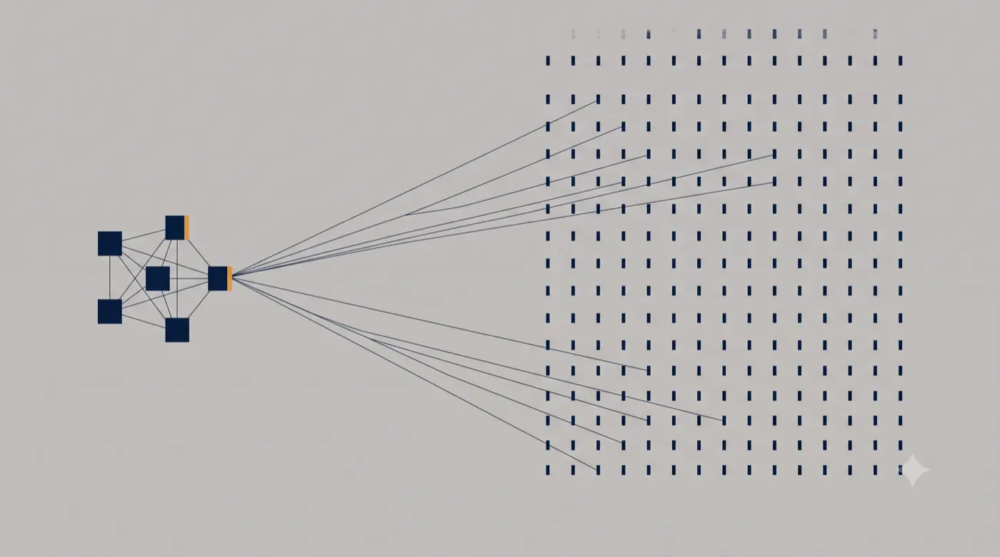
<figcaption>Figure 9: The design asymmetry. One population shaped the system through connected iteration. The other received it.</figcaption>
</figure>
## 7. FROM VISIBILITY TO PREDICTION

Once the location record existed, it became a training set.

Fused with warehouse management, resource planning, and time tracking data, it supported a model combining deterministic rules with statistical modeling. The model produced next-day forecasts identifying which bays and which products were likely to generate exceptions. Forecasts were delivered to supervisors at the start of shift, naming specific bays, which allowed reslotting, pre-emptive replenishment, or investigation before the shift degraded.

The operation moved from reacting to problems to pre-empting them. That is the point at which an analytics deployment becomes an operations tool, and it is not reachable without the measurement layer that preceded it.

<figure class="whitepaper-figure">
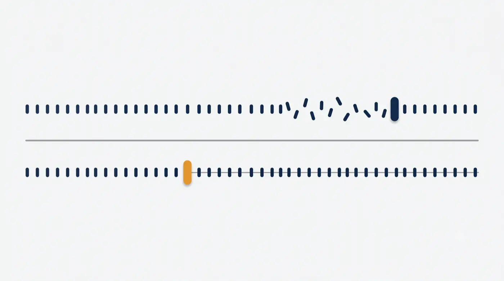
<figcaption>Figure 10: Correction after failure compared with intervention before it. The position of the corrective action relative to the failure is the entire value of the predictive layer.</figcaption>
</figure>
##### ON THE MODEL, AND WHAT IS NOT CLAIMED

The modeling was deliberately simple. The value sat in the feature data rather than in the algorithm, which is the usual case in operational forecasting and rarely the way such work is described.

This paper does not name the algorithm or publish an accuracy figure. Five years on, the author does not have the model specification or the validation record in hand, and reconstructing either from memory would be worth less than the omission. What can be stated is the validation design, because that is what determines whether any accuracy figure would have meant anything.

##### VALIDATION

Rolling-origin backtest. To predict a target day, the model was trained only on the preceding window, typically thirty trailing days. The target day was never present in the training data.

Without a clean holdout, a forecast score reflects fit rather than skill. The design matters more than the number it produced, and it is the reason supervisors were willing to plan against the output.

<figure class="whitepaper-figure">
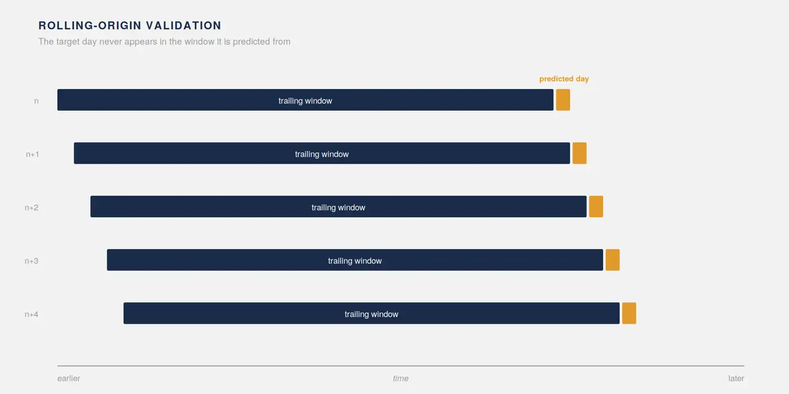
<figcaption>Figure 11: Rolling-origin validation. The training window advances with each prediction and the target day always falls outside it.</figcaption>
</figure>
##### AN OPERATIONAL CONSTRAINT WORTH NAMING

The forecast had to be computed against the previous day's closed data and land in the supervisor view before the first operators clocked in.

That is a pipeline scheduling requirement, not a modeling one. It is also the kind of constraint routinely omitted from machine learning case studies, which is one reason so many of them do not survive contact with a shift schedule.

## 8. RESULTS

| Measure | Value |
|---|---|
| Pre-deployment picking rate | 32 to 36 picks per hour |
| Post-deployment picking rate | 40 to 42 picks per hour |
| Threshold derived from loss analysis | 40 picks per hour |

The operation crossed the threshold its own loss analysis had identified.

This is where the argument closes. The loss analysis produced a cadence. The cadence specified the technology. The technology delivered the cadence.

The improvement was sustained rather than transient, and the deployment expanded from an initial multi-aisle pilot zone to the full facility.

<figure class="whitepaper-figure">
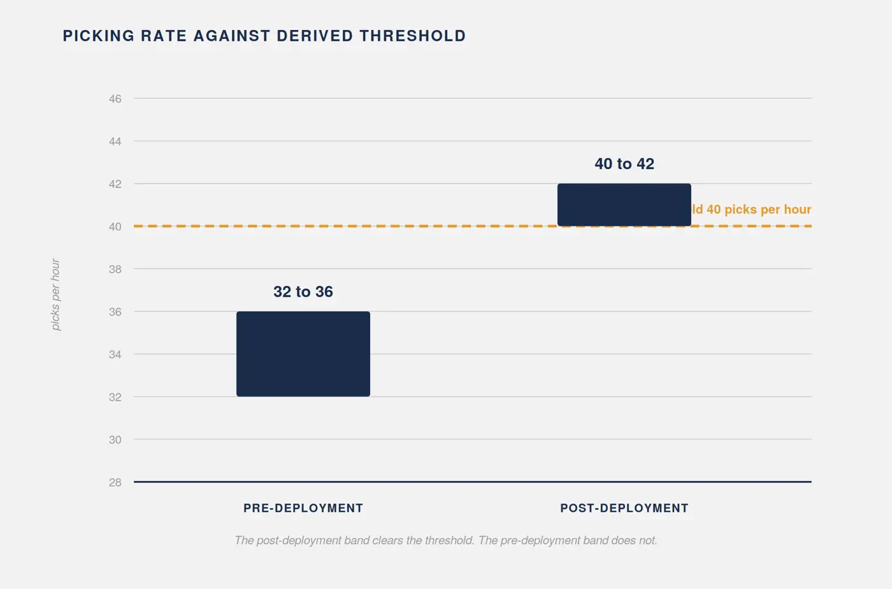
<figcaption>Figure 12: Pre-deployment and post-deployment picking rates against the threshold derived from the loss analysis.</figcaption>
</figure>
##### ON MEASUREMENT PROVENANCE

The client supplied their own historical picking records and verified the improvement themselves.

This is third-party verification against the client's own baseline, performed by the party with the least incentive to flatter the vendor. It is a stronger evidentiary position than most published operational case studies occupy, and it should be stated whenever these figures are cited.

## 9. KNOWN CONSIDERATIONS

These are not caveats appended for form. Each is a limit on what the preceding sections establish.

##### ATTRIBUTION

This was a production deployment, not a controlled experiment. Two changes occurred simultaneously to the same population. Supervisors gained actionable visibility, and operators became aware they were being measured. Both plausibly increase pick rate.

A single site before and after design cannot separate supervisory action from observation effects, because no condition existed in which one occurred without the other.

The result is well evidenced. The mechanism is less certain than the result, and this paper's argument concerns the mechanism.

Two observations bear on it without settling it. The initial deployment covered a subset of aisles while the remainder of the facility was untracked, which offers a comparison where the underlying records support one. Separately, the tamper incidents indicate that awareness of measurement did not uniformly produce compliance, which argues against a purely observational explanation.

##### GENERALIZABILITY

The method has one fully documented implementation, in a single facility and a single workflow. Additional deployments across different operations would be required before its transferability could be treated as established rather than argued.

##### PROVENANCE OF THE NUMBERS

Operational figures are as reported by the client operation. Where source documentation was not retained, this is stated rather than presented as instrumented measurement.

##### SCOPE OF QUANTIFICATION

Only picking was carried through to dollar quantification. The commercial argument in Section 10 extends to additional workflows on the basis of blueprinting that identified failure thresholds without costing them.

##### DEVICE ATTRITION

Early device losses occurred and were resolved through progressive physical hardening, after which attrition ceased to be an operational concern. Precise figures were not retained and no estimate is offered.

## 10. WHY THE METHOD SURVIVES PROCUREMENT

A method that produces a defensible technical decision is worth little if the resulting programme cannot be funded. Two features of this one address that directly.

##### THE INVESTMENT WAS PLATFORM, NOT SITE

Development cost was a multi-million-dollar platform investment, incurred once. A second deployment carries beacons, devices, and integration labour, but not development.

This distinction matters when the business case is presented. Payback calculated against a single facility understates the position substantially, because the expenditure being amortized is not repeated. The relevant denominator is total recoverable loss across a customer's workflows and facilities, which is why the blueprinting in Section 2 covered three workflows rather than the one that was funded.

##### THE CUSTOMER'S CONTRACT HORIZON IS THE APPROVAL WINDOW

This is the most transferable observation in the paper and it is specific to the customer type.

Third-party logistics providers contract with their own end customers on defined multi-year terms, commonly three, five, or seven years. That gives them a known amortization horizon and known revenue certainty against which technology investment can be justified internally.

Technology sold into that horizon is materially easier to approve than open-ended operating expense. Vendors selling into this market should structure commercial terms around the customer's contract structure rather than around their own fiscal calendar. Most do not, and it is a recurring reason that operationally sound proposals fail at procurement.

The connection back to the method is direct. A loss figure denominated in currency, tied to a threshold the operation recognizes, sized against a contract term the customer already commits to, is an approval case. A capability demonstration is not.

## 11. WHAT WOULD CHANGE TODAY

The deployment described here is five years old. The most useful thing to say about it is not that the architecture has aged, but that the method would tolerate the ageing and the architecture would not.

Ultra-wideband was disqualified on capital cost. Component pricing and vendor availability have both moved since, and the accuracy and update rate it offers were never in question. Run today, the honest expectation is that ultra-wideband would clear the cost criterion it previously failed. Whether it would clear the infrastructure and approval criteria is a separate question.

That possibility is the strongest available evidence for the argument. The criteria were derived from the operation rather than from the market, so they remain valid even when the market moves and the winner changes. A capability-first evaluation would have to be rerun from scratch. This one would only need to be rescored.

Two other decisions would shift. Managed streaming and pipeline services now cover most of what was self-operated, which lowers operating overhead per deployment and improves the marginal cost position in Section 10. And devices capable of resolving their own position are now capable of running inference on their own event stream, which would shorten the loop from next-day forecast to same-shift alert and relieve the scheduling constraint in Section 7.

That last change would raise a governance question this deployment did not have to answer. A device that flags its own operator's behaviour in real time is a materially different instrument from one contributing to an aggregate forecast. The commitments in Section 6 would need to be restated, and probably strengthened, before that capability were built.

## 12. CONCLUSION

The sequence this paper describes is not sophisticated. Map the work. Price the loss. Derive the cadence. Specify against the cadence. Choose last.

Its value is that every decision downstream inherits a justification the business already accepts. When a technically superior option is rejected, there is a number to point at. When an executive asks why this vendor, the answer is not a capability comparison but a threshold the operation had to meet. The evaluation matrix stops being a procurement formality and becomes an argument.

The method delivered what it was built to deliver. The operation crossed its own threshold and stayed there.

What the method did not produce was any account of who would be measured. It specified accuracy, frequency, and integration surface. It said nothing about the population whose work those specifications would render visible, and that omission is what the hardware budget eventually paid for.

A specification that answers what to build and is silent on whom it observes is not a complete specification. That is the open problem, and it was not solved here.

## APPENDIX A: DE-IDENTIFICATION APPLIED

| Actual | Published |
|---|---|
| Client | A national third-party logistics provider |
| Delivering organization | A large United States enterprise |
| Facility location | A Northeast United States distribution center |
| Positioning vendor | A commercial positioning software development kit vendor |
| Device manufacturer | A ruggedized Android device manufacturer |
| Facility size | Roughly half a million square feet |
| Beacon count | Approximately one beacon per five to six thousand square feet |
| Tracked fleet | Several dozen material handling units across three shifts |
| Specific aisle ranges | An initial multi-aisle pilot zone |
| Named individuals and organizational structure | Removed entirely |
| Platform investment | Multi-million-dollar platform investment |
| Internal project name | Not used. The system is referred to as the platform |

Unchanged, because they are load-bearing to the argument and not identifying: the 40 picks per hour threshold, the ninety second cadence, the pre-deployment and post-deployment rates, the approximately one million dollar annual loss, and the architecture itself.

## APPENDIX B: LICENSE AND CITATION

This work is licensed under a Creative Commons Attribution 4.0 International License.

You are free to share it in any medium or format, and to adapt, remix, transform, and build upon it for any purpose, including commercially. These freedoms cannot be revoked so long as the license terms are followed.

The condition is attribution. You must give appropriate credit, provide a link to the license, and indicate whether changes were made. You may do so in any reasonable manner, but not in any way that suggests the author endorses you or your use.

Full license text: https://creativecommons.org/licenses/by/4.0/

##### SUGGESTED CITATION

Lakisic, Z. (2026). *The KPI Is the Specification: A Loss-Driven Method for Technology Selection.* Grid Intelligence White Paper.

##### A NOTE ON SCOPE OF THE LICENSE

The license covers this document and its figures. It does not extend to the underlying engagement, the client relationship, or any material belonging to the organizations described here. Those are not the author's to license, which is the reason the paper is de-identified.

---

**White Paper, Version 1.0 (Beta)**

**A Case Study in Operational Intelligence for Distribution Logistics**

**License:** Creative Commons Attribution 4.0 International (CC BY 4.0)  
**Author:** Zlatko Lakisic  
**Portfolio:** [zlatko-lakisic.github.io](https://zlatko-lakisic.github.io/zlatko-lakisic/)  
**LinkedIn:** [linkedin.com/in/zlatko-lakisic](https://www.linkedin.com/in/zlatko-lakisic/)

Full PDF: [GRID-INTELLIGENCE_WhitePaper_Beta_v1.0.pdf](https://github.com/zlatko-lakisic/white-papers-grid-intelligence-public/raw/main/GRID-INTELLIGENCE_WhitePaper_Beta_v1.0.pdf) · Source release: [white-papers-grid-intelligence-public](https://github.com/zlatko-lakisic/white-papers-grid-intelligence-public)

