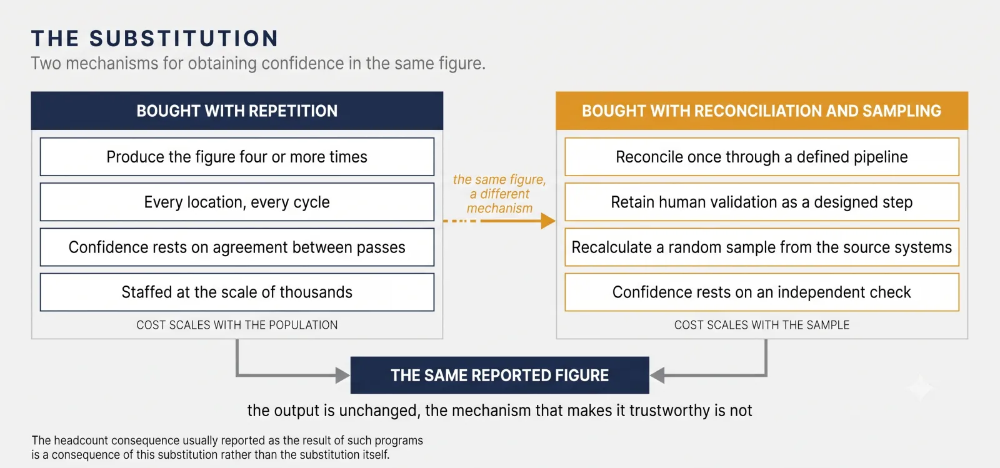
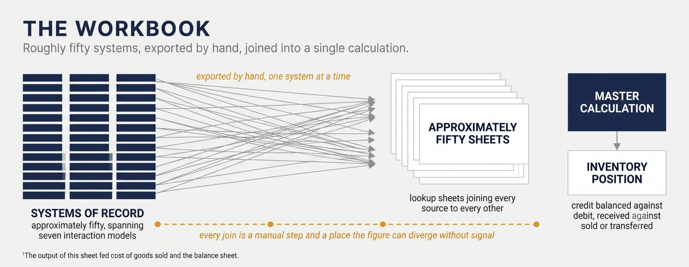
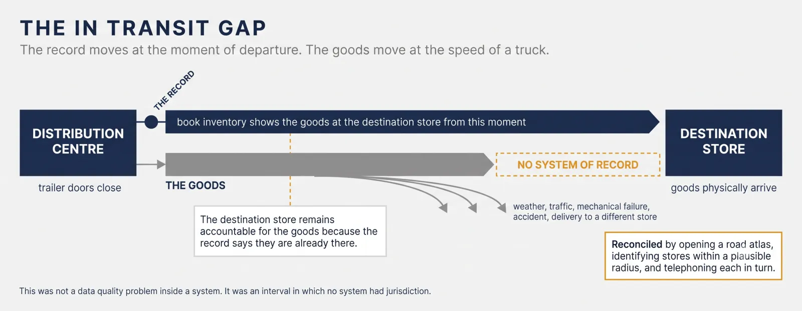
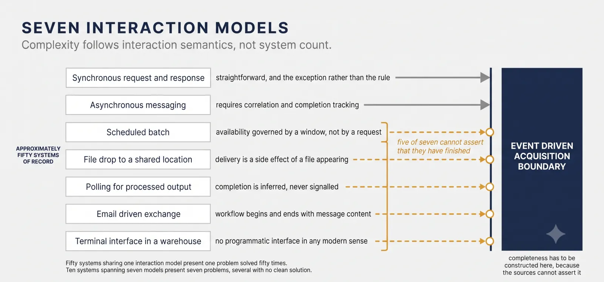
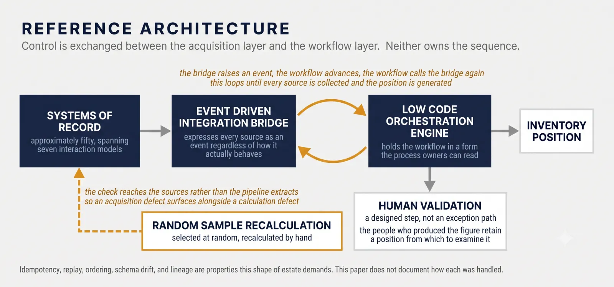
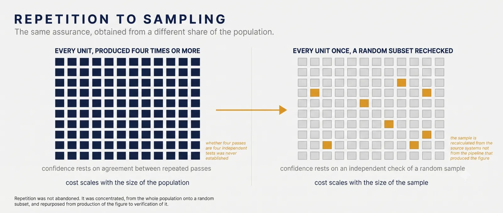
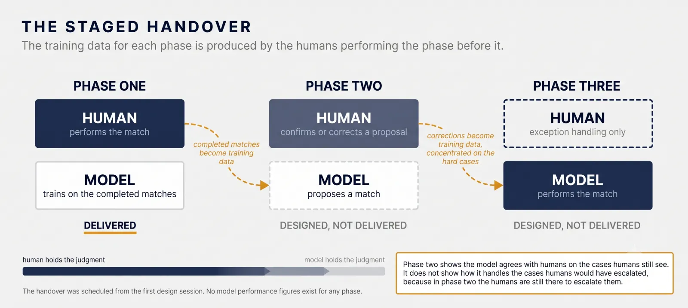
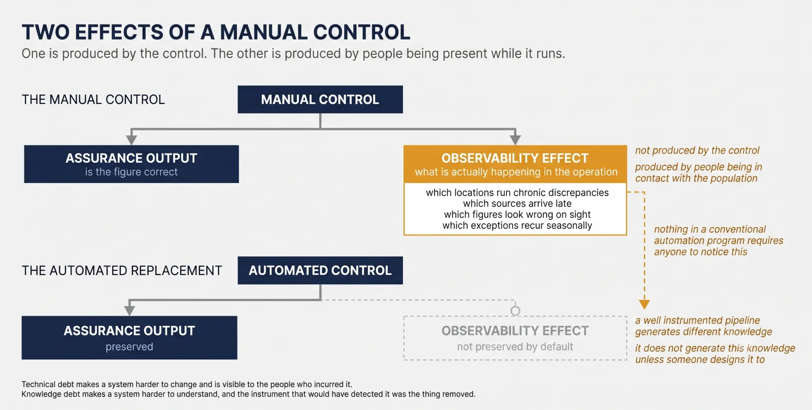

  

    Listen
    <audio class="whitepaper-audio" controls preload="metadata" src="../assets/white-papers/ledger/ledger-v1.3-narration.mp3">
      Your browser does not support audio playback.
    </audio>
    
  

  

    <a class="whitepaper-download" href="https://github.com/zlatko-lakisic/white-papers-ledger/raw/main/LEDGER_WhitePaper_v1.3.pdf" download="LEDGER_WhitePaper_v1.3.pdf">Download PDF (v1.3)</a>
    <a href="https://github.com/zlatko-lakisic/white-papers-ledger">Public release repo</a>
  

# Ledger: Assurance Is Bought With Labor

<em>Control Substitution, Enterprise Integration, and the Loss of Operational Observability</em>

<figure class="whitepaper-cover">

</figure>

## TABLE OF CONTENTS

1. [Executive Summary](#executive-summary)
2. [The Failure Mode](#the-failure-mode)
3. [What the Count Could Not See](#what-the-count-could-not-see)
4. [The Integration Problem](#the-integration-problem)
5. [The Architecture](#the-architecture)
6. [Substituting the Control](#substituting-the-control)
7. [The Matching Problem and the Staged Handover](#the-matching-problem-and-the-staged-handover)
8. [Evidence and Results](#evidence-and-results)
9. [Operational Observability and Knowledge Debt](#operational-observability-and-knowledge-debt)
10. [What Nobody Measured](#what-nobody-measured)
11. [Why This Matters More Now](#why-this-matters-more-now)
12. [Context and Related Work](#context-and-related-work)
13. [What Leadership Should Ask](#what-leadership-should-ask)
14. [Limitations](#limitations)
15. [Conclusion](#conclusion)
16. [Notes](#notes)
17. [Appendix A: De-Identification Applied](#appendix-a-de-identification-applied)
18. [Appendix B: License and Citation](#appendix-b-license-and-citation)

## EXECUTIVE SUMMARY

Every organization pays for confidence in its numbers. Few write down what it is paying with.

A manual process that produces a financially consequential figure is normally treated as an efficiency problem. It may instead be a control whose assurance mechanism happens to be labor. Automating it does not eliminate that control. It changes how assurance is produced, and the relevant question stops being how much work was removed and becomes whether the replacement performs the functions the original performed.

This paper documents an engagement at a large publicly traded retailer whose inventory position, a figure feeding cost of goods sold and the balance sheet, was assembled by hand. Staff exported data from roughly fifty systems into comma separated files and loaded them into a spreadsheet workbook carrying approximately fifty sheets and a master calculation that balanced credit against debit across every source.

The organization knew the figure mattered and acted accordingly. Each inventory was produced at least four times, frequently more, by policy rather than as rework. Repeated independent production was the practical mechanism through which confidence in the figure was obtained. Across several thousand locations on a quarterly cycle, the client identified approximately two thousand two hundred people as participating in this standing process.

Repetition at that scale is purchased with labor. The organization was not careless; it was rigorous in the only currency available to it, because no mechanism existed by which fifty systems could be reconciled once and shown to be correct.

The engagement designed a substitution. Reconciliation moved to a defined pipeline, human validation was retained as a designed step, and a replacement assurance mechanism was specified around random sampling with independent manual recalculation. The first phase was delivered.

<figure class="whitepaper-figure">

<figcaption>Figure 1: Two mechanisms for obtaining confidence in the same figure. The left is bought with repetition across the whole population and staffed accordingly. The right is bought with reconciliation performed once and an independent check on a random sample.</figcaption>
</figure>

##### THE THREE FINDINGS

**Control substitution.** Automating a manual control is a control change, not an efficiency exercise, and it should be approved, documented, and validated as one.

**Integration complexity follows interaction semantics, not system count.** Fifty systems sharing one interaction model are simpler than ten systems spanning seven. This estate spanned seven, and that proved more consequential to integration design than the raw count of systems.

**Loss of operational observability.** A manual control has two effects. It produces assurance about the controlled figure, and human participation in it incidentally generates knowledge about the population and the operating environment. Automation can preserve the first while removing the conditions that produced the second. Nothing in a conventional automation program requires anyone to notice.

The third is the finding this paper exists to raise, and it has become more consequential rather than less. In 2019, encoding human judgment into a system designed to succeed the people exercising it was an unusual construction. In 2026 it is a common shape of enterprise AI deployment, which is why a case from 2019 is worth reading now.

##### TERMS USED IN THIS PAPER

| Term | Meaning as used here |
|---|---|
| Control | A mechanism intended to prevent, detect, or correct an undesired condition |
| Assurance mechanism | The means by which an organization obtains confidence that a control or its output can be relied upon |
| Control function | A specific thing a control does: completeness, accuracy, independence, exception detection, anomaly recognition, escalation, evidence generation |
| Compensating behavior | Undocumented human activity maintaining process performance where the formal process or system is insufficient |
| Operational observability | The knowledge about a population and its operating environment that human participation in a control incidentally generates |
| Knowledge debt | The accumulated loss of operational understanding when human participation is removed without preserving the contextual knowledge and diagnostic capability that participation generated |
| Designed substitution | A replacement mechanism specified |
| Implemented substitution | A replacement mechanism built and in use |
| Demonstrated equivalence | Evidence that the replacement performs the functions of the mechanism it replaced |

This engagement achieved designed substitution and implemented substitution for its first phase. It does not report demonstrated equivalence, and the distinction is maintained throughout.

##### WHAT THIS PAPER DOES NOT CLAIM

This is a documented case study in how to think about replacing manual assurance, not a results paper. Section 7 states the evidentiary status of every claim. The headline omissions are that no achieved headcount endpoint is reported, no sampling parameters or agreement rate are available, and equivalence between the retired mechanism and its replacement is argued rather than demonstrated.

> An organization that instruments a number to the credit and debit column, and does not instrument what producing that number cost in knowledge, has measured the easier half.

---

**DISCLOSURE**

This paper is based on a real engagement carried out between 2018 and 2019 for a large publicly traded United States retailer, delivered by a global business process management and professional services firm. The client, the delivering organization, the facilities, and the participating vendors are not named. Figures relating to location counts and organizational scale have been generalized, and individually identifying details of the people described have been removed.

Headcount figures are reported as supplied by the client, with that provenance stated at each use. The contribution is methodological, and the argument does not depend on the identity of the parties.

## 1. THE FAILURE MODE

The client produced three inventories for every store. A physical count. A second derived from counts and books. A third assembled from the systems of record.

The third is the subject of this paper. Staff exported data by hand from roughly fifty systems into comma separated files. Those files were loaded into a workbook held on a shared drive, carrying approximately fifty sheets, several lookup sheets, and a master calculation sheet that balanced credit against debit across every source: what had been received against what had been sold or transferred. The output of that sheet was the inventory position.

That position was not an operational metric. Inventory valuation feeds cost of goods sold and the balance sheet, and for a public issuer those are audited and disclosed.

The obvious reading is that this was inefficiency waiting to be automated. That reading is wrong, and getting it wrong makes the rest of the paper impossible to follow.

Each inventory was performed at least four times, frequently more. Not because the first attempt failed. Because the organization had decided that a figure carrying that much consequence warranted repeated independent production, and repetition was how confidence in it was obtained.

<figure class="whitepaper-figure">

<figcaption>Figure 2: Roughly fifty systems, exported by hand, joined across roughly fifty sheets into a single master calculation. Each join is a manual step and a point at which the reported figure can diverge without signal.</figcaption>
</figure>

##### A NECESSARY DISTINCTION

This paper describes repeated independent production as the organization's practical assurance mechanism, because that is what the engagement observed.

It does not claim that repetition was the formally designated control over financial reporting. Organizations of this size maintain formal control frameworks in which management review, physical counts, segregation of duties, and audit procedures all appear. What the engagement observed was the working mechanism through which staff and management obtained confidence in the systems derived figure, and that mechanism was repetition.

The distinction matters because the two can diverge. A formally designated control satisfied by a procedure nobody trusts, sitting alongside an informal practice everybody relies on, is a common and under examined condition. Where the two differ, the informal one is usually the one doing the work.

##### AND A CAUTION ABOUT THE MECHANISM ITSELF

The intuition behind repetition is that if four independent productions agree, the probability that all four share an error is lower than the probability that one contains it.

That intuition holds only to the degree the productions are actually independent. Four passes drawing on the same source extracts, the same business rules, the same master data, the same timing, and the same human assumptions are not four independent tests. They are one test performed four times, and they will agree on an error as readily as on a correct figure.

The engagement did not establish the degree of independence between passes, and this paper does not claim it was high. That is worth stating clearly, because it cuts against the comfortable version of the story. The retired mechanism may have been less rigorous than the organization believed. Its replacement may also be less rigorous than the program believed. Both propositions can be true, and the paper is more useful if it holds them together than if it argues that one mechanism was simply better.

> When a figure cannot be verified, an organization will pay for confidence in some other currency. Usually the currency is labor, and the cost is invisible because it appears on a headcount line rather than on a control register.

## 2. WHAT THE COUNT COULD NOT SEE

Discovery ran roughly six months, conducted on site at the client's corporate headquarters.

The sessions deliberately spanned the full vertical. Back of house workers who executed the process, the managers who supervised them, and the executives accountable for the figure that came out the other end. Each workflow was mapped, each point of friction traced to a cause, and for each population the engagement documented two things usually collapsed into one: what that group cared about, and what that group did to keep the process running when it did not work as designed.

The second is where the engagement stopped being an automation project.

##### THE PROCESS DISCOVERY PRINCIPLE

A process map drawn from documentation describes the process as intended. A process map drawn from the people executing it describes the process as performed. The difference between them is compensating behavior: informal work absorbing a defect the organization has not modeled.

Compensating behavior is invisible from above by construction, because its function is to prevent a problem from becoming visible. Control design has to account for the difference, and the only way to see it is to ask the people doing the work.

The clearest instance concerned goods in transit.

##### THE GAP BETWEEN THE RECORD AND THE THING

When a trailer was loaded at a distribution center and its doors closed, the book inventory transferred those goods to the destination store immediately. The record moved at the moment of departure. The goods moved at the speed of a truck.

Everything that can happen to a truck happened. Weather, traffic, mechanical failure, accidents, and diversion of a load to a different store for operational reasons. The goods arrived late, arrived elsewhere, or did not arrive. The destination store remained accountable for them regardless, because the record said they were already there.

There was no system tracking goods between the warehouse and the store. This was not a data quality problem inside a system. It was an interval during which no system had jurisdiction.

##### THE ATLAS

During one session a worker was asked how they resolved a shipment that had not arrived.

They took a road atlas out of a desk drawer and opened it flat. They located the destination store, identified the other stores within a plausible driving radius, and began telephoning those stores one at a time to ask whether the goods had turned up. They worked the list until the goods were found.

That was the reconciliation procedure. It was not written down anywhere. It was not in any system. It was reliable, and it had presumably been refined over years, because it required knowing which stores neighbored which, which of them received from the same distribution center, and which were likely to have taken a diverted load.

It is tempting to read this as an anecdote about a backward process. It is better read as the most precise available description of the gap. An organization operating several thousand locations had an interval in its inventory record covered by a paper map, a telephone, and one person's accumulated knowledge of their own geography. The procedure worked. That is the uncomfortable part, because a procedure that works does not generate escalations, and a gap that does not generate escalations does not get funded.

<figure class="whitepaper-figure">

<figcaption>Figure 3: The record transfers when the trailer doors close. The goods transfer on arrival. The interval between them had no system of record and was reconciled by hand.</figcaption>
</figure>
> The compensating behavior was not overhead sitting on top of the process. It was load bearing structure inside it, and it was invisible precisely because it was working.

##### EXCEPTION FIRST DISCOVERY

The atlas was not found by asking someone to describe their process. Asked that question, an operator describes the documented path, because that is what the question is understood to be about.

It surfaced from a question about failure. That generalizes into a discovery technique worth stating plainly, because it costs nothing and it finds the controls nobody wrote down.

Do not ask an operator to describe the process. Ask them to describe the last time the process was wrong.

Then follow it: how did you know it was wrong, what did you do, what information did you use, where did that information live, is any of that documented, and what would happen if you were not here. The last question is the one that matters, and it is rarely asked before the answer becomes relevant.

##### WHY THIS DETERMINED THE SCOPE

Two consequences followed.

The first is that the engagement could not be scoped as digitization. Automating the process as documented would have left every compensating behavior outside the system, still running, still undocumented, now feeding a pipeline that assumed it did not exist. The visible work would have accelerated and the invisible work would have become the constraint. Scope was therefore extended to process improvement, which sounds like consultancy language and was a technical necessity.

The second concerns what a count can represent. The inventory position balanced credits against debits and reported a figure. It had no field for the fact that a given store's discrepancy was being resolved by a worker with an atlas, nor for the knowledge that made that resolution possible. That knowledge was an asset of the operation and it appeared in no record of the operation, including the headcount.

Sections 8 and 9 return to this.

## 3. THE INTEGRATION PROBLEM

The technical difficulty was not the calculation. The calculation was arithmetic and the spreadsheet already performed it. The difficulty was acquisition.

The distinction is routinely inverted in how such programs are scoped and funded. Executive attention goes to the analytical layer, which is visible and demonstrable. Cost and schedule risk sit largely in ingestion, which is neither.

##### FIFTY SYSTEMS, SEVEN INTERACTION MODELS

The estate spanned approximately fifty systems of record. It included modern enterprise resource planning software, modern enterprise asset management software, a range of contemporary databases, and databases old enough that their interaction models predated the assumptions of every integration tool on the market.

The systems did not merely differ in technology. They differed in how they could be talked to at all.

| Interaction model | Practical implication |
|---|---|
| Synchronous request and response | Straightforward. The exception rather than the rule |
| Asynchronous messaging | Requires correlation and completion tracking |
| Scheduled batch | Availability governed by a window, not a request |
| File drop to a shared location | Delivery is a side effect of a file appearing |
| Polling a shared location for processed output | Completion is inferred, never signalled |
| Email driven exchange | Workflow initiated and concluded by message content |
| Terminal interfaces in warehouse facilities | No programmatic interface in any modern sense |

<figure class="whitepaper-figure">

<figcaption>Figure 4: The estate did not present one integration problem repeated fifty times. It presented seven categorically different problems distributed unevenly across fifty systems.</figcaption>
</figure>

##### THE FINDING: COMPLEXITY FOLLOWS SEMANTICS, NOT COUNT

The count of distinct interaction semantics in an estate proved a more useful predictor of integration difficulty than the count of systems. Fifty systems sharing one interaction model present one problem solved fifty times. Ten systems spanning seven models present seven problems, several of which have no clean solution.

This is offered as a proposition derived from one estate rather than as a measured result. The engagement did not instrument engineering effort by interaction model, and no such breakdown is published here.

Three consequences follow, and each is a budget line rather than a technical curiosity.

No single integration pattern covers an estate like this. An architecture assuming a dominant pattern and treating the rest as exceptions will find the exceptions are a substantial fraction of the estate and carry a disproportionate share of the schedule.

Several of these models cannot report completion. A file appearing on a shared drive is not a message. A processed output discovered by polling did not announce itself. The system must construct a notion of completeness the sources are incapable of asserting, and that construction is where correctness is won or lost.

Some capabilities did not exist and had to be built. The in transit interval described in Section 2 had no system of record, so there was no integration to perform. There was an absence to fill.

##### THE QUESTION AT APPROVAL

Not whether the target architecture is sound. How many distinct interaction models the estate contains, and which of them can signal completion.

Programs of this shape are frequently approved on a demonstration against the two or three most modern systems in the estate, because those are the ones that demonstrate well. The remainder determine the timeline.

## 4. THE ARCHITECTURE

What follows is presented as reference architecture. Vendors and products are described by category where naming them would narrow the parties.

##### THE BRIDGE AND THE ORCHESTRATOR

Two components carried the design.

An event driven integration bridge, built on public cloud infrastructure, handled contact with the systems of record. It absorbed the seven interaction models and expressed each source, however it actually behaved, as events.

A low code orchestration engine held the workflow. The inventory generation process was mapped into it step by step, in a form the client's own process owners could read and reason about.

The two passed control back and forth. The bridge raised an event. The event triggered an orchestration step. That step invoked the bridge again for the next acquisition. The loop continued until every source had been collected, reconciled, and the inventory position generated.

<figure class="whitepaper-figure">

<figcaption>Figure 5: The integration bridge and the orchestration engine exchange control rather than one owning the sequence. Human validation is retained as a designed step rather than as an exception path.</figcaption>
</figure>

##### WHY CONTROL EXCHANGE RATHER THAN A DRIVING ORCHESTRATOR

An orchestrator that drives the whole process must wait on its slowest participant, which in this estate meant a nightly batch or a file that might appear at an unpredictable hour.

For this estate, separating event acquisition from workflow orchestration avoided coupling the process to the latency and completion semantics of its slowest sources. A source answering by email and a source answering in milliseconds could participate in the same process without the process being written down to the speed of the slower.

That is a result about this architecture against this estate. Whether it generalizes is a reasonable hypothesis and is not established here.

##### THE HUMAN VALIDATION STEP WAS DESIGNED IN

Staff retained the ability to inspect and validate generated inventories.

This is the difference between automating a process and substituting a control. The pipeline did not present a figure as authoritative on the strength of having computed it. The people who had previously produced the figure retained a position from which to examine it.

The choice of a low code orchestration engine reinforced this. The workflow was legible to the process owners who understood the operation, rather than existing solely as code readable by the delivery team. A control whose logic cannot be read by the people accountable for it has been relocated rather than retained.

##### WHAT THIS PAPER DOES NOT DOCUMENT ABOUT THE ARCHITECTURE

An enterprise architect reading Section 3 will reasonably ask what guaranteed correctness across sources with those semantics. Idempotency and duplicate delivery, replay after partial failure, ordering, late arriving data, schema drift, expected arrival rules for sources that cannot signal, dead letter handling for unparseable extracts, and lineage sufficient for audit are all properties this estate demanded.

This paper does not document how each was handled. The author does not hold the design records, and describing mechanisms from memory in a document built on provenance discipline would be worth less than the omission.

The list is offered instead as the set of properties a reader should demand of any architecture of this shape, including their own. An event driven acquisition layer over an estate that cannot signal completion is exactly as good as its completeness semantics and no better.

## 5. SUBSTITUTING THE CONTROL

The engagement's central act was the exchange of one assurance mechanism for another.

##### WHAT THE OLD MECHANISM WAS

Repeated independent production, four times or more, performed by people, quarterly, across several thousand locations, subject to the independence caution in Section 1.

It carried a second effect easy to overlook. The people performing the repetition were in continuous contact with the underlying operation. They accumulated knowledge about which stores ran chronic discrepancies, which distribution centers shipped late, and which figures looked wrong on sight. Section 8 is about that second effect.

##### WHAT REPLACED IT

Three mechanisms working together.

Reconciliation at acquisition, performed once against every source rather than repeatedly against exported copies. The workbook's fifty manual joins became a defined pipeline in which each join is specified rather than performed by hand under time pressure.

Retained human validation, as described in Section 4.

Random sampling quality assurance. Inventories were selected at random and recalculated manually, and the manual result compared against the generated one.

<figure class="whitepaper-figure">

<figcaption>Figure 6: Confidence obtained by repeating production across the whole population, compared with confidence obtained by reconciling once and independently checking a random sample.</figcaption>
</figure>

##### ON THE SAMPLING DESIGN, AND WHAT IS AND IS NOT CLAIMED

The design had the two properties an independent test requires, and it had them by construction rather than by accident.

Random selection prevents the check concentrating on cases the team expected to be clean.

And the recalculation reached the sources. Staff performing the check retrieved the underlying data from the source systems and computed the position the way the operation had always computed it, rather than working from extracts the pipeline had already produced. That distinction is the difference between a check that verifies arithmetic and a check that verifies the whole chain. Had the recalculation used pipeline extracts, it would have shared a failure mode with the thing it was checking: a source acquired incorrectly would have produced agreement between two wrong answers, and every sample would have passed. Reaching the sources means an ingestion defect surfaces in the comparison alongside a calculation defect.

There is a symmetry worth naming. The mechanism used to verify the replacement was the mechanism being replaced, reduced from the whole population to a random subset and repurposed from production to verification. Repetition was not abandoned. It was concentrated.

What is still not claimed is adequacy. A sampling regime is a complete design only when sample size, frequency, stratification, materiality threshold, what constitutes agreement, and the treatment of partial agreement and exceptions are all specified. This paper does not publish those parameters. The author does not hold them, and reconstructing them from memory would be worth less than the omission.

So the claim is bounded in one direction only. The replacement assurance mechanism was independent of the pipeline in both selection and method, which is the property most often absent from automated verification. Whether it was sized and scheduled to support a conclusion about the population is not established here.

##### WHAT WOULD HAVE DEMONSTRATED EQUIVALENCE

A parallel run. Operate the workbook process and the pipeline against the same cycle, and compare outputs directly.

That is the standard method for demonstrating that a substituted mechanism performs the function of the one it replaces, and it produces evidence nothing else in this program could produce.

A parallel run was planned as part of the rollout. The author's involvement concluded before it was executed, so no comparison result is reported here and none is inferred.

The planning of it is worth noting on its own, independently of the result the paper cannot supply. A program that believes it is automating a spreadsheet does not schedule a parallel run. Scheduling one is evidence that the substitution was understood as a change to how confidence in a reported figure would be obtained, which is the framing this paper argues for and which most programs of this shape never reach.

##### THE ASSURANCE FUNCTION

A change affecting a control over financial reporting is ordinarily documented, tested, and relied upon by internal audit and by the external auditor.

During the period described here, those functions were informed rather than driving. They were kept aware of the program. They did not set the requirements it was built against.

The requirements came from the operating staff. Subject matter experts from the process itself, the people who ran the inventory and knew where it broke, drove what the system had to do. In engineering terms that is the right source, and it is a substantial part of why the system fit the work rather than fitting a specification written at a distance from it.

It also means something worth stating plainly. For a process feeding a reported financial figure, the de facto requirements authority sat with the operators rather than with the functions accountable for control design. That is not an accusation. It is the predictable consequence of scoping the work as automation, which is what the program was scoped as, and it is the thesis of this paper appearing in the program's own governance. Nobody framed it as a control change, so the people whose function is control change were briefed rather than consulted.

What the assurance functions required at full rollout is outside the period this paper covers, and no claim is made about it.

## 6. THE MATCHING PROBLEM AND THE STAGED HANDOVER

Sections 1 through 5 describe assurance obtained through repetition. This section describes assurance obtained through judgment, in the same organization and during the same engagement.

The pairing matters. Two different operational failure modes, two different things being bought with labor, and the same substitution logic applied to both is what makes this a pattern rather than an anecdote.

##### THE PROBLEM

A store received a bill of lading when goods arrived. The corresponding invoice arrived separately, frequently months later.

The consequence is a reconciliation problem with a time gap inside it, structurally identical to the in transit gap in Section 2. The record and the event it records travel at different speeds. Establishing what went where, and which invoice corresponded to which delivery, was correspondingly difficult, and it was performed by people exercising judgment across documents separated by a substantial interval.

##### WHAT WAS BUILT

A custom matching interface with a supervised machine learning model behind it. The interface presented documents for matching, and the worker matched a bill of lading to an invoice in the manner of keeping a ledger, one side against the other, mirroring the mental model the work already used. Each completed match was a labelled example, and the accumulating set of human decisions was the training data.

The program was designed in three phases.

| Phase | Human role | Model role | Status |
|---|---|---|---|
| One | Performs the match | Trains on the completed matches | Delivered |
| Two | Confirms or corrects a proposal | Proposes a match | Designed |
| Three | Exception handling only | Performs the match | Designed |

<figure class="whitepaper-figure">

<figcaption>Figure 7: Three phases of a designed transfer of judgment. The training data for each phase is produced by the humans performing the phase before it.</figcaption>
</figure>
Phase one was delivered. Phases two and three were designed and were not delivered within the period described by this paper.

The phase two design is worth stating because it is the mechanism that would have carried the handover. The model proposes a match, the worker confirms or corrects it, and that confirmation or correction returns as a further labelled example. The correction signal is more informative than the original matching signal, because it is concentrated on the cases the model finds hard. A system in phase two therefore learns fastest precisely where its remaining human dependency lies.

No model performance figures exist for any phase, and none are reconstructed.

##### WHAT EACH PHASE WOULD HAVE HAD TO ESTABLISH

Staged handover with human confirmation in the middle phase is a careful design, more careful than most deployments of the period managed, and it deserves to be described as good engineering rather than apologized for.

It is worth being precise about what each transition requires, because the trap in this pattern is treating a successful phase two as authorization for phase three.

| Transition | Evidence required |
|---|---|
| One to two | Sufficient labelled matches, with the distribution of case types understood rather than assumed |
| Two to three | Precision and recall measured against human judgment on cases outside the training set, with false negative cost understood separately from false positive cost |
| Three onward | An exception threshold, drift monitoring, and a retained human capability able to adjudicate the cases the model routes out |

Phase two demonstrates that the model agrees with humans on the cases humans are still seeing. It does not demonstrate that it handles the cases humans would have escalated, because in phase two the humans are still there to escalate them. That distinction is the whole risk of the pattern.

##### THE PRINCIPLE THIS EXPOSES

State the phases plainly and they describe a system whose training data was the judgment of the people it was intended to succeed, on a schedule established before the first phase shipped.

That is not a hidden consequence discovered afterward. It is the design, and given the objective it was the right design. But it produces a relationship worth naming.

> When automation learns from operators, the operator is simultaneously workforce, training data, and assurance mechanism. Retiring the role retires all three, and only the first appears on a plan.

## 7. EVIDENCE AND RESULTS

This section states what can be evidenced, what cannot, and how the two relate.

##### EVIDENTIARY STATUS OF EVERY CLAIM

| Claim | Evidence status |
|---|---|
| Approximately fifty systems, seven interaction models | Established during discovery |
| Quarterly cycle across several thousand locations | Client operation |
| Four or more passes per inventory, by policy | Observed during discovery |
| Repetition as the practical assurance mechanism | Observed. Not claimed as the formally designated control |
| Independence between passes | Not established |
| Baseline of approximately two thousand two hundred people | Client supplied. Not independently measured |
| Architecture implemented, first phase delivered | Author's direct involvement |
| Human validation retained by design | Author's direct involvement |
| Sampling mechanism designed, recalculation drawn from source systems | Author's direct involvement |
| Sampling parameters and agreement rate | Not available |
| Parallel run against the prior process | Planned. Not executed within the period covered |
| Assurance functions informed, requirements driven by operating staff | Author's direct involvement, for the period covered |
| Matching model, supervised, phase one delivered | Author's direct involvement |
| Matching phases two and three | Designed. Not delivered within the period covered |
| Model performance figures for any phase | Not available |
| Headcount target of just over two hundred | Program target. Not a measured outcome |
| Achieved headcount | Not reported |
| Processing time, error rate, cost benefit | Not available |
| Disposition of affected staff | Client statement. Not independently confirmed |

##### WHAT WAS DELIVERED

The first phase was completed, and quickly relative to the estate it addressed. The integration bridge, the orchestration of the inventory generation workflow, the retained human validation step, and the random sampling quality process were built and put into use. The document matching interface was delivered in its first phase.

##### ON THE BASELINE

The figure of approximately two thousand two hundred is the number of people the client identified as participating in this standing process. It is not an instrumented measurement produced by the engagement, and this paper does not assert that all of them were dedicated exclusively to it.

That provenance is stated because it is the honest description and because the argument does not require precision. Whether the true figure was two thousand or two thousand four hundred changes nothing about the finding that assurance for this figure was being purchased with labor at a scale of thousands.

##### THE ARITHMETIC, DONE HONESTLY

The program was scoped against a target of just over two hundred people for this process. Set that target beside the baseline and it implies roughly a ninety percent reduction, which is more than control substitution alone can explain. The paper is stronger for doing that arithmetic itself.

Retiring three of four passes, holding everything else constant, accounts for a reduction to roughly a quarter of the baseline. That portion is control substitution and it is the part requiring an equivalence argument.

The remaining majority of the target reduction comes from ordinary automation: eliminating manual exports from fifty systems and the hand construction of fifty joins. That work is valuable and it is not a control change. It required no equivalence case, because reconciling once through a defined pipeline replaces manual assembly rather than replacing a mechanism of assurance.

Labor also returns. Retained human validation and manual recalculation of samples are staffed activities, and any honest target has to carry them.

So the composition is roughly this: a minority of the reduction is control substitution, a majority is conventional automation, and a portion of the remaining staffing exists specifically to operate the replacement assurance mechanism. Only the first requires the argument this paper spends Sections 5 and 8 making. Separating them is what allows the equivalence question to be asked about the part it actually applies to.

##### WHAT IS NOT REPORTED

The endpoint. Just over two hundred was the target the program was scoped against, and it is stated here as a target because that is what it was. The author's involvement concluded before the full rollout, and the figures describing the completed state are not his to report.

This costs the paper its headline number, and it is the correct trade. A published reduction figure that turned out to describe an objective rather than an outcome would discredit every other figure in the document.

## 8. OPERATIONAL OBSERVABILITY AND KNOWLEDGE DEBT

This is the transferable finding of the engagement. It is stated separately from the author's personal account in Section 9 because it stands without it.

##### A MANUAL CONTROL HAS TWO EFFECTS

The first is the assurance output: evidence about whether the controlled condition is correct.

The second is an observability effect. Human participation in the control incidentally generates knowledge about the population and the operating environment. It is not produced by the control as such. It is produced by people being in contact with the operation while executing it, and it accumulates whether or not anyone intends it to.

That distinction matters, because the obvious objection to a looser formulation is that this is merely a side effect of having humans involved. It is exactly that. The point is that the side effect was doing work, and that retiring the mechanism retires the side effect without anyone recording the decision.

<figure class="whitepaper-figure">

<figcaption>Figure 8: A manual control produces assurance about the figure and, through human participation, incidental knowledge about the operation. An automated control can preserve the first while removing the conditions that generated the second.</figcaption>
</figure>

##### WHAT THE OBSERVABILITY EFFECT CONSISTED OF HERE

People executing repeated production were in contact with the population. They accumulated knowledge that never entered a system: which stores ran chronic discrepancies, which distribution centers shipped late, which figures looked wrong on sight, which exceptions recurred seasonally, how a given source system behaved under load.

That knowledge can be an input to control effectiveness, because it is what allows an operator to notice that a technically valid figure is nonetheless wrong. This paper does not quantify its contribution in this case and does not claim to. The atlas demonstrates that such knowledge existed and was operationally useful. It does not establish how much of the reported figure's accuracy depended on it.

##### AUTOMATION CAN PRESERVE THE FIRST AND REMOVE THE SECOND

A sampling based mechanism detects error. Whether it sustains the observability effect depends entirely on how it is designed, and by default it does not, because far fewer people are in contact with far less of the population.

The precise claim is this. A replacement mechanism may preserve numerical assurance while losing forms of contextual knowledge previously generated through human participation. It is not that automated controls cannot generate operational knowledge. A well instrumented pipeline produces anomaly telemetry, exception analytics, event history, and statistical patterns a manual process never could. It is that these are different knowledge, they must be deliberately designed, and nothing in a conventional automation program requires anyone to notice the substitution has occurred.

##### KNOWLEDGE DEBT

The accumulated loss of operational understanding that occurs when human participation in a process is removed without preserving the contextual knowledge, exception patterns, and diagnostic capability that participation generated.

It is worth distinguishing from technical debt. Technical debt makes a system harder to change, and it is at least visible to the people who incurred it. Knowledge debt makes a system harder to understand, and its defining property is that the organization cannot see it, because the instrument that would have detected it was the thing removed.

The system continues to work. The organization becomes progressively less able to explain why it works or to anticipate where it will fail.

##### CONTROL FUNCTION MAPPING

The useful question is not what the old control was. It is what functions it performed, and what performs each one now.

| Control function | Retired mechanism | Replacement | Evidence available | Residual risk |
|---|---|---|---|---|
| Accuracy of the figure | Repeated production | Reconciliation through a defined pipeline | Parallel run planned, not executed | Unquantified |
| Independence of check | Separate passes, independence unestablished | Random sample recalculated from source systems | Design established. Results not available | Lower. Unquantified |
| Completeness across sources | Manual assembly of fifty extracts | Specified integration mappings and completion semantics | Not documented here | Unquantified |
| Detection of ingestion error | Human contact with source data every pass | Sample recalculation reaching the sources | Design established. Results not available | Lower. Unquantified |
| Detection of calculation error | Human comparison across passes | Sample recalculation | Design established. Results not available | Unquantified |
| Recognition that a valid figure looks wrong | Operator familiarity | Not addressed | None | High |
| Local anomaly and exception knowledge | Continuous human exposure | Not addressed | None | High |
| Informal escalation between store, region, and center | Operator networks | Not addressed | None | High |
| Regeneration of that knowledge as staff turn over | By product of the work | Not addressed | None | High |

The left column is what an equivalence case has to cover. The rows without a replacement are the program's actual exposure, and they are the rows nobody was required to fill.

Note where the design was strong and where it was silent. The functions that could be expressed as a test were replaced by a test, and replaced carefully, with independence preserved down to the source data. The functions that existed only as a by product of people being present were not replaced, and were not refused either. They were never enumerated, which is why the right column has gaps rather than decisions.

##### A DESIGN RESPONSE THAT COSTS ALMOST NOTHING

The random sampling quality process is the one remaining mechanism keeping people in contact with the population. In a substituted control it is the vestigial observability generator.

Design it for that purpose as well as for defect detection and the parameters change. Sample size gets set by two objectives rather than one. Rotation of the staff performing recalculation becomes a design parameter rather than a scheduling convenience, because a fixed team develops depth while a rotating one develops breadth and the choice should be deliberate. Exceptions get annotated with why the figure looked wrong rather than only whether it was wrong, which converts a pass or fail record into an accumulating account of how the operation actually behaves.

None of that requires additional headcount. It requires the sampling regime to be specified against a second objective, and it is the most concrete available answer to the problem this paper raises.

Other mechanisms are available to a program willing to treat knowledge preservation as a deliverable: exception taxonomies maintained rather than closed, decision logs from the human validation step, retained override records, and structured capture from operators before they leave rather than after. The point is not the specific list. It is that observability is designable, and that a program which does not design it has not decided against it. It has simply not noticed the question.

## 9. WHAT NOBODY MEASURED

The engagement instrumented an inventory to the credit and debit column. It did not instrument what happened to the people whose work the process had been.

This section is the author's, and it is stated in the order in which the author holds it.

##### ON THE UNIT OF MEASURE

Processes of this kind are sorted, prioritized, and justified by the number of full time equivalents they occupy.

The author objects to that unit, and the objection is not decorative. A full time equivalent carries hours and cost. It carries nothing else. It cannot represent that the worker in Section 2 held a working model of which stores neighbored which, learned over years, present in no system and in no requirements document.

That is a measurement failure, and it is the same one this paper spends its first half describing. A process was producing a figure that could not be verified, so the organization paid for confidence in a currency that appeared on no control register. The people running it held knowledge that could not be expressed in the unit used to count them, so it did not appear either.

An organization that notices this about its inventory and not about its workforce has done half the analysis.

##### ON THE PROGRAM ITSELF

It was a strong program and a powerful use case. The author does not disown it.

The problem was real, the estate was genuinely difficult, the architecture was sound, the validation was designed rather than assumed, and the client's underlying concern, that a figure feeding audited financials should be trustworthy, was legitimate. Nothing here retracts that.

Once committed, the author saw the work through. That is stated plainly because the alternative reading, of someone who harbored objections and delivered anyway, would be false.

##### ON THE TIMING OF THE REGRET

The reservations recorded here arrived afterward. They were not raised during the engagement, and this paper does not present its author as having objected at the time.

That sequence is stated deliberately, because it is the honest one and because it is the more useful admission. The question of what a control retirement costs in operational knowledge was not available to the author while the work was underway. It became available later. That is the ordinary condition under which this kind of work is done, and an account implying otherwise would be a more flattering document and a less true one.

##### THE RELATIONSHIP, STATED PRECISELY

Prior work by this author, concerning an operational intelligence deployment in logistics, identified an asymmetry between a population consulted as users and a population measured as subjects.1 The remedy implied by that finding is consultation. Bring the measured population into the design and the asymmetry closes.

This engagement is the case that shows the remedy is not sufficient.

The requirements came from the operating staff. Subject matter experts drawn from the process itself drove what the system had to do, over roughly six months, in detail, and the system was better for it. They were not overlooked. They were the design authority.

They were also the people the program was scoped to reduce by roughly ninety percent, and in the matching workstream the same population produced the training data for the model designed to assume their function.

So the relationship here is not consultation withheld. It is consultation granted and decoupled from consequence. These workers determined what got built. Nothing about that determined what happened to them.

That is a harder finding than the earlier one and it resists the easy answer. A reader can respond to the logistics case by saying the operators should have been consulted. There is no equivalent response here. They were at the table, they shaped the outcome, and their participation was simultaneously the design input, the training data, and the thing being retired.

A subject is observed. A training set is absorbed. A consulted expert who is also the training set is doing three jobs at once, and only one of them appears on a plan.

##### WHAT THE CLIENT SAID, AND WHAT THE AUTHOR CAN CONFIRM

The client stated that affected staff were reassigned. The author cannot verify that and does not assert it. It is recorded as a statement made by the client and not independently confirmed, which is the standard applied to every other figure in this paper.

The asymmetry is worth sitting with. The program existed because a figure that could not be verified was considered unacceptable. The single outcome touching the largest number of people was accepted on an unverified assurance, and nobody, including the author, asked for the evidence.

> A program that would not accept an unverified inventory accepted an unverified account of what became of the people who had produced it.

##### WHAT WOULD CHANGE

Where a system learns from the judgment of the people it is designed to succeed, state that in the design documentation and treat the disposition of those people as a deliverable of the program rather than as a consequence of it.

And do not treat consultation as having discharged the obligation. This engagement consulted extensively and consulted the right people. What it did not do was connect their participation to any decision about their position, which means the consultation informed the system and not the program. Those are separable, and separating them is the default unless someone requires otherwise.

That is a governance commitment and it is also the right thing to do. The author sees no reason to pretend those are in tension.

## 10. WHY THIS MATTERS MORE NOW

The engagement concluded in 2019. The reason to read it in 2026 is the matching workstream.

A system learning from the judgment of the people it is designed to succeed, with the handover scheduled before the first phase shipped, was an unusual construction then. It is now a common shape of enterprise AI deployment. The pattern of human demonstration, system suggestion, and human exit appears across document processing, customer operations, claims handling, code review, and back office reconciliation of exactly the kind described in Section 6.

The control substitution problem has therefore not been dissolved by better technology. It has been made easier to execute and more consequential to get wrong.

| 2019 | 2026 |
|---|---|
| Human matching | Model or agent matching |
| Human judgment on ambiguous cases | Model inference |
| Spreadsheet and rule logic | Model behavior |
| Manual exception handling | Routed exceptions |
| Operator knowledge | Training and interaction data |
| Random sample recalculation | Evaluation sets |
| Parallel run | Shadow mode |
| Process change | Model drift |
| Control retirement | Human removal from the loop |

Two things follow.

The judgment work now being automated is precisely the work that carried the observability effect described in Section 8. Routine transaction processing generated little contextual knowledge. Exception handling and ambiguous matching generated most of it, and that is the category current systems are best at absorbing.

The equivalence question is harder to answer than it was for a spreadsheet. A model's failure modes are not legible by inspection, and drift means the mechanism validated at deployment may not be the mechanism running eighteen months later. A control that changes behavior without anyone changing it is a category assurance functions have limited practice with.

The questions in Section 12 were derived from a spreadsheet, fifty systems, and a road atlas. They apply without modification to a model, an agent framework, and a queue of exceptions.

## 11. CONTEXT AND RELATED WORK

This section situates the argument. It is not a literature survey, and the case study is not offered as an empirical test of any of the work cited.

##### THE OBSERVABILITY ARGUMENT HAS A PRECEDENT

Bainbridge's *Ironies of Automation* made a structurally similar argument in 1983.2 Automating most but not all of a process leaves the operator responsible for the situations the automation cannot handle, while removing the routine participation through which the operator maintained the skill and understanding required to handle them. The operator becomes a monitor, and monitoring does not regenerate what execution regenerated.

That precedent is worth stating rather than avoiding. The argument in Section 8 is a variant of it, applied to a different setting and with a different consequence. Bainbridge is concerned with skill atrophy and intervention capability in process control, where the operator remains present. This paper is concerned with a control over financial reporting, where the operator does not remain present, and where the knowledge in question is not skill at operating a plant but familiarity with a population. The mechanism differs and the direction of the finding is the same, which should increase rather than decrease a reader's confidence in it.

Parasuraman and Riley's treatment of use, misuse, disuse, and abuse of automation extends the same tradition into questions of reliance and calibration.3

##### TACIT KNOWLEDGE

The claim that operationally significant knowledge exists in a form not fully expressible in documentation is not novel. Polanyi's formulation, that we know more than we can tell, and Nonaka's account of how tacit knowledge is converted into organizational knowledge, are the standard references.4,5

What this case adds is narrower and more specific: an instance in which tacit knowledge was an input to a control over financial reporting, was held by staff whose roles were being retired, and appeared in no artifact the program produced.

##### CONTROLS AND SAMPLING

The framework treatment of internal control, including the distinction between control design and operating effectiveness, is set out by COSO.6 Audit sampling, including the requirement that a sample support a conclusion about the population from which it is drawn, is addressed in professional auditing standards.7

The argument of this paper is compatible with both and adds one observation. Control frameworks evaluate whether a control operates effectively. They do not ordinarily ask what an organization loses when a control is replaced by one that operates effectively in a different way.

##### PROCESS DISCOVERY

The gap between documented and performed process is the founding observation of process mining.8 The exception first technique in Section 2 is an interview method rather than an analytical one, and is offered as a complement where event logs do not exist, which in this estate they largely did not.

##### AI ASSURANCE

For the 2026 framing in Section 10, the NIST AI Risk Management Framework provides the current vocabulary for governing, mapping, measuring, and managing risk in deployed systems.9 The observation this paper contributes is that a system replacing human judgment inherits the control substitution question whether or not anyone frames it that way, and that the measure function is where operational observability would have to be addressed if it is addressed at all.

## 12. WHAT LEADERSHIP SHOULD ASK

Six questions, applying to any program proposing to automate work an organization currently performs by hand.

##### IS THIS PROCESS A CONTROL

If its output feeds a reported figure, a regulatory filing, a safety determination, or a decision the organization is accountable for, it is a control regardless of what the project charter calls it. Programs scoped as efficiency exercises against processes that are actually controls are the recurring failure this paper describes.

##### WHAT IS THE CURRENT ASSURANCE MECHANISM, AND WHAT IS IT COSTING

Assurance is always being purchased. In manual processes it is usually purchased with repetition, review layers, sign off chains, or duplicate production, and it usually appears as headcount rather than as a line item labelled assurance.

Ask also how independent the current mechanism really is. Repetition sharing source data, business rules, and timing is one test performed several times.

##### WHAT SPECIFICALLY REPLACES EACH FUNCTION

Each function, not the process. Enumerate them, name what performs each one now, and record the evidence available for each. The rows with no answer are the exposure. The table in Section 8 is one worked example of the form.

##### WHAT OPERATIONAL KNOWLEDGE IS NO LONGER GENERATED OR AVAILABLE

Not what disappears, because knowledge can be documented, encoded, or retained elsewhere. The question is whether the mechanism that continuously generated it still exists, and if not, what replaces that generation.

This is the question the atlas answers, and it cannot be answered from documentation. It requires talking to the people performing the work, for long enough that they describe what they actually do rather than what the procedure says. The exception first technique in Section 2 is the cheapest available way in.

##### WHAT EVIDENCE WILL DEMONSTRATE THE REPLACEMENT WORKS

Specified before approval, not after deployment. A parallel run across at least one full cycle is the strongest available evidence and is rarely refused when asked for early. A sampling regime is evidence only when its size, frequency, threshold, and independence from the pipeline are specified.

##### WHO APPROVES THIS CONTROL CHANGE, AND DOES THE ASSURANCE FUNCTION KNOW IT IS HAPPENING

If the process bears on a control over financial reporting, internal audit and the external auditor have a defined role. A program reaching production without them has not avoided the requirement. It has deferred it to a less convenient moment.

> If an organization cannot answer the third and fifth questions, it is not automating a process. It is migrating a control without a control equivalence case.

## 13. LIMITATIONS

Each of these is a limit on what the preceding sections establish.

**No achieved endpoint.** A delivered first phase and a program target are reported. The completed state is not, because the author's involvement concluded before the rollout finished.

**No validation result.** The sampling design is described in outline. Its parameters and its agreement rate are not available and are not estimated.

**Equivalence is argued, not demonstrated.** The paper reports designed substitution and first phase implementation. A parallel run was planned and was not executed within the period covered, so no comparison against the prior mechanism is reported.

**Independence of the retired mechanism is unestablished.** The paper describes repeated production as the practical assurance mechanism without claiming the repetitions were independent tests.

**Formal control status is unestablished.** The engagement observed the working mechanism. It did not audit the client's formal control framework, and this paper makes no claim about it.

**Assurance function engagement is reported only for the period covered.** Internal audit and the external auditor were informed rather than driving requirements while the author was involved. What they required at full rollout is outside this paper's scope and is not asserted.

**The observability contribution is unquantified.** The paper establishes that operationally useful knowledge existed and was not replaced. It does not establish how much of the figure's accuracy depended on it.

**Program cost is not reported.** For a document asking readers to think about assurance economics, the omission is worth naming. The author does not hold the commercial figures and does not estimate them.

**Provenance of headcount.** The baseline is client supplied. The disposition of affected staff is a client statement the author could not confirm.

**Single engagement.** The argument rests on one program at one organization. The pattern is offered as a hypothesis worth testing rather than an established regularity.

**Period.** The architecture would be built differently today. Managed integration and event streaming services now cover most of what was self operated, document understanding models handle extraction from unstructured sources that previously required custom parsing, and terminal and file based sources are more commonly wrapped by robotic process automation than by bespoke adapters. The questions in Section 12 do not change, which is the usual relationship between a method and the technology available to it.

## 14. CONCLUSION

An organization producing a figure it could not verify paid for confidence in the only currency it had. It produced the figure repeatedly, with people, deliberately, because the figure mattered.

The engagement designed a substitution for that mechanism. Fifty systems across seven interaction models were reconciled once through an event driven bridge and an orchestration layer exchanging control rather than competing for it, human validation was retained as a designed step, and a replacement assurance mechanism was specified around random sampling with independent manual recalculation. The first phase was delivered. A target was set for what the process would then require in staff, and this paper does not report whether it was met, because the author was no longer there to see it.

What the program did not do was inventory what it was retiring.

The manual mechanism detected error, and human participation in it generated something else: thousands of people in continuous contact with an operation, accumulating knowledge that never entered a system. A worker with a road atlas resolving a shipment by telephone is the sharpest available image of that knowledge, and there was nowhere in the program's documentation it could have been recorded.

In the matching workstream the same thing happened in explicit form. The judgment of the people performing the work was the training data for the model designed to perform it instead, and the handover was scheduled before the first phase shipped. Those same people had driven the requirements. That construction was unusual in 2019 and is now common.

None of this makes the program wrong. The problem was real, the design was careful, and the client's concern was legitimate. It makes the program incomplete in a way its own instrumentation could not detect, which is exactly the failure it was built to correct.

The automation succeeded at measuring the thing it was designed to measure. It did not measure the thing it was designed to remove.

Before retiring a manual control, an organization should be able to answer three questions. What assurance are we retiring. What mechanism performs each function of that assurance now. What operational knowledge is no longer generated when the people are no longer there.

If those cannot be answered, the automation design is not finished. A control migration has begun without a control equivalence case.

> An organization that measures a figure to the credit and debit column, and does not measure what producing it cost in knowledge, has instrumented the easier half.

That is the open problem, and it was not solved here.

## NOTES

1. Lakisic, Z. (2026). *The KPI Is the Specification: A Loss-Driven Method for Technology Selection.* [Grid Intelligence White Paper](./Grid-Intelligence.md).

2. Bainbridge, L. (1983). Ironies of automation. *Automatica*, 19(6), 775 to 779. https://doi.org/10.1016/0005-1098(83)90046-8

3. Parasuraman, R., and Riley, V. (1997). Humans and automation: use, misuse, disuse, abuse. *Human Factors*, 39(2), 230 to 253.

4. Polanyi, M. (1966). *The Tacit Dimension.* Routledge and Kegan Paul.

5. Nonaka, I. (1994). A dynamic theory of organizational knowledge creation. *Organization Science*, 5(1), 14 to 37.

6. Committee of Sponsoring Organizations of the Treadway Commission (2013). *Internal Control, Integrated Framework.*

7. Public Company Accounting Oversight Board. *AS 2315, Audit Sampling.*

8. van der Aalst, W. (2016). *Process Mining: Data Science in Action.* Springer.

9. Tabassi, E. (2023). *Artificial Intelligence Risk Management Framework (AI RMF 1.0).* National Institute of Standards and Technology. https://doi.org/10.6028/NIST.AI.100-1

## APPENDIX A: DE-IDENTIFICATION APPLIED

| Actual | Published |
|---|---|
| Client | A large publicly traded United States retailer |
| Delivering organization | A global business process management and professional services firm |
| Client headquarters location | The client's corporate headquarters |
| Store estate and format detail | Several thousand retail locations across multiple formats |
| Named systems where identifying | Described by category |
| Orchestration and integration products | Described by category |
| Named individuals, their gender, and organizational structure | Removed entirely |
| Internal program name | Not used. The work is referred to as the engagement |

Unchanged, because they are load bearing to the argument and not identifying: the approximate count of systems, the seven interaction models, the four or more passes performed as policy, the quarterly cycle, the client supplied headcount baseline, the program headcount target, the in transit gap, and the architecture itself.

De-identification of this kind reduces exposure rather than eliminating it. This paper discloses no proprietary implementation detail and no contractual or pricing terms.

## APPENDIX B: LICENSE AND CITATION

This work is licensed under a Creative Commons Attribution 4.0 International License.

You are free to share it in any medium or format, and to adapt, remix, transform, and build upon it for any purpose, including commercially. These freedoms cannot be revoked so long as the license terms are followed.

The condition is attribution. You must give appropriate credit, provide a link to the license, and indicate whether changes were made. You may do so in any reasonable manner, but not in any way that suggests the author endorses you or your use.

Full license text: https://creativecommons.org/licenses/by/4.0/

##### ON THE SERIES NAME

Ledger is the reference name for this paper and the engagement it documents, used in place of the client's internal program name. It is retained because the second workstream in Section 6 asked workers to reconcile documents in the manner of keeping a ledger, one side against the other, and because the paper's argument concerns what an organization records and what it does not.

##### SUGGESTED CITATION

Lakisic, Z. (2026). *Assurance Is Bought With Labor: Control Substitution, Enterprise Integration, and the Loss of Operational Observability.* Ledger White Paper, version 1.3.

##### A NOTE ON SCOPE OF THE LICENSE

The license covers this document and its figures. It does not extend to the underlying engagement, the client relationship, or any material belonging to the organizations described here. Those are not the author's to license, which is the reason the paper is de-identified.

---

**White Paper, Version 1.3**

**License:** Creative Commons Attribution 4.0 International (CC BY 4.0)  
**Author:** Zlatko Lakisic  
**Portfolio:** [zlatko-lakisic.github.io](https://zlatko-lakisic.github.io/zlatko-lakisic/)  
**LinkedIn:** [linkedin.com/in/zlatko-lakisic](https://www.linkedin.com/in/zlatko-lakisic/)

Related method paper → [*Grid Intelligence: The KPI Is the Specification*](./Grid-Intelligence.md)

Source release: [white-papers-ledger](https://github.com/zlatko-lakisic/white-papers-ledger) · [Download PDF](https://github.com/zlatko-lakisic/white-papers-ledger/raw/main/LEDGER_WhitePaper_v1.3.pdf)

