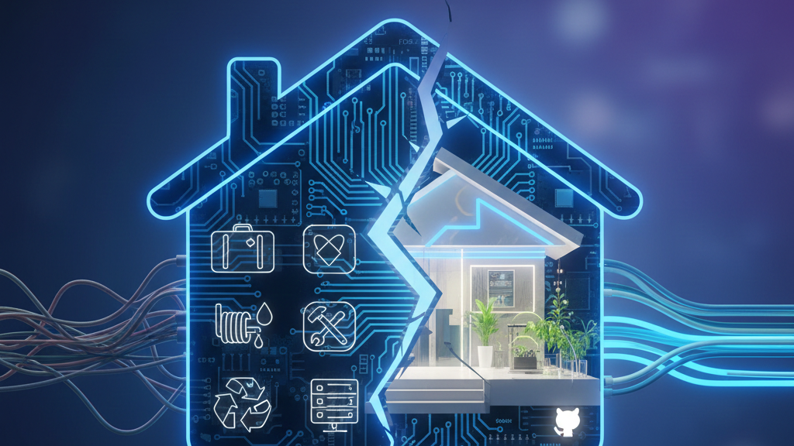

# The break I didn’t want, but needed in the end.

<time datetime="2026-01-18">2026-01-18</time> · Article · <a href="https://www.linkedin.com/posts/zlatko-lakisic_the-break-i-didnt-want-but-needed-in-the-activity-7418794317139320832-eiQM">View on LinkedIn</a>

<figure class="writing-cover">

</figure>

After experiencing the Verizon layoffs, I have redirected my efforts towards "repaying technical debt" at home. I am applying an outcome-first mindset to develop a "recycle-first" home automation project. Additionally…

**[Continue the discussion on LinkedIn →](https://www.linkedin.com/posts/zlatko-lakisic_the-break-i-didnt-want-but-needed-in-the-activity-7418794317139320832-eiQM)**
