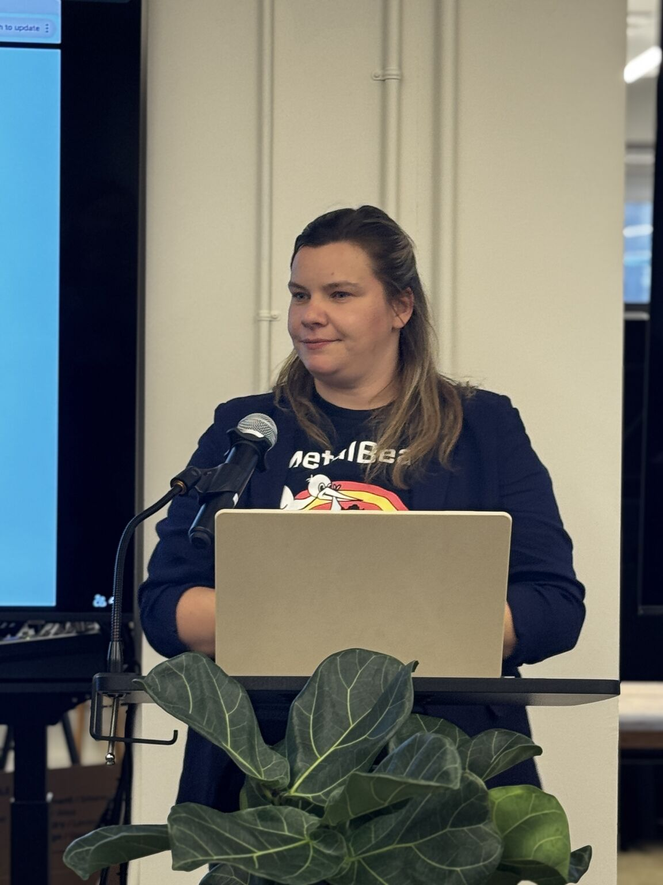

# So proud of my wife Adna Z

<time datetime="2026-02-26">2026-02-26</time> · Post · <a href="https://www.linkedin.com/posts/zlatko-lakisic_kubernetes-automation-activity-7432915163198091264-ukcn">View on LinkedIn</a>

<figure class="writing-cover">

</figure>

So proud of my wife Adna Z. ! Let's get it! 🥳 #Kubernetes #Automation

**[Continue the discussion on LinkedIn →](https://www.linkedin.com/posts/zlatko-lakisic_kubernetes-automation-activity-7432915163198091264-ukcn)**
