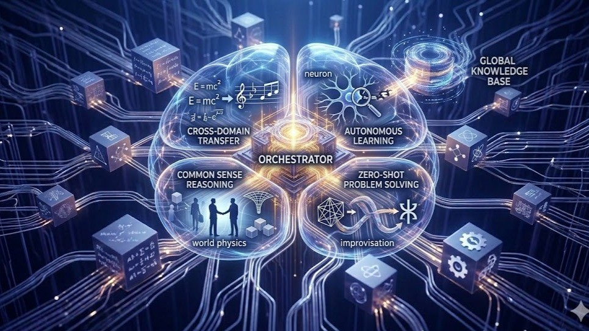

# From Static Infrastructure to Dynamic Intelligence: The Path to AGI Orchestration

<time datetime="2026-04-02">2026-04-02</time> · Article · <a href="https://www.linkedin.com/posts/zlatko-lakisic_from-static-infrastructure-to-dynamic-intelligence-activity-7445503405524959232-e8c6">View on LinkedIn</a>

<figure class="writing-cover">

</figure>

The Agentic Onramp to AGI 🧠 The era of the "Monolithic LLM" is evolving into the era of the Agentic System. 🤖 I’ve been diving deep into the roadmap toward AGI, and it is clear that the breakthrough isn't just about…

**[Continue the discussion on LinkedIn →](https://www.linkedin.com/posts/zlatko-lakisic_from-static-infrastructure-to-dynamic-intelligence-activity-7445503405524959232-e8c6)**
