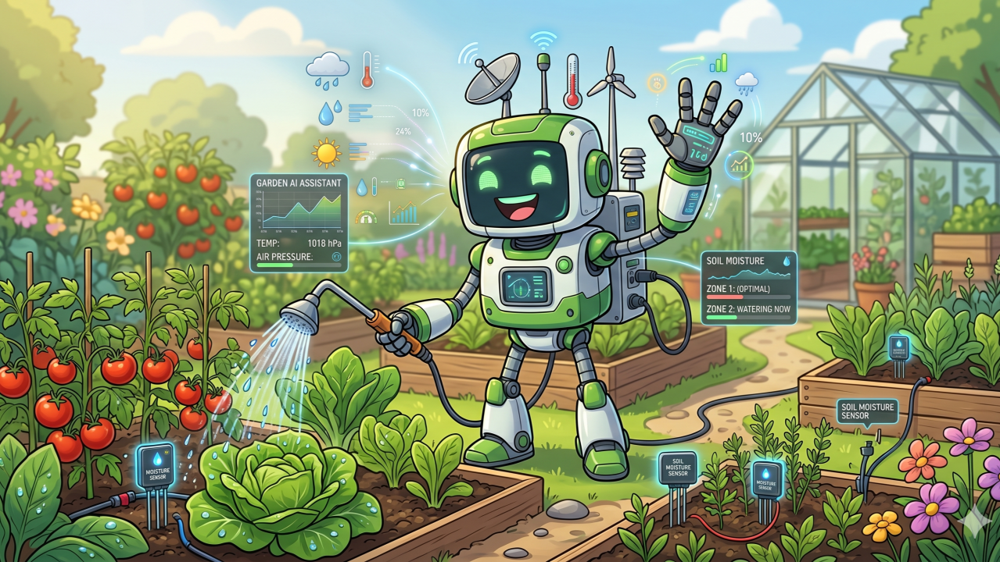
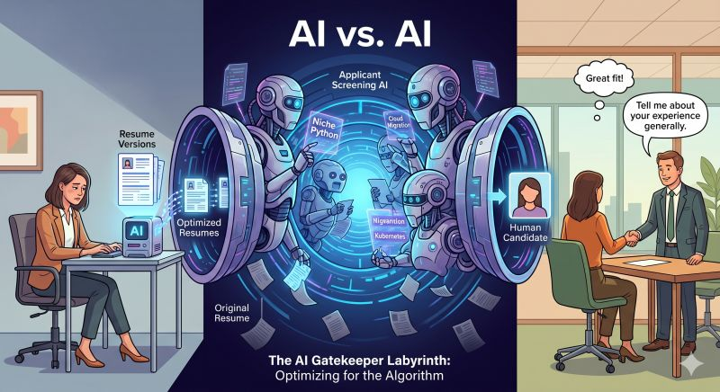
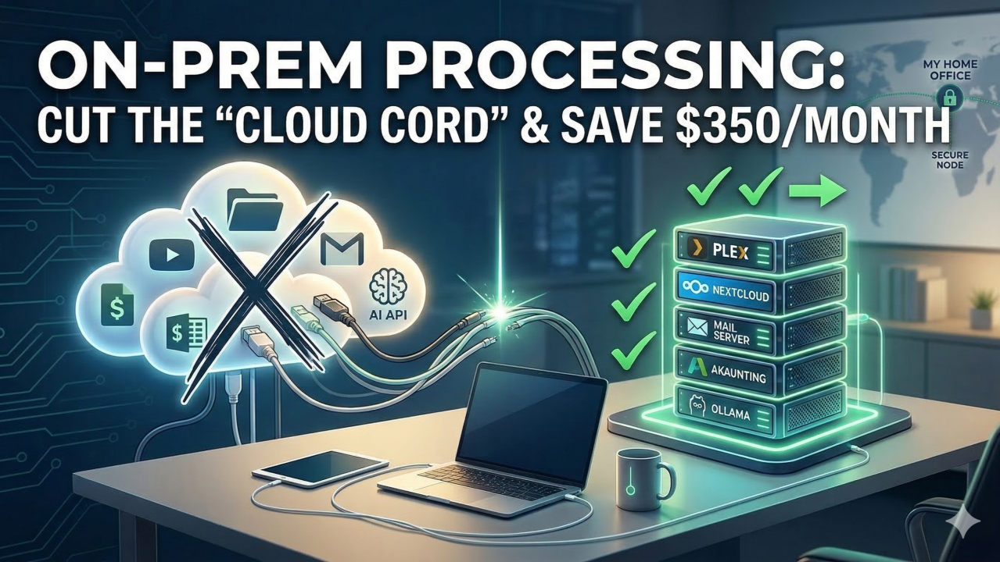

# Writing

[← Back to Main Portfolio](../index.md)

Selected LinkedIn posts and articles — full discussion stays on LinkedIn.

[Open LinkedIn profile →](https://www.linkedin.com/in/zlatko-lakisic/)

<article class="writing-entry">

<time datetime="2026-04-29">2026-04-29</time> · Article

### [From Theory to Turf: Cutting the \"Green\" Cost of my $900 Water Bill with On-Prem AI](./2026-04-29-from-theory-to-turf-cutting-the-green-cost-of-my-900-water-bill-with-on.md)

$900 for a water bill? Not on my watch. 📉 Last summer, my garden was the most expensive "hobby" I owned. The culprit wasn't just the heat; it was "dumb" automation. I had a schedule, but I didn't have intelligence. I’ve just published a new article detailing how I applied an "Outcome-First" engineering mindset to my backyard. By integrating Home Assistant, Ollama, and Orbit BHyve, I’ve moved from static timers to a…

[Read more →](./2026-04-29-from-theory-to-turf-cutting-the-green-cost-of-my-900-water-bill-with-on.md) · [Discuss on LinkedIn →](https://www.linkedin.com/posts/zlatko-lakisic_from-theory-to-turf-cutting-the-green-activity-7455072800836382720-4JSz)

</article>

<article class="writing-entry">

<time datetime="2026-04-16">2026-04-16</time> · Article

### [AI Gatekeepers in Hiring: Are Humans Still Needed?](./2026-04-16-ai-gatekeepers-in-hiring-are-humans-still-needed.md)

The AI vs. AI Arms Race: Are We Still Hiring Humans? 🤖 vs 🤖 The current state of job seeking has officially entered the Twilight Zone. We’re living in a world where the workforce is naturally growing, leading to more applicants than ever. To manage the noise, companies have installed AI as the ultimate "gatekeeper" to summarize, categorize, and qualify candidates. But here’s the irony: Because we’re now being…

[Read more →](./2026-04-16-ai-gatekeepers-in-hiring-are-humans-still-needed.md) · [Discuss on LinkedIn →](https://www.linkedin.com/posts/zlatko-lakisic_hiring-ai-futureofwork-activity-7450555997921632259-h23J)

</article>

<article class="writing-entry">

<time datetime="2026-04-02">2026-04-02</time> · Article

### [From Static Infrastructure to Dynamic Intelligence: The Path to AGI Orchestration](./2026-04-02-from-static-infrastructure-to-dynamic-intelligence-the-path-to-agi-orche.md)

The Agentic Onramp to AGI 🧠 The era of the "Monolithic LLM" is evolving into the era of the Agentic System. 🤖 I’ve been diving deep into the roadmap toward AGI, and it is clear that the breakthrough isn't just about larger models ➜ it is about Orchestration. ⚙️ We are moving away from static pattern matchers and toward "Dynamic Crews" 🌐: small, specialized agents that form and dissolve in real-time to solve unique…

[Read more →](./2026-04-02-from-static-infrastructure-to-dynamic-intelligence-the-path-to-agi-orche.md) · [Discuss on LinkedIn →](https://www.linkedin.com/posts/zlatko-lakisic_from-static-infrastructure-to-dynamic-intelligence-activity-7445503405524959232-e8c6)

</article>

<article class="writing-entry">

<time datetime="2026-03-18">2026-03-18</time> · Article

### [On-Prem Processing: How I Cut the \"Cloud Cord\" and Saved $350/Month](./2026-03-18-on-prem-processing-how-i-cut-the-cloud-cord-and-saved-350-month.md)

I cut the "Cloud Cord" and saved $350/month. 🔌💰 When my role at Verizon was eliminated during the 2025 layoffs, I audited our "digital tax." Between streaming, storage, accounting, and AI APIs, the subscriptions were endless. I decided to stop renting and start owning. Using Gemini, ChatGPT, and Cursor as my "junior engineers," I migrated our entire life on-prem: ✅ Media: Plex + OMV (Goodbye, streaming hikes). ✅…

[Read more →](./2026-03-18-on-prem-processing-how-i-cut-the-cloud-cord-and-saved-350-month.md) · [Discuss on LinkedIn →](https://www.linkedin.com/posts/zlatko-lakisic_on-prem-processing-how-i-cut-the-cloud-activity-7440067004083884032-r-3_)

</article>

<article class="writing-entry">

<time datetime="2026-01-18">2026-01-18</time> · Article

### [The break I didn’t want, but needed in the end.](./2026-01-18-the-break-i-didn-t-want-but-needed-in-the-end.md)

After experiencing the Verizon layoffs, I have redirected my efforts towards "repaying technical debt" at home. I am applying an outcome-first mindset to develop a "recycle-first" home automation project. Additionally, I am open-sourcing this journey on GitHub.

[Read more →](./2026-01-18-the-break-i-didn-t-want-but-needed-in-the-end.md) · [Discuss on LinkedIn →](https://www.linkedin.com/posts/zlatko-lakisic_the-break-i-didnt-want-but-needed-in-the-activity-7418794317139320832-eiQM)

</article>

